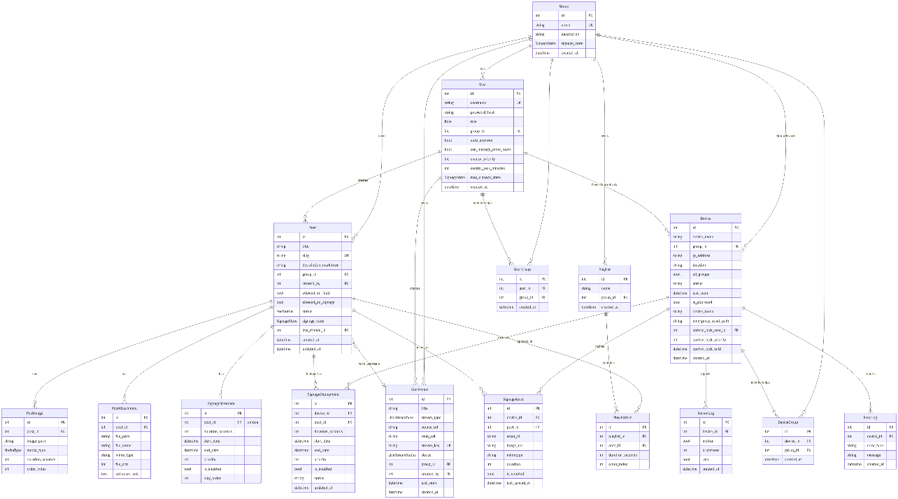
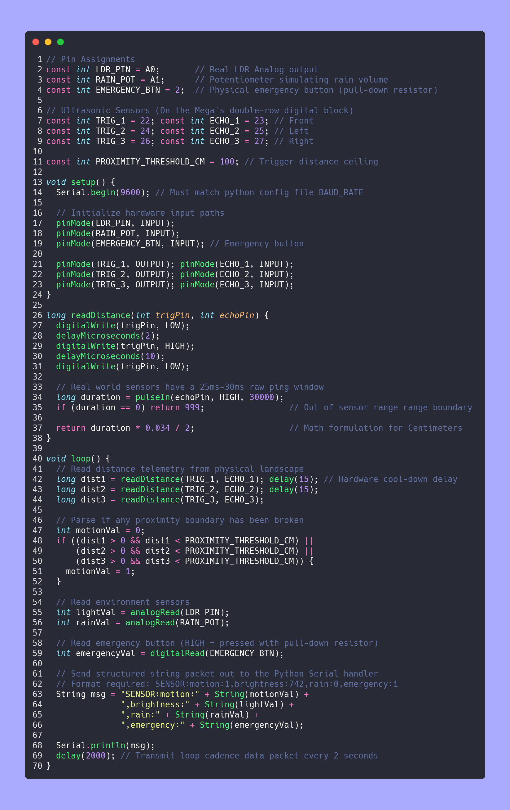
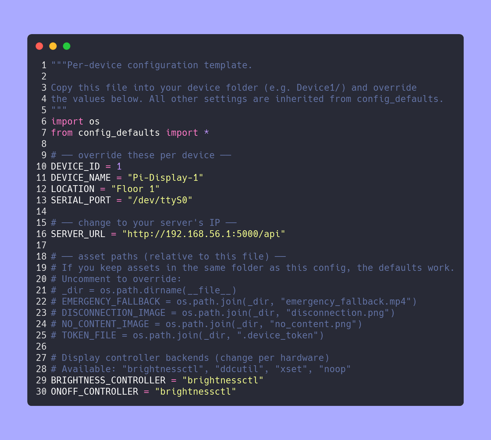
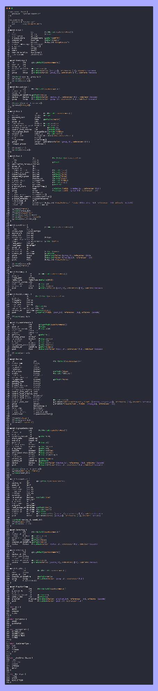
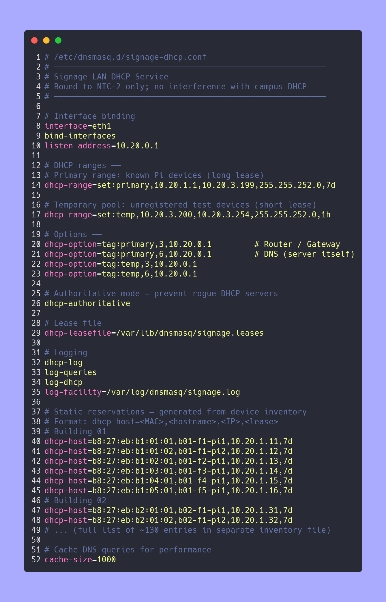
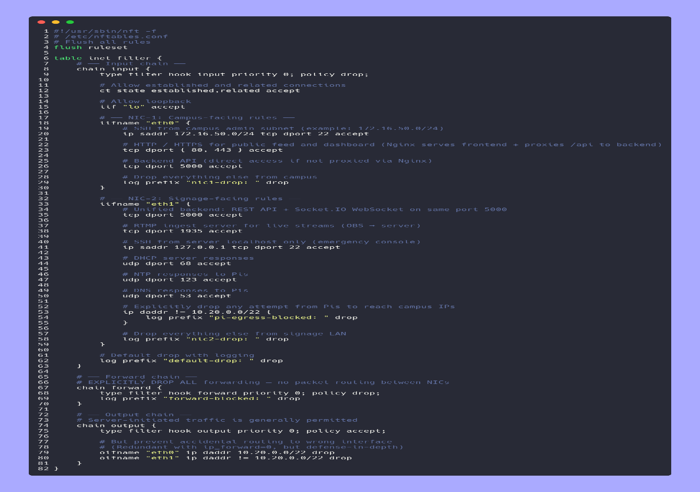

# Appendices

Comprehensive supplementary material for all chapters

## Appendix A - Database Entity-Relationship Diagram

<figure>

<figcaption>
Prisma Schema Entity-Relationship
Diagram.
</figcaption>
</figure>

**Fig A.1** Shows all 15+ models (User, Group, Post, PostImage, Media,
Device, SensorLog, ErrorLog, Playlist, PlaylistItem, LiveStream,
Deployment, Session, SignageState, SignageCommand) with relationships,
foreign keys, and indexes. Generated from `backend/prisma/schema.prisma`
using `prisma-erd-generator`.

## Appendix B - Complete REST API Endpoint Reference

<caption>Complete REST API Endpoint Reference</caption>
| Route | Method | Auth | Description | Key Query Params |
|----|----|----|----|----|
| `/api/auth/register` | POST | \- | First user bootstrap or admin creation | \- |
| `/api/auth/login` | POST | \- | JWT login, returns access + refresh tokens | \- |
| `/api/auth/refresh` | POST | \- | Refresh access token via refresh token | \- |
| `/api/auth/me` | GET | JWT | Current user profile | \- |
| `/api/users` | GET | JWT | List users (admin: all; creator: own group) | `group_id`, `role` |
| `/api/users/:id` | GET/PUT/DELETE | JWT | CRUD user with role-based constraints | \- |
| `/api/groups` | GET/POST | JWT | List/create groups | `signage_state` |
| `/api/groups/:id` | GET/PUT/DELETE | JWT | Group CRUD + state propagation | \- |
| `/api/posts` | GET/POST | JWT | List/create posts with media | `group_id`, `status` |
| `/api/posts/:id` | GET/PUT/DELETE | JWT | Post CRUD + deployment sync | \- |
| `/api/devices` | GET/POST | JWT | List/register devices | `group_id`, `status` |
| `/api/devices/:id` | GET/PUT/DELETE | JWT | Device CRUD + approval + token | \- |
| `/api/devices/:id/approve` | POST | Admin | Approve pending device, generate token | \- |
| `/api/signage/deploy` | POST | JWT | Deploy content to group or device | `group_id`, `device_id` |
| `/api/signage/emergency` | POST | Admin | Emergency override to group | `group_id`, `level` |
| `/api/signage/state` | GET/PUT | JWT | Read/update signage state | `group_id` |
| `/api/playlists` | GET/POST | JWT | Playlist CRUD | `group_id` |
| `/api/playlists/:id/items` | GET/POST/PUT | JWT | Playlist item management | \- |
| `/api/liveStreams` | GET/POST | JWT | Live stream CRUD | `group_id` |
| `/api/liveStreams/:id/start` | POST | JWT | Start RTMP ingest + HLS relay | \- |
| `/api/liveStreams/:id/stop` | POST | JWT | Stop stream, kill FFmpeg | \- |
| `/api/sensors/logs` | GET/POST | Device | Read/submit sensor data | `device_id`, `limit` |
| `/api/uploads` | POST | JWT | Multipart media upload (Multer) | \- |
| `/api/uploads/:id` | GET/DELETE | JWT | Retrieve/delete media | \- |
| `/api/ai/chat` | POST | JWT | AI Q&A with post context grounding | \- |
| `/api/health` | GET | \- | Server health check | \- |

## Appendix C - Socket.IO Event Protocol Reference

Client → Server Events (Authenticated Pi)

<caption>Socket.IO Client to Server Events</caption>
| Event | Payload | Server Action |
|----|----|----|
| `authenticate` | `{ deviceToken: string }` | Verify token, register socket in deviceSockets Map |
| `heartbeat` | `{ deviceId: number, ipAddress: string, timestamp: number }` | Update last_seen in Device table |
| `sensor_update` | `{ motion: boolean, brightness: number, rain: number, emergency: boolean }` | Insert SensorLog row |
| `content_sync_complete` | `{ deviceId: number, postIds: number[] }` | Update Deployment status to `synced` |
| `error_report` | `{ deviceId: number, code: string, message: string }` | Insert ErrorLog row |

Server → Client Events (Pi Receivers)

<caption>Socket.IO Server to Client Events</caption>
| Event | Payload | Trigger |
|----|----|----|
| `auth_success` | `{ deviceId: number, tokenExpiry: number }` | Successful device token validation |
| `auth_failed` | `{ reason: string }` | Invalid or missing token |
| `signage_command` | `{ action: string, payload: object }` | Admin publishes content or triggers emergency |
| `brightness_set` | `{ value: number }` | Sensor-driven brightness adjustment |
| `display_wake` | `{ reason: string }` | Motion detected, wake from standby |
| `display_standby` | `{ reason: string }` | No motion timeout |
| `duplicate_connection` | `{}` | Same token connects from second socket |

## Appendix D - Arduino Firmware (`sensors.ino`)

Code A.D

**Code A.D -** Arduino Mega 2560 sensor firmware. Reads three HC-SR04
ultrasonic sensors, one LDR light-dependent resistor, and one
potentiometer. Formats output as
`SENSOR:motion:X,brightness:XXX,rain:X.X` and transmits via Serial at
9600 baud every 500 ms.

## Appendix E - Raspberry Pi Agent Configuration (`config.py`)

Code A.E

**Code A.E -** Anthias device configuration file. Defines per-device
overrides: `DEVICE_ID`, `DEVICE_NAME`, `LOCATION`, `SERVER_URL`,
`SERIAL_PORT`, `DISPLAY_BACKEND`, and `EMERGENCY_ASSET_PATH`.

## Appendix F - Prisma Schema Excerpt (Key Models)

<caption>Code A.F</caption>
| Code A.F |
|----------|

**Code A.F -** Prisma schema excerpt showing User, Group, Device, Post,
and SensorLog models with relationships, indexes, and enum definitions.

## Appendix G - Network Configuration Files

G.1 dnsmasq Configuration (`/etc/dnsmasq.conf`)

Code A.G1

**Code A.G1 -** dnsmasq configuration for DHCP reservation, DNS
forwarding, and domain resolution within the signage LAN
(`10.20.0.0/22`).

G.2 nftables Rules (`/etc/nftables.conf`)

<caption>Code A.G2</caption>
| Code A.G2 |
|-----------|

**Code A.G2 -** nftables firewall rules implementing default-deny
policy, allowing only HTTP/HTTPS from campus LAN, SSH from admin VLAN,
and blocking Pi-initiated outbound connections.

<caption>Frontend component hierarchy</caption>
| Component | File | Props | State |
|----|----|----|----|
| `App` | `App.jsx` | \- | Router, auth provider |
| `AdminPage` | `pages/AdminPage.jsx` | \- | `users`, `devices`, `groups`, `playlists` |
| `AdminDevices` | `components/AdminDevices.jsx` | `devices`, `onApprove` | `pendingFilter`, `selectedDevice` |
| `CreatorPage` | `pages/CreatorPage.jsx` | \- | `posts`, `playlists`, `streams` |
| `CreatorDashboard` | `components/CreatorDashboard.jsx` | `posts` | `activeTab`, `editorMode` |
| `PostForm` | `components/PostForm.jsx` | `post`, `onSubmit` | `title`, `body`, `images[]`, `video` |
| `Designer` | `components/Designer.jsx` | `canvasData`, `onExport` | `objects[]`, `activeObject` |
| `FeedPage` | `pages/FeedPage.jsx` | \- | `posts`, `filterGroup` |
| `LoginPage` | `pages/LoginPage.jsx` | \- | `email`, `password`, `error` |
| `LiveStreamManager` | `components/LiveStreamManager.jsx` | `streams` | `activeStream`, `previewUrl` |

## Appendix H - Frontend Component Hierarchy

## Appendix I - Systemd Service Units

<caption>Systemd service units</caption>
| Service | File | Purpose | Restart Policy |
|----|----|----|----|
| `socket-signage.service` | `socket_client.py` | Socket.IO client, heartbeat, sensor loop | `always`, 10 s delay |
| `content-sync.service` | `content_sync.py` | Periodic content synchronization | `on-failure`, 60 s delay |
| `brightness-daemon.service` | `brightness_control.py` | Sensor-driven brightness control | `always`, 5 s delay |
| `emergency-monitor.service` | `mvp-player.py` | Emergency override monitoring | `always`, 10 s delay |
| `api-server.service` | `pm2` or `systemd` | Node.js Express server | `on-failure`, 30 s delay |

## Appendix J - Security Vulnerability Detail Cards

<caption>Security vulnerability detail cards</caption>
| CVE / ID | Severity | Location | Description | Remediation | Status |
|----|----|----|----|----|----|
| V-001 | P0 | `uploads.js` | Path traversal via `../` in filename | `path.basename()`, `sanitize-filename` | **Closed** |
| V-002 | P0 | `auth.js` | Missing rate limiting on login | `express-rate-limit`, 5 req/15 min | **Closed** |
| V-003 | P0 | `socket.js` | No device token auth on handshake | `authDevice.js` middleware | **Closed** |
| V-004 | P0 | `signage.js` | Deployment pull without token check | Device token header + `authDevice` | **Closed** |
| V-005 | P1 | `users.js` | No input sanitization on search | `express-validator`, parameterized queries | **Closed** |
| V-006 | P1 | All routes | Missing security headers | `helmet()`, CSP, HSTS | **Closed** |
| V-007 | P1 | `auth.js` | JWT stored in `localStorage` (XSS risk) | `httpOnly` cookie migration (deferred) | **Open** |
| V-008 | P1 | Frontend | Potential XSS in markdown rendering | `dompurify` + `react-markdown` | **Closed** |
| V-009 | P2 | `devices.js` | No audit log for admin actions | `AuditLog` model + middleware (deferred) | Open |

## Appendix K - Risk Register

<caption>Risk register</caption>
| Risk ID | Risk | Probability | Impact | Mitigation | Owner |
|----|----|----|----|----|----|
| R-001 | Core switch failure | Low | High | Cold-spare switch, 4-hour replacement SLA | Network team |
| R-002 | Pi SD card corruption | Medium | Medium | 30-day image backup, PXE boot research | DevOps |
| R-003 | Display panel failure | Medium | Medium | 2% annual failure budget, commercial warranty | Procurement |
| R-004 | Security breach (unauth access) | Low | High | Device tokens, RBAC, firewall, rate limiting | Security lead |
| R-005 | Content sync failure at scale | Medium | High | `tc` rate limiting, CDN fallback, batch scheduling | Backend team |
| R-006 | API performance degradation | Low | Medium | Load testing, query optimization, caching | Backend team |
| R-007 | Emergency alert delivery delay | Low | High | Socket.IO broadcast, local fallback assets, UPS | Operations |
| R-008 | Sensor calibration drift | Medium | Low | Annual recalibration, automated anomaly detection | Hardware team |

## Appendix L - Glossary of Terms

<caption>Glossary of terms</caption>
| Term | Definition |
|----|----|
| **Anthias** | Docker-based digital signage player for Raspberry Pi; runs Chromium in kiosk mode |
| **CEC** | Consumer Electronics Control; HDMI protocol for display power and input control |
| **DDC/CI** | Display Data Channel Command Interface; VESA standard for monitor control over DDC |
| **FFmpeg** | Open-source multimedia framework for encoding, decoding, and streaming |
| **HLS** | HTTP Live Streaming; Apple adaptive bitrate streaming protocol |
| **JWT** | JSON Web Token; compact, self-contained authentication token format |
| **MVP** | Minimal Viable Player; native MPV-based signage player in this project |
| **Prisma** | Type-safe ORM for Node.js and TypeScript |
| **RBAC** | Role-Based Access Control; permission model based on user roles |
| **RTMP** | Real-Time Messaging Protocol; Adobe streaming protocol for live video ingest |
| **Socket.IO** | Real-time bidirectional event-based communication library |
| Weber-Fechner | Psychophysical law stating perceived intensity is proportional to logarithm of stimulus |

\newpage