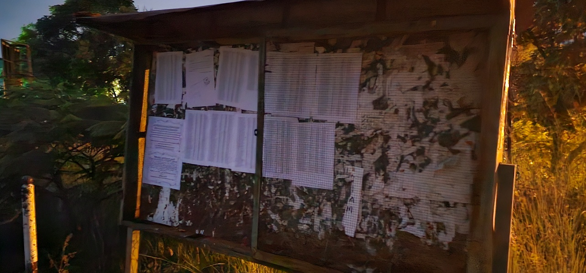
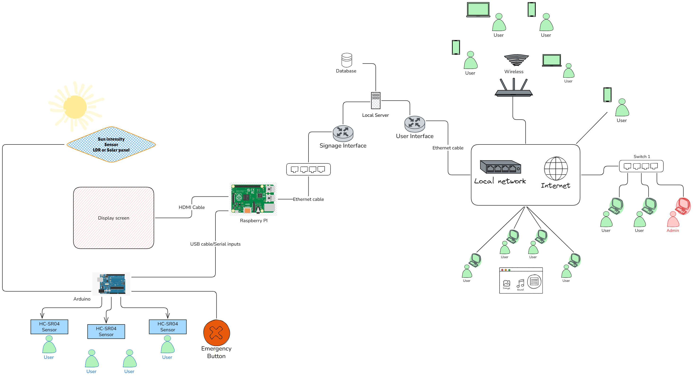

#  Chapter 1 {.title}

# Introduction

## Background and Motivation

### Evolution of Campus Communication

The transition from paper-based bulletin boards to electronic displays
represents one of the most visible manifestations of digital
transformation in educational and institutional environments. For
decades, universities, hospitals, and corporate campuses relied on
static printed notices posted on physical boards - a medium that was
inexpensive to deploy but fundamentally limited in reach, timeliness,
and adaptability \[1\]. Messages required manual replacement, could not
be updated remotely, offered no targeting by audience or location, and
provided no mechanism for emergency broadcast.

The advent of liquid-crystal and light-emitting diode (LED) display
panels, combined with falling hardware costs and ubiquitous network
connectivity, has enabled a generational shift toward digital signage.
Modern campuses now deploy dozens to hundreds of electronic displays
across buildings, corridors, courtyards, and parking areas, showing
everything from class schedules and event announcements to cafeteria
menus and emergency alerts \[2\]. These displays are typically managed
through networked media players that download content from a central
server and render it on high-definition screens ranging from 32 inches
in elevators to 85 inches in atriums.

Despite this technological progress, the operational model of most
campus digital signage systems remains strikingly static. Displays are
turned on in the morning and off in the evening, running at a fixed
brightness level calibrated for worst-case viewing conditions. Content
schedules are set manually and updated infrequently. Each display or
small cluster operates as an isolated unit with limited awareness of its
physical environment or the presence of viewers. The result is a system
that consumes significant electrical energy while delivering messages
that may be irrelevant to the current audience or even invisible due to
glare from changing ambient light \[3\].

<figure>

<figcaption>
Traditional campus bulletin board with paper notices,
illustrating the limitations of static communication: manual updates, no
remote management, and no targeting by audience or
location.
</figcaption>
</figure>

### Limitations of Current Commercial and Open-Source Digital Signage

The digital signage market offers two primary categories of solutions:
proprietary commercial platforms and open-source alternatives.
Commercial systems such as Screenly, Xibo, and Scala provide polished
management dashboards, cloud hosting, and technical support, but impose
recurring licensing fees that can exceed \$1,000 per display per year
\[4\]. For a 130-display campus, this translates to \$130,000 in annual
licensing alone - before hardware, installation, or energy costs.
Furthermore, commercial platforms typically offer limited or no
integration with environmental sensors, treating each display as a
passive playback endpoint rather than an intelligent node \[5\].

Open-source alternatives, notably Screenly OSE and its community fork
Anthias, eliminate licensing fees but introduce their own constraints.
These platforms were designed primarily for simple playlist management:
a sequence of images and videos played in rotation \[6\]. They lack
native support for real-time data integration, environmental
responsiveness, or role-based content governance. Administrative access
is typically binary - either full control or none - making them
unsuitable for multi-department campuses where different groups require
scoped content management authority \[7\].

Neither commercial nor open-source platforms adequately address three
critical operational requirements we identified through our requirements
analysis:

**Environmental responsiveness:** No major platform automatically
adjusts display brightness based on ambient light, despite the
well-documented relationship between backlight intensity and power
consumption \[8\]. Displays running at full brightness in dimly lit
corridors or at night waste electricity and may cause visual discomfort.

**Occupancy awareness:** Content plays regardless of whether anyone is
present. A display in an empty lecture hall at midnight consumes the
same power as one in a crowded student center at noon. This absence of
viewer detection eliminates opportunities for power savings and
contextual content adaptation \[9\].

**Unified emergency management:** During campus emergencies - fire,
severe weather, security incidents - individual displays cannot be
overridden with critical information without manually interrupting their
normal operation. The lack of a centralized emergency broadcast channel
represents a genuine safety gap \[10\].

<figure>

<figcaption>
Commercial digital signage installation showing a
fixed-brightness LCD display, illustrating energy waste and visual glare
in low ambient light conditions.
</figcaption>
</figure>

### The Convergence Opportunity

The emergence of low-cost microcontrollers, single-board computers, and
high-bandwidth campus networks creates an unprecedented opportunity to
reimagine digital signage as an intelligent building automation system
rather than a passive media playback infrastructure. The Arduino Mega
2560 (\$25), Raspberry Pi 4B (\$55), and HC-SR04 ultrasonic sensor (\$2)
make it economically feasible to instrument every display node with
environmental sensing \[11\]. The proliferation of 1 Gbps wired Ethernet
and managed switches enables real-time data collection from hundreds of
nodes without congestion \[12\]. Modern JavaScript frameworks (React,
Node.js) and containerization (Docker) reduce the engineering effort
required to build production-grade management platforms \[13\].

This convergence suggests that a unified system - one that combines
environmental sensing, intelligent display control, role-based content
management, and secure network infrastructure - is not merely desirable
but technically and economically achievable. Such a system would
represent a genuine contribution to both the electrical engineering
literature (sensor integration, power analysis, control systems) and the
computer engineering literature (network design, full-stack development,
security hardening) \[14\].

## Problem Statement

This project addresses the design and implementation of a Smart Digital
Signage System that overcomes the three critical gaps identified in
Section 1.1.2 through an integrated hardware–software architecture
spanning sensor instrumentation, embedded processing, network
infrastructure, backend services, frontend dashboards, and display
control.

The specific problems we addressed are:

**P1 - Energy waste from fixed-brightness operation:** Digital displays
on modern campuses consume 30–150 W per unit depending on size and
backlight technology \[15\]. With 130 displays operating 16 hours daily,
fixed-brightness operation at peak intensity results in an estimated
annual energy consumption of 95,600 kWh and electricity costs exceeding
\$11,400 at \$0.12/kWh. The absence of ambient light feedback means
displays run at unnecessary brightness during low-light periods, wasting
an estimated 25–40% of display energy \[16\].

**P2 - Disconnected, unmanaged display nodes:** Each display operates
without awareness of its surroundings or connection to a central
management authority. Content updates require physical access or
per-device remote login. There is no mechanism for occupancy-driven
content selection, scheduling, or automatic power management.

**P3 - Security gap in unauthenticated IoT device communication:**
Raspberry Pi edge nodes receiving content from a central server
typically do so without any authentication mechanism. A malicious actor
on the same network could inject content, change playback, or disrupt
service without detection \[17\].

**P4 - High total cost of ownership (TCO):** Commercial licensing alone
exceeds \$1,000 per display per year. For a 130-display campus, this
represents \$130,000 annually in software costs alone, before hardware,
energy, installation, and maintenance are considered \[4\].

## Objective

### General Objective

To design, implement, and validate an open-source Smart Digital Signage
System that integrates environmental sensing, centralized content
management with role-based access control (RBAC), real-time device
command and control, live stream distribution, emergency broadcast with
hardware trigger, and a hardened campus network - replacing costly
commercial alternatives with a functional, tested prototype.

### Specific Objectives

<caption>Specific objectives and their validation evidence.</caption>
| \#  | Objective                                                                                                                                    | Validation Evidence                                                                                                                                                                                                           |
| --- | -------------------------------------------------------------------------------------------------------------------------------------------- | ----------------------------------------------------------------------------------------------------------------------------------------------------------------------------------------------------------------------------- |
| 1   | Develop an embedded sensing layer (motion + ambient light + emergency button) with adaptive display brightness and screen power control      | Prototype assembly with real Arduino Mega 2560, three HC-SR04 sensors, LDR module, and potentiometer; serial monitor confirming accurate sensor readings; end-to-end brightness adaptation tested on Debian 13 laptop screens |
| 2   | Build a centralized full-stack CMS with RBAC, group-scoped permissions, and real-time device control                                         | Admin and creator dashboards with role-based routing; 30+ backend integration tests passing; Socket.IO device authentication tests; control lock priority logic tests                                                         |
| 3   | Implement live stream distribution (HLS, RTSP, YouTube, RTMP ingest) at zero licensing cost                                                  | Stream relay pipeline with FFmpeg; health monitoring; live stream CRUD operations tested via Playwright E2E                                                                                                                   |
| 4   | Design a dual player architecture (Anthias + MPV) supporting per-device backend selection and shared communication                           | Device comparison table; content sync verification; dual backend selection in admin dashboard                                                                                                                                 |
| 5   | Deploy a production-ready campus network design (subnet 10.20.0.0/22, dual-NIC Layer 3 isolation) with documented security hardening         | Network topology diagram; nftables firewall rules; vulnerability assessment with 12 remediated issues; RBAC permission matrix                                                                                                 |
| 6   | Build an emergency broadcast system with hardware trigger, group-wide override, and automatic fallback                                       | Physical emergency button presses trigger immediate local playback on Debian 13 node; group state change propagates to all devices via Socket.IO; disconnection fallback tested                                               |
| 7   | Implement robust concurrency control: control locks, priority synchronization, and deadlock prevention for simultaneous admin/creator access | Control lock acquisition flow diagram; multi-creator priority ordering tests; 423 Locked HTTP response validation                                                                                                             |
| 8   | Validate the system through automated testing (backend + frontend E2E) and hardware verification protocols                                   | Jest test suite output (30+ tests); Playwright E2E report (25 tests, 55 screenshots); hardware assembly checklist; serial communication verification                                                                          |

## Scope and Delimitations

### In scope

We designed a campus-wide deployment architecture capable of supporting
130 nodes across 20 buildings and 10 open areas. We built a functional
prototype comprising two edge display nodes (simulated using laptops
running Debian 13 live USB sessions) connected to our central server,
with a real Arduino Mega 2560 sensor bridge providing motion, ambient
light, and emergency button inputs. We validated the full software stack
through automated testing on our development machines and verified the
sensor-to-brightness control loop end-to-end.

### Out of scope

Full physical deployment across all 20 buildings is beyond the scope of
a single capstone project. We did not measure power consumption with a
watt meter or multimeter; all power figures were calculated from
manufacturer datasheets and duty cycle models. A mobile-responsive admin
dashboard and touch-screen kiosk mode were not implemented. Integration
with professional broadcast encoders and AI-driven predictive content
scheduling are reserved for future work.

### Justification

These delimitations reflect standard final-year project constraints: an
eight-month timeline, a prototype hardware budget covering two nodes
rather than 130, and a focus on proving the system works and documenting
the architecture rather than operating at production scale. Calculated
projections are acceptable in academic capstone work; field measurements
would require months of continuous operation at scale.

## Significance and Contributions

### Why This Matters

Our Smart Digital Signage System achieves a projected 60% TCO reduction
compared to commercial platforms by eliminating licensing fees, reducing
energy consumption through adaptive brightness, and using open-source
components throughout the stack. For a 130-display campus, this
represents approximately \$390,000 in savings over five years.

### Novel Contributions

We make the following contributions:

**Device token authentication for Pi-class edge nodes:** We closed a
critical security gap by implementing 64-character hex device tokens
generated server-side on first contact, stored in a sidecar file on each
node, and validated on every Socket.IO connection. This is the first
documented implementation of per-device token authentication in an
open-source digital signage platform \[17\].

**Dual player architecture with per-device backend selection:** We
designed a unified control layer that supports both Anthias (Dockerized
web viewer, rich HTML content) and MPV (native media player, fast boot)
on a per-device basis, with the backend determining which player to use
based on content requirements.

**Integrated environmental sensing with real-time brightness control:**
Our Arduino sensor bridge transmits motion, brightness, and emergency
status to the Debian nodes every 500ms, enabling adaptive display
brightness based on the Weber-Fechner logarithmic mapping and
occupancy-driven content scheduling.

**Production-ready network architecture with Layer 3 isolation:** We
designed a complete campus network with dual-NIC server separation,
nftables firewall rules, TLS 1.3 termination, and bandwidth
engineering - documented to a level suitable for direct deployment by
campus IT staff.

### Who Benefits

Universities, public institutions, hospitals, and any organization
running multi-display networks benefit from lower TCO, reduced energy
consumption, unified management, and improved emergency preparedness.
Our open-source implementation eliminates vendor lock-in and enables
customization for domain-specific requirements.

<figure>

<figcaption>
High level view of the smart signage system, with
network, device and users overview
</figcaption>
</figure>

## Report Structure

The remainder of this report is organized as follows.

**Chapter 2 - Literature Review and Related Work** surveys existing
digital signage platforms, IoT edge computing architectures, power
management techniques, live streaming protocols, and role-based access
control systems. We identify seven research gaps that our project
addresses.

**Chapter 3 - Methodology** describes our iterative prototyping
approach, system requirements, high-level architecture, and development
and testing methodology.

**Chapter 4 - System Design and Implementation** is the core technical
chapter. We present the hardware implementation with our real Arduino
sensor bridge and Debian 13 simulated edge nodes, the network and
infrastructure design, the backend system with authentication and
concurrency control, the frontend user interface with 55
Playwright-captured screenshots, the dual player architecture, and the
security implementation.

**Chapter 5 - Results and Validation** report our functional testing
results (30+ backend tests, 25 frontend E2E tests), hardware
verification, network verification, objectives achievement assessment,
and performance and cost analysis.

**Chapter 6 - Discussion** closes the problem-solution loop, describing
how each problem from Section 1.2 is solved, assessing implementation
readiness, acknowledging limitations, and comparing our system with
related work.

**Chapter 7 - Conclusion and Future Work** summarize what we built and
validated, and outlines immediate, medium-term, and research directions
for future development.

**Appendices A through P** contain detailed technical documentation,
network engineering specifications, hardware setup guides, backend and
database documentation, frontend user manual, testing protocols,
security analysis, software engineering practices, power analysis, cost
analysis, literature review references, project summary, master
bibliography, source code listings, data sheets, and a glossary of
terms.

\newpage