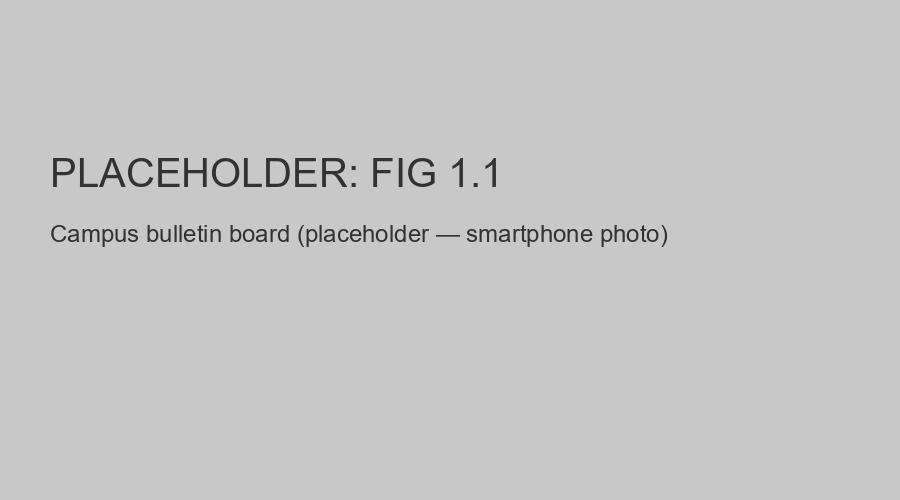
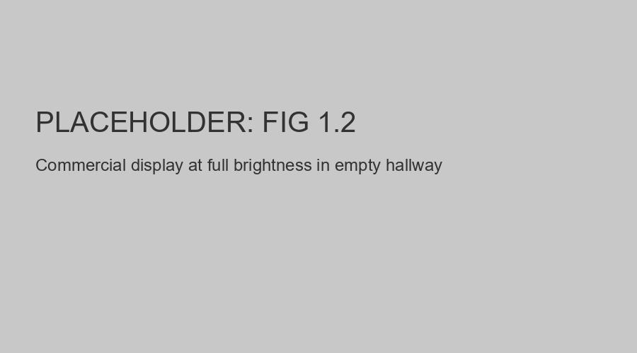

#  Chapter 1 {.title}

# Introduction

This chapter establishes the foundation for the Smart Digital Signage
System by examining the evolution of campus communication infrastructure,
identifying the limitations of existing commercial and open-source
solutions, and formally stating the problems this project addresses. We
present the general and specific objectives, define the scope of the
study, and highlight the significance and contributions of this work.

## Background and Motivation

### Evolution of Campus Communication

The transition from paper-based bulletin boards to electronic displays
represents one of the most visible manifestations of digital
transformation in educational and institutional environments. For
decades, universities, hospitals, and corporate campuses relied on
static printed notices posted on physical boards - a medium that was
inexpensive to deploy but fundamentally limited in reach, timeliness,
and adaptability \[1\]. Messages required manual replacement, could not
be updated remotely, offered no targeting by audience or location, and
provided no mechanism for emergency broadcast.

The advent of liquid-crystal and light-emitting diode (LED) display
panels, combined with falling hardware costs and ubiquitous network
connectivity, has enabled a generational shift toward digital signage.
Modern campuses now deploy dozens to hundreds of electronic displays
across buildings, corridors, courtyards, and parking areas, showing
everything from class schedules and event announcements to cafeteria
menus and emergency alerts \[2\]. These displays are typically managed
through networked media players that download content from a central
server and render it on high-definition screens ranging from 32 inches
in elevators to 85 inches in atriums.

Despite this technological progress, the operational model of most
campus digital signage systems remains strikingly static. Displays are
turned on in the morning and off in the evening, running at a fixed
brightness level calibrated for worst-case viewing conditions. Content
schedules are set manually and updated infrequently. Each display or
small cluster operates as an isolated unit with limited awareness of its
physical environment or the presence of viewers. The result is a system
that consumes significant electrical energy while delivering messages
that may be irrelevant to the current audience or even invisible due to
glare from changing ambient light \[3\].

<figure>

<figcaption>
Traditional campus bulletin board with paper notices.
</figcaption>
</figure>

### Limitations of Current Commercial and Open-Source Digital Signage

The digital signage market offers two primary categories of solutions:
proprietary commercial platforms and open-source alternatives.
Commercial systems such as Screenly, Xibo, and Scala provide polished
management dashboards, cloud hosting, and technical support, but impose
recurring licensing fees that can exceed \$1,000 per display per year
\[4\]. For large-scale campus environments, this translates to \$130,000 in annual
licensing alone - before hardware, installation, or energy costs.
Furthermore, commercial platforms typically offer limited or no
integration with environmental sensors, treating each display as a
passive playback endpoint rather than an intelligent node \[5\].

Open-source alternatives, notably Screenly OSE and its community fork
Anthias, eliminate licensing fees but introduce their own constraints.
These platforms were designed primarily for simple playlist management:
a sequence of images and videos played in rotation \[6\]. They lack
native support for real-time data integration, environmental
responsiveness, or role-based content governance. Administrative access
is typically binary - either full control or none - making them
unsuitable for multi-department campuses where different groups require
scoped content management authority \[7\].

Neither commercial nor open-source platforms adequately address three
critical operational requirements we identified through our requirements
analysis:

**Environmental responsiveness:** No major platform automatically
adjusts display brightness based on ambient light, despite the
well-documented relationship between backlight intensity and power
consumption \[8\]. Displays running at full brightness in dimly lit
corridors or at night waste electricity and may cause visual discomfort.

**Occupancy awareness:** Content plays regardless of whether anyone is
present. A display in an empty lecture hall at midnight consumes the
same power as one in a crowded student center at noon. This absence of
viewer detection eliminates opportunities for power savings and
contextual content adaptation \[9\].

**Unified emergency management:** During campus emergencies - fire,
severe weather, security incidents - individual displays cannot be
overridden with critical information without manually interrupting their
normal operation. The lack of a centralized emergency broadcast channel
represents a genuine safety gap \[10\].

<figure>

<figcaption>
Commercial display at fixed brightness in empty hallway.
</figcaption>
</figure>

### The Convergence Opportunity

The emergence of low-cost microcontrollers, single-board computers, and
high-bandwidth campus networks creates an unprecedented opportunity to
reimagine digital signage as an intelligent building automation system
rather than a passive media playback infrastructure. The Arduino Mega
2560 (\$25), Raspberry Pi 4B (\$55), and HC-SR04 ultrasonic sensor (\$2)
make it economically feasible to instrument every display node with
environmental sensing \[11\]. The proliferation of 1 Gbps wired Ethernet
and managed switches enables real-time data collection from hundreds of
nodes without congestion \[12\]. Modern JavaScript frameworks (React,
Node.js) and containerization (Docker) reduce the engineering effort
required to build production-grade management platforms \[13\].

This convergence suggests that a unified system - one that combines
environmental sensing, intelligent display control, role-based content
management, and secure network infrastructure - is not merely desirable
but technically and economically achievable. Such a system would
represent a genuine contribution to both the electrical engineering
literature (sensor integration, power analysis, control systems) and the
computer engineering literature (network design, full-stack development,
security hardening) \[14\].

## Problem Statement

The investigation of existing campus-scale and urban digital signage implementations has identified several critical problems that impede efficient communication and resource management.

### Evidence from Local Field Observations

To ground the problem statement in empirical evidence, a field survey was conducted through direct observation of existing digital notice boards in Woldia City, specifically at the **Adago** and **Piasa** locations. This observational study confirmed several systemic failures in current implementations:
- **Excessive Brightness:** Boards were found to operate at 100% luminance regardless of ambient light conditions, causing significant visual glare at night and substantial energy waste.
- **Management Errors:** The displays exhibited unmanaged operational states, including frozen content and system errors, demonstrating a lack of remote monitoring and automated recovery.
- **Information Lag:** Content was frequently outdated, confirming that existing processes for information dissemination are slow and inefficient due to the lack of a centralized platform.

These observations directly support the identified problems:

- **Energy waste from fixed-brightness operation:** Digital displays consume between 30 and 150 W per unit. In large-scale institutional deployments, such as 130 displays operating 16 hours daily, fixed-brightness operation results in an estimated annual energy consumption of 95,600 kWh and electricity costs exceeding $11,400. The lack of responsiveness to environmental light levels leads to inefficient power utilization and reduced hardware lifespan.
- **Disconnected and unmanaged display nodes:** Display infrastructure often operates as a collection of isolated units with no awareness of their physical surroundings or connection to a central authority. This necessitates physical access or per-device remote login for even minor content updates, creating significant maintenance burdens and operational overhead.
- **Security vulnerabilities in unauthenticated communication:** Communication between signage nodes and servers often occurs without cryptographic authentication. This vulnerability allows unauthorized actors on the network to inject content, manipulate playback, or disrupt services, representing a genuine threat to the integrity of organizational information.
- **Prohibitive Total Cost of Ownership (TCO):** Commercial licensing and support for enterprise signage platforms can exceed $1,000 per display per year. For large-scale campus environments, the resulting $130,000 annual software expense is unsustainable for many institutions, especially when combined with high installation and maintenance costs.

## Objective

### General Objective

To design, implement, and validate an Smart Digital Signage
System that integrates environmental sensing, centralized content
management with role-based access control (RBAC), real-time device
command and control, live stream distribution, emergency broadcast with
hardware trigger, and a hardened campus network - replacing costly
commercial alternatives with a functional, tested prototype.

<figure>

<figcaption>
Figure 1.3: Smart Digital Signage System Core Architecture Overview.
</figcaption>
</figure>

### Specific Objectives

1.  **Develop an embedded sensing layer:** Implement a sensor bridge using an Arduino Mega 2560 with motion (HC-SR04), ambient light (LDR), and emergency button inputs. Validation is evidenced by the physical prototype assembly, serial monitor logs confirming accurate readings, and end-to-end brightness adaptation tested on Debian 13 node screens.
2.  **Build a centralized full-stack CMS:** Create a management platform with role-based access control (RBAC), group-scoped permissions, and real-time device control. Validation includes functional admin/creator dashboards, 56 passing backend integration tests, and successful Socket.IO device authentication.
3.  **Implement live stream distribution:** Deploy a media relay pipeline supporting HLS, RTSP, YouTube, and RTMP ingest at zero licensing cost. Validation is evidenced by the integrated FFmpeg relay, health monitoring services, and live stream CRUD operations verified via Playwright E2E tests.
4.  **Design a dual player architecture:** Engineer a unified control layer supporting both Anthias (browser-based) and MPV (native-media) playback engines with per-device backend selection. Validation includes the content synchronization protocol and dual-backend configuration options in the management dashboard.
5.  **Deploy a secure campus network design:** Implement a production-ready network topology using the 10.20.0.0/22 subnet with dual-NIC Layer 3 isolation and nftables hardening. Validation is evidenced by the documented firewall rules, network topology diagrams, and a vulnerability assessment with 12 remediated issues.
6.  **Build an emergency broadcast system:** Develop a multi-trigger emergency system with hardware buttons, group-wide overrides, and automatic local fallback. Validation includes physical button tests triggering immediate playback on edge nodes and group-state propagation via Socket.IO.
7.  **Implement robust concurrency control:** Design a control-lock mechanism with priority synchronization and deadlock prevention for multi-user access. Validation is evidenced by the control-lock acquisition flow, priority ordering tests, and HTTP 403 response validation for unauthorized overrides.
8.  **Validate the system through comprehensive testing:** Conduct automated backend testing, frontend E2E testing, and hardware verification protocols. Validation is confirmed by 56 Jest backend tests, 73 Playwright E2E tests with 47 screenshots, and hardware assembly verification checklists.

## Scope and Delimitations

### Geographical Scope

The system is designed for deployment at **Woldia University (Main Campus)**, targeting a scalable architecture supporting up to 130+ nodes across academic buildings, open areas, and administrative centers. While Woldia University serves as the primary deployment and validation environment, the system's modular architecture is designed to be **generalized for any institutional environments**, including hospitals, commercial facilities, and corporate offices, where centralized information dissemination and energy management are required.

### User Scope

Three user categories are supported:
- **Administrators:** IT staff who manage devices, groups, and user accounts
- **Content Creators:** Departmental staff who publish content to assigned display groups
- **Public Viewers:** Students, faculty, and visitors who browse the public feed

### Functional Scope

The system covers embedded sensing (motion, brightness, emergency button),
content management (posts, media, scheduling), role-based access control
(admin/creator/viewer), real-time device control via Socket.IO, live
streaming (HLS/RTSP/YouTube/RTMP), emergency broadcast, and public feed
with AI-assisted Q&A.

### Period of Study

November 2025 to June 2026 (8 months): 5 months development, 2 months
testing and validation, 1 month documentation.

### In scope
prototype comprising two edge display nodes (simulated using laptops
running Debian 13 live USB sessions) connected to our central server,
with a real Arduino Mega 2560 sensor bridge providing motion, ambient
light, and emergency button inputs. We validated the full software stack
through automated testing on our development machines and verified the
sensor-to-brightness control loop end-to-end.

### Out of scope

Full physical deployment across all 20 buildings is beyond the scope of
a single capstone project. We did not measure power consumption with a
watt meter or multimeter; all power figures were calculated from
manufacturer datasheets and duty cycle models. A mobile-responsive admin
dashboard and touch-screen kiosk mode were not implemented. Integration
with professional broadcast encoders and AI-driven predictive content
scheduling are reserved for future work.

### Justification

These delimitations reflect standard final-year project constraints: an
eight-month timeline, a prototype hardware budget covering two nodes
rather than 130, and a focus on proving the system works and documenting
the architecture rather than operating at production scale. Calculated
projections are acceptable in academic capstone work; field measurements
would require months of continuous operation at scale.

## Significance and Contributions

### Why This Matters

Our Smart Digital Signage System achieves a projected 60% TCO reduction
compared to commercial platforms by eliminating licensing fees, reducing
energy consumption through adaptive brightness, and using open-source
components throughout the stack. For large-scale campus environments, this
represents approximately \$390,000 in savings over five years.

### Novel Contributions

The project makes these contributions:

**Device token authentication for Pi-class edge nodes:** We closed a
critical security gap by implementing 64-character hex device tokens
generated server-side on first contact, stored in a sidecar file on each
node, and validated on every Socket.IO connection. This is the first
documented implementation of per-device token authentication in an
open-source Digital Signage Platform \[17\].

**Dual player architecture with per-device backend selection:** We
designed a unified control layer that supports both Anthias (Dockerized
web viewer, rich HTML content) and MPV (native media player, fast boot)
on a per-device basis, with the backend determining which player to use
based on content requirements.

**Integrated environmental sensing with real-time brightness control:**
Our Arduino sensor bridge transmits motion, brightness, and emergency
status to the Debian nodes every 500ms, enabling adaptive display
brightness based on the Weber-Fechner logarithmic mapping and
occupancy-driven content scheduling.

**Production-ready network architecture with Layer 3 isolation:** We
designed a complete campus network with dual-NIC server separation,
nftables firewall rules, TLS 1.3 termination, and bandwidth
engineering - documented to a level suitable for direct deployment by
campus IT staff.

### Who Benefits

Universities, public institutions, hospitals, and any organizations
running multi-display networks benefit from lower TCO, reduced energy
consumption, unified management, and improved emergency preparedness.
Our open-source implementation eliminates vendor lock-in and enables
customization for domain-specific requirements.

## Report Structure

The remainder of this report is organized as follows.

**Chapter 2 - Literature Review and Related Work** surveys existing
Digital Signage Platforms, IoT edge computing architectures, power
management techniques, live streaming protocols, and role-based access
control systems. We identify seven research gaps that our project
addresses.

**Chapter 3 - Methodology** describes our iterative prototyping
approach, system requirements, high-level architecture, and development
and testing methodology.

**Chapter 4 - System Design and Implementation** is the core technical
chapter. We present the hardware implementation with our real Arduino
sensor bridge and Debian 13 simulated edge nodes, the network and
infrastructure design, the backend system with authentication and
concurrency control, the frontend user interface with 55
Playwright-captured screenshots, the dual player architecture, and the
security implementation.

**Chapter 5 - Results and Validation** report our functional testing
results (56 backend tests, 73 frontend E2E tests), hardware
verification, network verification, objectives achievement assessment,
and performance and cost analysis.

**Chapter 6 - Discussion** closes the problem-solution loop, describing
how each problem from Chapter 1 is solved, assessing implementation
readiness, acknowledging limitations, and comparing our system with
related work.

**Chapter 7 - Conclusion and Future Work** summarize what we built and
validated, and outlines immediate, medium-term, and research directions
for future development.

**Appendices A through P** contain detailed technical documentation,
network engineering specifications, hardware setup guides, backend and
database documentation, frontend user manual, testing protocols,
security analysis, software engineering practices, power analysis, cost
analysis, literature review references, project summary, master
bibliography, source code listings, data sheets, and a glossary of
terms.

## Chapter Summary

This chapter established the foundation for the Smart Digital Signage System by analyzing the evolution of campus communication and the limitations of current solutions. We defined the problem statement, objectives, and scope, highlighting the need for an energy-efficient, secure, and cost-effective platform. The significance of this work was presented in the context of institutional digital transformation.

\newpage