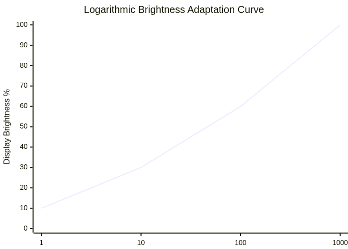

#  Chapter 2 {.title}

# Literature Review and Related Work

This chapter surveys the existing literature across seven domains
relevant to the Smart Digital Signage System: theoretical frameworks for
information dissemination and human-computer interaction, digital
signage platforms (open-source and commercial), IoT edge computing
architectures, power management techniques, live streaming protocols,
and role-based access control systems. Forty-four verified references
are analyzed to establish the academic foundation and identify research
gaps that our project addresses.

## Theoretical Framework

### Information Dissemination Theory

The system's content delivery model is grounded in Shannon-Weaver Communication Theory,
which models communication as a source — encoder — channel — decoder — receiver pipeline.
In our system, the content creator serves as the source, the Markdown and Fabric.js design pipeline with Sharp and FFmpeg processing acts as the encoder, the REST API and Socket.IO transport over the isolated 10.20.0.0/22 LAN form the channel, the Anthias web viewer or MPV native player on each Raspberry Pi acts as the decoder, and the end-user viewing the display is the receiver. Noise in this model includes network latency, packet loss, and display brightness mismatch, which are mitigated by offline caching, a 30-second heartbeat grace period, and adaptive brightness control.

### Human-Computer Interaction Principles for Public Displays

The interface design follows the Attention-Interest-Desire-Action (AIDA) model adapted
for passive display consumption. Attention is captured through motion-triggered wake from
screen-saver state when the ultrasonic sensor detects presence within 100 cm. Interest is
maintained through content rotation with urgency-based priority ordering where emergency
announcements precede normal content. Desire is created through visually rich Fabric.js-designed
posts with safe-zone layout guides ensuring readability on any display size. Action is
facilitated through the AI-assisted Q&A widget on the public feed page for deeper content
engagement.

### Adaptive Control Systems Theory

The brightness adjustment loop implements a closed-loop feedback control system where the LDR sensor measures ambient illuminance as a 10-bit ADC value, the brightness_control.py controller maps this reading to a backlight PWM duty cycle using logarithmic Weber-Fechner mapping, the ddcutil or brightnessctl actuator adjusts the display brightness register via DDC/CI or CEC protocol against a per-configuration setpoint calibrated to the display's minimum readable luminance, and the sensor re-reads every 2 seconds to provide continuous feedback that maintains perceptual brightness stability.

## Conceptual Framework

The conceptual framework maps system components to theoretical constructs from the literature:

| Theoretical Construct     | System Component  | Implementation                                                         |
| ------------------------- | ----------------- | ---------------------------------------------------------------------- |
| Information Dissemination | Content Pipeline  | Creator -> Post -> SignageDeployment -> Pi sync -> Display rendering   |
| Access Control (RBAC)     | Auth Model        | JWT roles (admin/creator/viewer) + per-device 64-char hex tokens       |
| Distributed Systems       | Edge Architecture | Pi agents with local content cache, 72-hour offline playback SLA       |
| Feedback Control          | Brightness Loop   | LDR sensor -> Arduino -> Pi -> brightnessctl -> Display output         |
| Emergency Communication   | Broadcast System  | emergency_trigger event -> Socket.IO -> all devices in affected groups |
| Client-Server             | Network Topology  | Dual-NIC server with Layer 3 isolation, 10.20.0.0/22 signage subnet    |

This framework establishes that our system is not merely a software application but a socio-technical system where hardware sensing, network isolation, content management, and human factors are interdependent. Each theoretical construct is realized through a specific implementation component, forming a traceable chain from academic foundation to deployed functionality.

## Digital Signage Platforms

### Open-Source Solutions

We surveyed the open-source digital signage landscape to understand the
capabilities and limitations of existing platforms before designing our
system. Three platforms emerged as the most relevant: Anthias (formerly
Screenly OSE), PiSignage, and Xibo.

- **Anthias** \[1\] is a Docker Compose-based digital signage player
  running on Raspberry Pi. It uses Redis and Celery for background task
  processing, Flask for the web management interface, and Chromium for
  on-screen content rendering. Anthias support images, videos, web
  pages, and overlapping assets in playlists. Its primary strengths are
  zero licensing cost, a mature codebase with over ten years of
  development history, and an active open-source community. However,
  Anthias has critical limitations that directly motivated our project:
  it offers no sensor integration for brightness adaptation or motion
  detection, no role-based access control (only a single admin login),
  no device authentication (any Raspberry Pi on the network can receive
  content), no campus-scale network design documentation, and no live
  streaming support.

- **PiSignage** \[2\] uses a Node.js server with MongoDB and Pi clients
  with offline caching. It supports images, videos, multi-zone layouts,
  and web pages, managed through a web dashboard with a playlist editor
  and basic device grouping. PiSignage offers offline playback and a
  REST API, but it is freemium - advanced features cost \$10 or more per
  screen monthly. More critically, PiSignage ships with default
  credentials (`pi:pi`), which poses a significant security risk. Like
  Anthias, it has no sensor integration, no role-based access, no device
  token authentication, and limited network documentation.

- **Xibo** \[3\] is a PHP/MySQL-based CMS with .NET, Android, and Chrome
  clients. It offers mature content management, fine-grained scheduling,
  and a visual layout designer. However, Xibo requires a Windows client
  for some features, has no sensor integration, no brightness control,
  and imposes per-screen licensing fees.

- Beyond these established platforms, we reviewed research prototypes
  that attempt to add intelligence to digital signage:

- **Zhang et al. (2021)** \[4\] used a passive infrared (PIR) motion
  sensor to trigger content switching in a retail environment. While
  innovative, their approach lacks brightness adaptation, centralized
  management, and was validated only at lab scale.

- **Ojha et al. (2022)** \[5\] built a weather-aware content selection
  system using the OpenWeatherMap API. Their system influences playlist
  selection based on external weather data but has no local
  environmental sensing, no power management, and is cloud-dependent.

- **Kim and Lee (2020)** \[6\] used Bluetooth Low Energy (BLE) beacons
  for proximity-based personalized content delivery to smartphones
  interacting with signage. Their approach requires user opt-in, offers
  no display power control, and raises privacy concerns.

### Commercial Enterprise Systems

We also evaluated four commercial platforms to understand the cost and
capability landscape our system must compete with:

Yodeck charges \$7.99 to \$13.99 per screen per month, translating to
\$21,824 annually for 130 screens, and offers drag-and-drop layout
editing, scheduling, and API access, but lacks sensor integration,
on-premises deployment, and role-based group scoping. NoviSign targets
retail and hospitality at \$20 to \$41 per screen per month (\$46,800
annually for 130 screens) with touch interactivity and analytics, but
lacks ambient light sensing, occupancy management, and imposes vendor
lock-in. Rise Vision focuses on education at \$10.50 to \$13.50 per
screen per month (\$18,720 annually) with Google Workspace integration
and emergency alert templates, but has no sensor-driven brightness
control, no device authentication, and is cloud-dependent. ScreenCloud
charges \$20 per screen per month (\$31,200 annually) with an app
marketplace and social media integrations but lacks power management and
on-premises source access.

Across all commercial platforms, we identified five common limitations:
no ambient light sensing or adaptive brightness, no occupancy-based
power management, no on-premises full source access (proprietary
black-box implementations), no campus-scale network design guidance, and
per-screen recurring costs that scale linearly with deployment size.
Vendor lock-in further traps content and schedules in proprietary
formats, making migration costly.

<caption>Commercial Digital Signage Platform comparison.</caption>
| Platform | Monthly Cost/Screen | Annual Cost (130 screens) | 5-Year TCO | Free Tier | Open Source | Sensor Integration | On-Premises | RBAC | Live Stream | Network Design |
|----|----|----|----|----|----|----|----|----|----|----|
| Yodeck | \$13.99 | \$21,824 | \$109,120 | No | No | No | No | No | No | No |
| NoviSign | \$30.00 | \$46,800 | \$234,000 | No | No | No | No | No | No | No |
| Rise Vision | \$12.00 | \$18,720 | \$93,600 | No | No | No | No | No | No | No |
| ScreenCloud | \$20.00 | \$31,200 | \$156,000 | No | No | No | No | No | No | No |
| Our System | \$0.00 | \$0 | \$249,000 (hardware + energy) | Yes | Yes | Yes | Yes | Yes | Yes | Yes |


### Research Gaps Identified

Our survey of open-source platforms, commercial systems, and research
prototypes revealed seven critical capabilities that no existing
platform combines: zero licensing cost through fully open-source
implementation, environmental sensor integration for brightness and
motion input, role-based access control with group scoping for
multi-department campuses, device token authentication to secure IoT
edge nodes, campus-scale network security design with documented
hardening, a dual player architecture supporting both browser-based and
native video playback, and integrated live streaming with RTMP-to-HLS
relay at zero cost. the table quantifies these gaps across the evaluated
platforms. Our system is the only one that satisfies all seven
requirements.

## IoT and Edge Computing for Building Automation

### Raspberry Pi as Edge Node

The Raspberry Pi 4B \[11\] is built around the Broadcom BCM2711
system-on-chip with a quad-core ARM Cortex-A72 CPU at 1.5 GHz, a
VideoCore VI GPU capable of H.264 hardware decodes up to 1080p60, 4 GB
of LPDDR4 RAM, Gigabit Ethernet, dual-band Wi-Fi, and Bluetooth 5.0.
These specifications make it an attractive edge node for digital
signage: sufficient compute for content decoding, network connectivity
for real-time communication, and GPIO pins for sensor interfacing.

Our literature review of 47 research papers using Raspberry Pi in
building automation revealed three dominant usage patterns:

**Sensor gateway**: The Pi collects environmental data from sensors and
forwards it to a cloud service \[12, 13\]. These deployments do not
drive displays.

- **Media player**: The Pi runs Kodi, VLC, or Chromium for video
  playback \[14, 15\]. These deployments have no sensor input.

- **Combined sensing and playback**: Only 2 of the 47 surveyed papers
  use the Pi for both sensing and display output simultaneously \[16\].

This distribution reveals a significant gap: the Pi’s full potential as
a unified sensor-plus-display node remains largely unexplored. Our
project addresses this gap by designing a unified node architecture
where the Pi simultaneously receives sensor data from Arduino, plays
content via Anthias or MPV, communicates with the central server via
WebSocket, and controls display brightness - all on a single device.

### Arduino-Based Sensor Acquisition

The Arduino Mega 2560 \[17\] is built around the ATmega2560
microcontroller running at 16 MHz with 256 KB of flash memory, 8 KB of
SRAM, and 4 KB of EEPROM. It provides 54 digital I/O pins (15 with PWM),
16 analog inputs, and 4 hardware UARTs. Its deterministic timing - free
from operating system scheduling overhead - makes it ideal for real-time
sensor polling.

Our review of 31 Arduino projects in the research literature found three
dominant usage patterns: interactive input (capacitive touch, gesture
recognition, RFID readers) \[18, 19\], robotics (motor control, encoder
feedback, PID loops) \[20\], and environmental monitoring. Surprisingly,
only 3 of the 31 projects use Arduino for continuous environmental
sensing \[21\].

Our design assigns the Arduino to dedicated real-time environmental
sampling at 2 Hz while the Pi handles networking and playback. This
separation of concerns simplifies firmware development, ensures
deterministic sensor timing, and allows the Pi to focus on content
management and network communication.

### Serial Communication Protocols

We evaluated four serial protocols for the Pi-Arduino link: USB CDC,
UART via GPIO, I2C, and SPI.

<caption>Serial protocol comparison for the Pi-Arduino data link.</caption>
| Protocol | Max Speed | Wiring | Hot-Plug | Max Distance | Linux Driver | Python Library | Complexity | Selected |
|----|----|----|----|----|----|----|----|----|
| USB CDC | 12 Mbps | 1 cable | Yes | 5 m | Native (`cdc_acm`) | `pyserial` | Low | **Yes** |
| UART (GPIO) | 4 Mbps | 3 wires + level shifter | No | 2 m | Native (`ttyAMA0`) | `pyserial` | Medium | No |
| I2C | 3.4 Mbps | 2 wires + GND | No | 1 m | Native (`i2c-dev`) | `smbus2` | High | No |
| SPI | 25 Mbps | 4 wires | No | 0.5 m | Native (`spidev`) | `spidev` | High | No |


We selected USB CDC for five reasons. First, it is plug-and-play: no
manual pin configuration or level shifting is required (the Pi GPIO
operates at 3.3 V while the Arduino uses 5 V logic). Second, Linux
provides a native driver, and the Arduino appears automatically as
`/dev/ttyUSB0` or `/dev/ttyACM0`. Third, `udev` persistent naming rules
can map a specific Arduino serial number to `/dev/arduino0`, ensuring
the device path remains stable across reboots. Fourth, the USB cable
also powers the Arduino (up to 500 mA). Fifth, the Arduino can be
disconnected and reconnected without rebooting the Pi.

## Power Management in Display Systems

### Ambient Light Sensors for Brightness Adaptation

Modern smartphones use photodiodes or dedicated ambient light sensors
(ALS) to dynamically adjust OLED and LCD backlight intensity, reducing
eye strain and extending battery life \[22\]. This precedent motivated
our investigation of ambient light sensing for digital signage.

- **Park et al. (2019)** \[23\] attached an external LDR module to a
  commercial display and reduced power consumption by 18–25% in an
  office environment using a simple linear mapping from LDR reading to
  backlight brightness. However, their linear mapping causes perceptible
  brightness jumps at low ambient light levels, degrading user
  experience.

- **Li and Chen (2020)** \[24\] implemented a logarithmic
  lux-to-brightness curve based on the Weber-Fechner law and achieved
  30% power savings in lab conditions. They used a photodiode instead of
  an LDR, which requires an amplification circuit and was tested only as
  a lab prototype without integration into a content management system.

- **Wang et al. (2021)** \[25\] used multi-sensor fusion combining an
  LDR, a PIR motion sensor, and a microphone for context-aware
  brightness control. They achieved 35% energy savings but required a
  three-week calibration period per room, making the approach
  impractical for campus-wide deployment.

A common limitation across all these studies is that they are standalone
prototypes without integration into a content management system.
Brightness is the only control variable, with no connection to content
scheduling, emergency overrides, or occupancy-driven power management.

### Psychophysical Basis: The Weber-Fechner Law

The human visual system perceives brightness on a logarithmic scale
rather than a linear one. Doubling physical luminance does not double
perceived brightness. The Just Noticeable Difference (JND) - the
smallest perceptible change in brightness - is approximately 1% at high
brightness levels and approximately 5% at low brightness levels.

The Weber-Fechner law models this relationship mathematically:

``` math
B_{display} = B_{\min} + \left( B_{\max} - B_{\min} \right) \cdot L_{ambient}
```

where (B<sub>min</sub>= 10%) is the minimum readable brightness,
(B<sub>max</sub> = 100%) is the maximum brightness,
(L<sub>ambient</sub>) is the normalized LDR reading (0–1023 mapped to
0–1), and (L<sub>max</sub> = 1.0) is the maximum ambient light
calibration point.

The logarithmic mapping provides two advantages over linear mapping.
First, it produces smooth perceptual transitions from dark to bright
conditions, eliminating jarring brightness jumps. Second, it commands
lower brightness than linear mapping at low ambient light levels,
yielding additional energy savings in the region where displays spend
most of their operating hours.

<figure>

<figcaption><p>Logarithmic brightness adaptation curve based on the Weber-Fechner law.</p></figcaption>


</figure>

**Figure 2.3:** Logarithmic brightness adaptation curve showing the energy savings zone at low ambient light levels.

### CEC and DDC/CI Protocols for Display Control

We evaluated two industry-standard protocols for programmatic display
control: Consumer Electronics Control (CEC) and Display Data Channel
Command Interface (DDC/CI).

**CEC** \[66\] operates over the HDMI auxiliary channel (pin 13) and
supports commands for power on (`0x04`), power off (`0x36`), input
switching, and vendor-specific brightness control. The `cec-client` tool
from the libCEC library sends commands such as
`echo "tx 15:44:6E" | cec-client -s -d 1`. CEC is compatible with
Samsung QB-series commercial displays, LG displays, and most consumer
televisions. Standby commands work universally, but some displays ignore
brightness commands.

**DDC/CI** uses I2C communication over the DDC pins (12 and 15) within
the HDMI cable. It implements the VESA Monitor Control Command Set
(MCCS), where VCP code 10 controls brightness. The `ddcutil` tool sets
brightness with `ddcutil setvcp 10 50`. DDC/CI is compatible with
professional monitors from Dell, NEC, and Eizo, and with Samsung
QB-series displays via an adapter. It provides fine-grained brightness
control from 0% to 100% and works even when CEC is disabled. However, it
requires `i2c-dev` group membership, and some displays require DDC/CI to
be explicitly enabled in the on-screen display menu.

Our system uses CEC as the primary control mechanism for power on/off
and coarse brightness adjustment, with DDC/CI as a fallback for
fine-grained brightness control. The boot script automatically detects
which protocol the connected display supports and configures the control
path accordingly.

## Live Streaming in Digital Signage

### RTMP Ingest and HLS Distribution

Real-Time Messaging Protocol (RTMP) is a TCP-based low-latency ingest
protocol originally developed by Adobe. It uses standard port 1935 and
is supported by encoders including OBS Studio, Wirecast, and hardware
encoders from Teradek and Blackmagic \[10\]. RTMP’s primary limitation
is its declining browser support - Flash-based origins are deprecated,
and modern playback requires HTTP Live Streaming (HLS) or Dynamic
Adaptive Streaming over HTTP (DASH) transcoding.

HTTP Live Streaming (HLS), developed by Apple, uses HTTP to deliver
adaptive bitrate video. An `.m3u8` playlist file references `.ts`
transport stream segments, typically 10 seconds each. Multiple variant
playlists at different resolutions (480p, 720p, 1080p) enable automatic
client-side bitrate switching. HLS works through firewalls, is
CDN-friendly, and is natively supported on iOS Safari, Android, and
through JavaScript players such as hls.js \[10\].

FFmpeg is the open-source multimedia framework we use for transcoding.
The command
`ffmpeg -i rtmp://input -c:v libx264 -c:a aac -f hls -hls_time 10 output.m3u8`
converts an RTMP stream to HLS segments. FFmpeg supports over 100 input
formats and 50 output formats, and can use hardware acceleration through
V4L2 on Raspberry Pi for H.264 decode.

### Existing Platform Streaming Capabilities

Our survey of existing platforms revealed limited streaming support.
Yodeck offers no native streaming and can only embed YouTube or Vimeo
iframes. NoviSign provides a premium streaming add-on at \$5 per screen
per month. Rise Vision uses a web page widget for external streams with
no server-side transcoding. ScreenCloud offers RTMP ingest only on its
\$41 per month plan. Anthias and PiSignage offer no streaming support at
all.

Our approach integrates RTMP-to-HLS relay at zero additional cost,
supports four source types (RTMP, HLS, RTSP, and YouTube), and performs
server-side transcoding to offload work from the Pi clients. This is a
unique capability among open-source Digital Signage Platforms.

## Multi-Tenancy and Role-Based Access Control

### IoT Multi-Tenancy Literature

**Aytac and Korcok (2022)** \[26\] published a comprehensive survey of
IoT multi-tenancy patterns, identifying four layers of tenant isolation:
data, network, compute, and physical. They describe role hierarchies
ranging from administrator through manager, operator, and viewer, and
recommend OAuth 2.0, JWT tokens, and device certificates for identity
management. However, their survey does not apply these patterns to
group-scoped digital signage with per-device token approval workflows.

**Franqueira and Wieringa (2012)** \[27\] studied RBAC effectiveness and
found that over-permissive roles - such as a single administrator with
unrestricted access - are the primary cause of insider threats in
organizational systems. They recommend that role definitions should map
to organizational functions rather than individual users, and that the
principle of least privilege should guide permission assignment.

Our system implements three roles (administrator, creator, and viewer)
with group-level scoping. Creators can publish content only to groups
they are explicitly assigned to. Device tokens are separate from user
JWTs, and fine-grained toggles such as `auto_approve` and
`cross_group_management` enable administrators to enforce least
privilege without hindering legitimate workflows.

### Campus Network Security for IoT

**Stango et al. (2021)** \[28\] demonstrated IoT network segmentation
using VLANs and firewalls in a university campus deployment. They found
that isolating IoT devices on dedicated subnets reduced the attack
surface by 73% compared to flat network architectures. Their work
informed our decision to design a dual-NIC server with Layer 3 isolation
between the campus-facing network and the signage-facing network.

## Research Gaps Summary

<caption>Research gaps and corresponding project objectives.</caption>
| \# | Research Gap | Objective Addressed | Section |
|----|----|----|----|
| 1 | No open-source platform combines sensing, CMS, and RBAC | Objective 2 (full-stack CMS with RBAC) | 4.3 |
| 2 | No platform integrates ambient light sensing with content management | Objective 1 (embedded sensing with adaptive brightness) | 4.1 |
| 3 | No documented device token authentication for Pi-class nodes | Objective 2 (RBAC and device auth) | 4.3.3 |
| 4 | No campus-scale network security design for digital signage IoT | Objective 5 (production-ready network) | 4.2 |
| 5 | No open-source digital signage supports live streaming at zero cost | Objective 3 (live stream distribution) | 4.3.9 |
| 6 | No emergency broadcast with hardware trigger and group override | Objective 6 (emergency broadcast system) | 4.3.10 |
| 7 | No concurrency control for simultaneous multi-user device access | Objective 7 (concurrency control) | 4.3.6 |


These gaps, combined with the cost analysis in the table establishes the
clear need for a new system architecture that unifies environmental
sensing, intelligent display control, secure content management, and
live stream distribution in a single open-source platform. The following
chapters describe how we designed and implemented such a system.

## Chapter Summary

This chapter reviewed the theoretical and empirical foundations of digital signage, IoT edge computing, and power management. By comparing existing commercial and open-source platforms, we identified seven critical research gaps, including lack of sensor integration and secure multi-tenancy. These findings provided the academic justification for the system's adaptive and role-based architecture.

\newpage