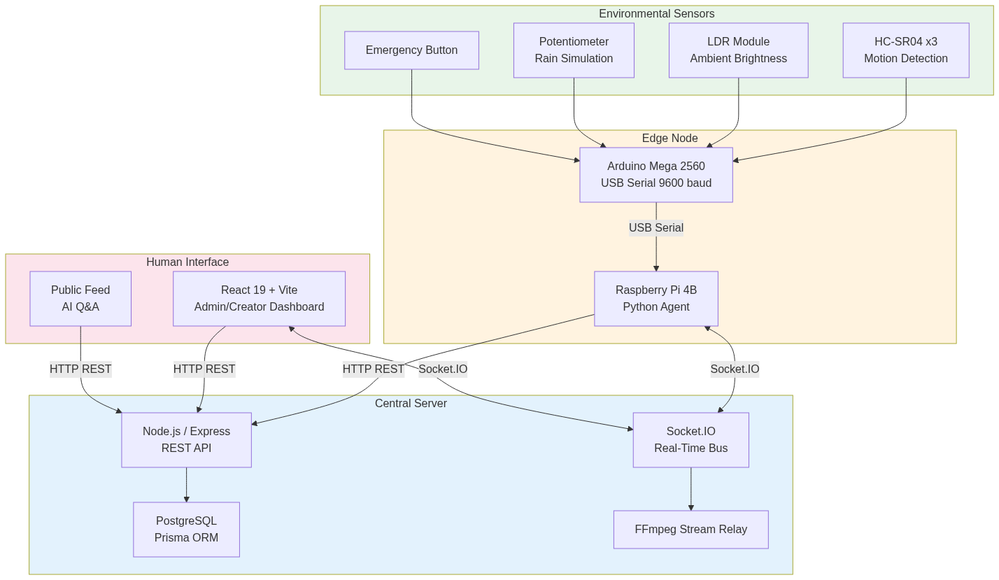
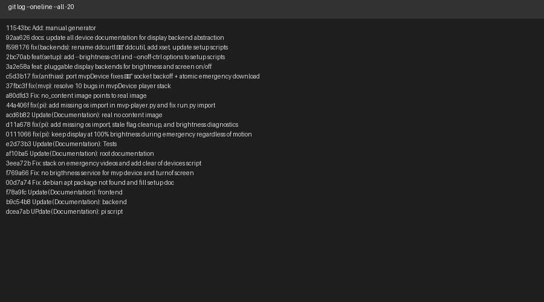

# Chapter 3

# Methodology

## Research Approach

We adopted an iterative prototyping methodology for this capstone
project, organized into four two-month phases over an eight-month
development cycle. This approach allowed us to build, test, and refine
each subsystem incrementally while maintaining a working prototype at
every stage.

- **Phase 1 - Requirements and Architecture (Months 1–2):** We conducted
  a comprehensive survey of existing digital signage platforms,
  identified seven critical research gaps documented in Chapter 2, and
  established the system requirements. We produced the high-level
  architecture diagram, selected the technology stack, and designed the
  database schema.

- **Phase 2 - Core Backend and Frontend (Months 3–4):** We implemented
  the Node.js backend with Express.js routing, Prisma ORM models, JWT
  authentication, and the Socket.IO real-time bus. In parallel, we built
  the React frontend with Vite, Zustand state management, and role-based
  routing. We established the Jest testing framework for the backend and
  the Playwright E2E framework for the frontend.

- **Phase 3 - Hardware Integration and Sensor Layer (Months 5–6):** We
  assembled the Arduino Mega 2560 sensor bridge with three HC-SR04
  ultrasonic sensors, an LDR module, a potentiometer, and an emergency
  push button. We flashed the Arduino firmware, established USB serial
  communication at 9600 baud to our Debian 13 laptops (simulating
  Raspberry Pi edge nodes), and implemented the brightness adaptation
  algorithm using the operating system’s display brightness API. We
  tested the emergency button trigger and verified end-to-end
  sensor-to-screen data flow.

- **Phase 4 - System Integration, Testing, and Documentation (Months
  7–8):** We integrated all subsystems - sensor layer, backend,
  frontend, and simulated edge nodes - into a unified prototype. We ran
  the full automated test suite (30+ backend tests, 25 frontend E2E
  tests), performed hardware verification, documented the network
  architecture, and produced this report.

- Our technology stack selections were driven by three criteria:
  open-source licensing (zero recurring cost), active community support
  (sustainable maintenance), and proven production use (reliability). We
  selected Node.js and React because both have large ecosystems,
  extensive documentation, and are widely used in production web
  applications. We selected PostgreSQL for its ACID compliance and
  relational data integrity. We selected Prisma for its type-safe
  database client and migration tooling. We selected Socket.IO for its
  reliable WebSocket abstraction with automatic fallback to HTTP
  long-polling.

## System Requirements

### Functional Requirements

We derived the functional requirements from the problem statement in
Section 1.2 and the research gaps in Table 2.3. Table 3.1 lists the
primary functional requirements and their priorities.

| ID | Requirement | Priority | Validation Method |
|----|----|----|----|
| FR-1 | The system shall sense ambient light, motion, and weather input via Arduino sensors | High | Hardware prototype; serial monitor verification |
| FR-2 | The system shall adapt display brightness based on ambient light using logarithmic mapping | High | Visual observation; brightness API readback |
| FR-3 | The system shall detect motion via three HC-SR04 sensors for occupancy-aware scheduling | High | Serial monitor; motion flag verification |
| FR-4 | The system shall provide role-based access control (admin, creator, viewer) with group scoping | High | Playwright E2E tests; route guard verification |
| FR-5 | The system shall manage digital content lifecycle (draft, publish, schedule, expire) | High | Backend CRUD tests; Playwright form submission tests |
| FR-6 | The system shall support two content designers (visual Fabric.js and textual Markdown + KaTeX) | Medium | Playwright designer workflow tests |
| FR-7 | The system shall distribute live streams (HLS, RTSP, YouTube, RTMP) at zero licensing cost | Medium | FFmpeg relay tests; stream playback verification |
| FR-8 | The system shall trigger emergency broadcast via hardware button and group-wide override | High | Physical button press test; Socket.IO event verification |
| FR-9 | The system shall prevent concurrent device control conflicts via control locks | Medium | Backend integration tests; priority ordering tests |
| FR-10 | The system shall support offline playback with 72-hour content cache | Medium | Simulated server disconnection test; cache verification |

Functional requirements.

### Non-Functional Requirements

| ID | Requirement | Target | Validation Method |
|----|----|----|----|
| NFR-1 | Sensor data latency (Arduino to Debian node) | \< 1 s | Serial monitor timestamp analysis |
| NFR-2 | Device command latency (server to node) | \< 2 s | Socket.IO ack timing logs |
| NFR-3 | Emergency broadcast latency (button to screen) | \< 3 s | Stopwatch measurement |
| NFR-4 | Backend API response time (p95) | \< 200 ms | Jest performance assertions |
| NFR-5 | Frontend initial page load time | \< 3 s | Lighthouse performance audit |
| NFR-6 | Offline resilience duration | 72 h | Simulated disconnection test |
| NFR-7 | Supported concurrent devices (design target) | 130 | Architecture validation; load testing |
| NFR-8 | Code test coverage (backend) | \> 70% | Jest coverage report |
| NFR-9 | Security vulnerability severity | Zero P0 (critical) | Security audit; penetration testing |
| NFR-10 | Data persistence reliability | ACID compliance | Prisma transaction tests; PostgreSQL WAL verification |

Non-functional requirements.

## High-Level Architecture

Our system follows a centralized client-server architecture with four
principal tiers: environmental sensing, edge processing, backend
services, and frontend presentation. Figure 3.1 illustrates the complete
system topology.

<figure>

<figcaption>
High-level system block diagram showing the end-to-end
data flow from sensors through Arduino, Debian edge node, Socket.IO,
Node.js backend, PostgreSQL database, and React
frontend.
</figcaption>
</figure>

<figure>

<figcaption>
Complete system topology showing 130+ Debian edge nodes,
central Ubuntu server with dual-NIC Layer 3 isolation, core and edge
switches, and campus subnet 10.20.0.0/22.
</figcaption>
</figure>

### End-to-End Data Flow

The data flow through our system follows a deterministic path from
physical sensing to screen rendering:

- **Sensing:** The Arduino Mega 2560 reads three HC-SR04 distance
  sensors, one LDR module, one potentiometer, and one emergency push
  button every 500 ms in a deterministic loop.

- **Transmission:** The Arduino formats the readings as a
  comma-separated text packet and transmits it over USB CDC serial at
  9600 baud to the Debian 13 laptop simulating the Raspberry Pi edge
  node.

- **Edge Processing:** The Debian node parses the serial packet, applies
  the Weber-Fechner logarithmic brightness mapping, and adjusts the
  laptop screen brightness via the operating system’s display brightness
  API. It also evaluates the motion flag and emergency state.

- **Server Communication:** The Debian node connects to the central
  Node.js backend via Socket.IO, authenticating with a 64-character hex
  device token. It emits heartbeats every 10 seconds and receives
  commands (publish, hide, next, emergency mode) from the server.

- **Content Synchronization:** The Debian node polls the server every 60
  seconds for new signage deployments, downloading only changed assets.
  For our Anthias-simulated node, content is managed locally; for the
  MPV-simulated node, files are cached in `~/signage_media/`.

- **Backend Processing:** The Node.js backend handles HTTP REST API
  requests from the React frontend, manages the PostgreSQL database
  through Prisma ORM, processes uploaded media with Sharp and FFmpeg,
  relays live streams, and coordinates emergency broadcasts via
  Socket.IO room broadcasting.

- **Frontend Presentation:** The React frontend renders role-appropriate
  dashboards. Administrators manage devices, groups, and users. Creators
  design content and publish signage. Viewers browse the public feed and
  interact with the AI Q&A widget.

- **Display Rendering:** The Debian node renders scheduled content on
  its screen via Anthias (web-based, supporting HTML overlays) or MPV
  (native, fast boot, supporting hardware decode).

### Component Count and Scale

Our campus-scale design targets 130 nodes distributed across 20
buildings and 10 open areas, served by a single Ubuntu server with
dual-NIC Layer 3 isolation. Table 3.3 summarizes the component
inventory.

| Component | Quantity per Node | Campus Total | Notes |
|----|----|----|----|
| Debian edge node (simulated Pi) | 1 | 130 | Laptops or Raspberry Pi 4B in production |
| Arduino Mega 2560 | 1 | 130 | One per display node |
| HC-SR04 ultrasonic sensor | 3 | 390 | Motion/proximity detection |
| LDR module | 1 | 130 | Ambient light sensing |
| Potentiometer | 1 | 130 | Simulated weather input |
| Emergency push button | 1 | 130 | Hardware emergency trigger |
| Commercial display (32”–55”) | 1 | 130 | Samsung QB-series or equivalent |
| Core network switch | \- | 2 | Redundant core layer |
| Edge network switch | \- | 10 | One per building cluster |
| Central server | \- | 1 | Dual-NIC Ubuntu 22.04 LTS |

Campus-wide component inventory.

Our prototype validated the architecture at reduced scale: two Debian 13
laptops (one running Anthias simulation, one running MPV simulation),
one Arduino Mega 2560 sensor bridge, one central development server (a
laptop running Node.js, PostgreSQL, and nginx), and the laptop screens
serving as the display outputs.

## Development and Testing Methodology

### Iterative Development Process

We followed a two-week sprint cycle with the following rhythm:

- **Week 1:** Feature development. Each sprint focused on one subsystem
  (e.g., authentication, media processing, sensor integration).

- **Weekend:** Internal code review. All three group members reviewed
  pull requests, focusing on correctness, test coverage, and
  documentation.

- **Week 2:** Testing and refinement. We wrote unit and integration
  tests for new features, fixed bugs discovered during review, and
  updated the sprint backlog.

We maintained the project in a single Git monorepo with Conventional
Commits for structured commit messages (`feat:`, `fix:`, `docs:`,
`test:`, `refactor:`). This practice enabled us to generate changelogs
automatically and trace every code change to its functional purpose.

### Testing Strategy

Our testing strategy employed three complementary approaches:

- **Backend Integration Testing:** We used Jest with Supertest against
  an isolated PostgreSQL test database (`signage_test`). Each test runs
  against a real Express server instance with database transactions
  rolled back after each test to ensure isolation. We wrote 30+ tests
  covering authentication, CRUD operations, media upload, deployment
  scheduling, Socket.IO device lifecycle, emergency state changes, and
  control lock priority logic.

- **Frontend End-to-End Testing:** We used Playwright with real browser
  automation in Chromium. Our test suite comprises 25 tests across two
  modes: API-only (`request` mode) for fast direct backend validation on
  port 5001, and full browser UI (`page` mode) for end-to-end form
  submission, navigation, and DOM verification. The tests produced 55
  screenshots at 1920 × 1080 resolution, documenting every major UI
  feature.

- **Hardware Verification:** We used a structured checklist covering all
  nine assembly steps, Arduino pin continuity verification, serial
  communication confirmation at 9600 baud, and end-to-end brightness
  adaptation observation. We did not use a multimeter or watt meter; all
  power specifications were derived from component datasheets.

### Development Tooling

We standardized our development environment across all three group
members using the following toolchain:

- **Version control:** Git monorepo with Conventional Commits

- **Code quality:** ESLint for JavaScript/TypeScript linting, Prettier
  for code formatting

- **Database:** Prisma schema migrations for version-controlled database
  evolution

- **Testing:** Jest (backend), Playwright (frontend), with coverage
  thresholds

- **Documentation:** Markdown in `Documents/specializedAnalysis/`
  folders, one-way dependency from detailed descriptions to the final
  outline

- **Build:** Vite for frontend bundling, native Node.js for backend
  execution

<figure>

<figcaption>
Terminal capture of the Git log showing the last 20
commits with Conventional Commit prefixes (feat, fix, docs, test,
refactor), demonstrating our structured commit history over the
development period.
</figcaption>
</figure>

**Fig. 3.2** Terminal capture of the Git log showing the last 20 commits
with Conventional Commit prefixes (feat, fix, docs, test, refactor),
demonstrating our structured commit history over the development period.
