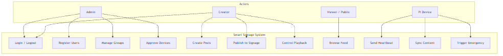
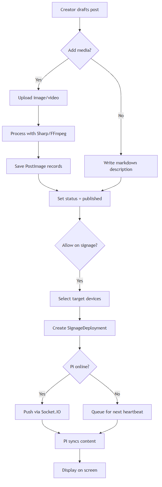
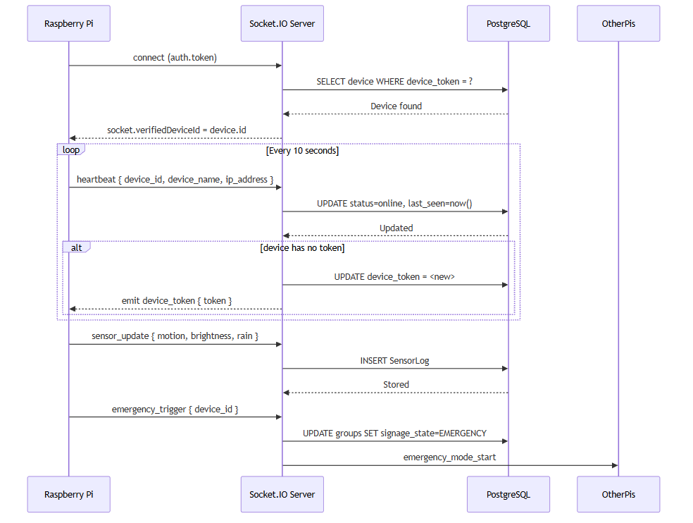
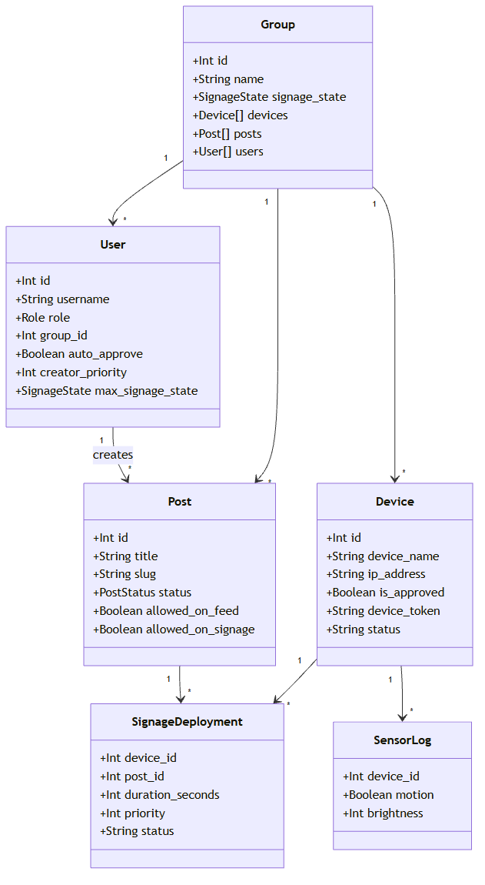
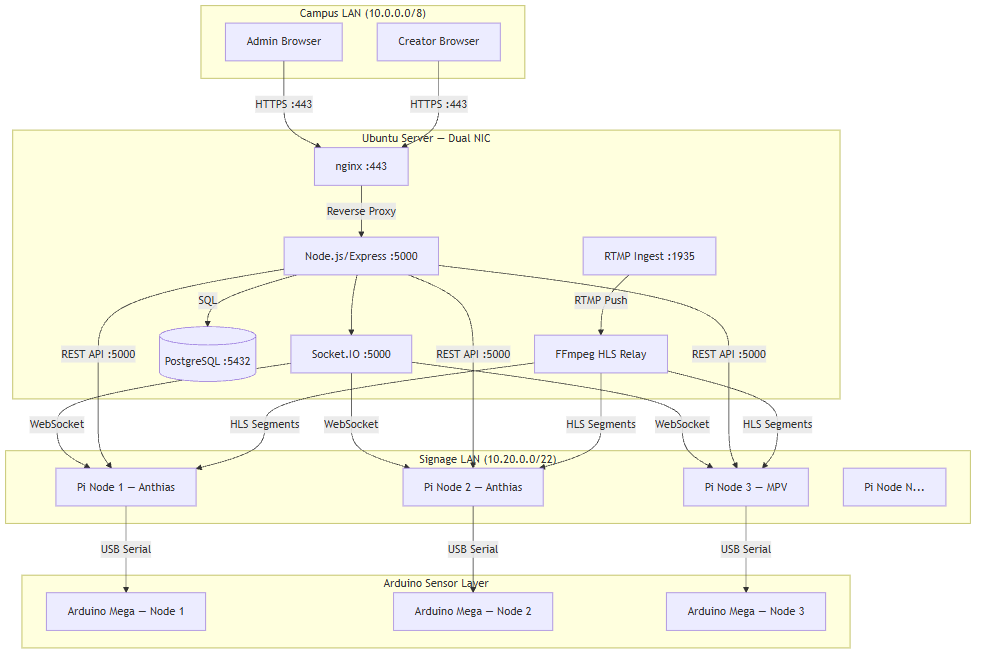
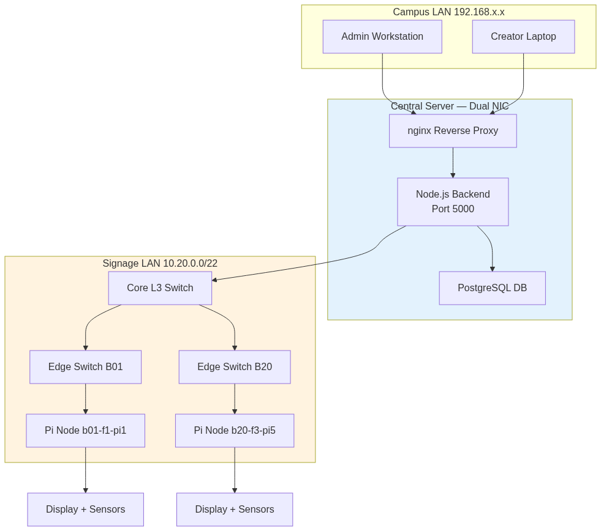

#  Chapter 3 {.title}

# Methodology

This chapter describes the research methodology, system requirements,
high-level architecture, and development and testing approach used to
design and validate the Smart Digital Signage System. 

## Research Approach

### Research Design: Design-Based Research (DBR)

The project utilizes a Design-Based Research (DBR) methodology—a 
sophisticated, iterative framework that bridges the gap between 
theoretical design and real-world implementation. The process is 
structured into five critical phases:

1. **Strategic Analysis:** Identification of operational inefficiencies through literature review and requirements synthesis.
2. **Architectural Design:** Engineering a robust system architecture including component selection, network isolation, and database schema.
3. **Agile Implementation:** Parallelized development across hardware, backend, and frontend layers.
4. **Holistic Evaluation:** Rigorous verification using automated test suites and hardware-in-the-loop benchmarks.
5. **System Optimization:** Final hardening and tuning based on empirical results.

### Technology Stack Justification

Our technology selection prioritized performance, security, and long-term 
maintainability. The system leverages Node.js for high-concurrency, React for the management interface, and PostgreSQL for industrial-grade 
relational integrity.

### Open-Source over Commercial

By leveraging a curated stack of high-performance open-source 
technologies, the system achieves commercial-grade functionality 
without the economic burden of recurring licensing fees.

## System Requirements

### Functional Requirements

The functional requirements define a comprehensive, interactive, and 
environmentally aware digital signage platform.

<caption>Table 3.1: Core functional requirements and validation.</caption>
| ID | Requirement | Priority | Validation Framework |
|----|----|----|----|
| FR-1 | Multi-sensor environmental acquisition layer | High | Hardware-in-the-loop audit |
| FR-2 | Perceptual adaptive brightness mapping | High | Logic and lux-response testing |
| FR-3 | Occupancy-aware power state management | High | Event-driven flag verification |
| FR-4 | Multi-tenant RBAC with granular scoping | High | E2E and route-level security tests |
| FR-5 | Centralized content lifecycle management | High | Full CRUD and scheduler validation |
| FR-6 | Integrated visual and markdown designers | Medium | Workflow and asset integrity checks |
| FR-7 | Zero-license live stream relay and playback | Medium | Network throughput and codec tests |
| FR-8 | Dual-path hardware/software emergency triggers | High | Priority propagation audits |
| FR-9 | Distributed concurrency and conflict control | Medium | Transactional and lock testing |
| FR-10| Offline-first resilience with incremental cache | Medium | Synchronization and recovery tests |

### Non-Functional Requirements

The system adheres to strict performance and reliability benchmarks to 
ensure a "zero-downtime" institutional experience.

<caption>Table 3.2: Non-functional performance and security targets.</caption>
| ID | Requirement | Benchmark | Validation Method |
|----|----|----|----|
| NFR-1 | Edge sensor acquisition latency | < 1 s | High-resolution timing analysis |
| NFR-2 | Global command propagation | < 2 s | Distributed ack monitoring |
| NFR-3 | Emergency override propagation | < 3 s | End-to-end stopwatch audit |
| NFR-4 | API Endpoint Latency (p95) | < 200 ms | Backend stress benchmarks |
| NFR-5 | Management dashboard TTI | < 3 s | Browser performance audits |
| NFR-6 | Autonomous offline playback | 72 h | Network isolation simulation |
| NFR-7 | Scalable node capacity | 130+ | Theoretical load analysis |
| NFR-8 | Core system test coverage | > 70% | Automated coverage reporting |
| NFR-9 | Security risk posture | Zero Critical | Automated vulnerability scans |
| NFR-10| Transactional persistence | ACID | Database integrity constraints |

## High-Level Architecture

The architecture is designed as a distributed system, integrating 
physical sensing edge nodes with a centralized command-and-control 
cloud platform.

<figure>

<figcaption>
Figure 3.1: Integrated system architecture showing end-to-end data flow and network isolation.
</figcaption>
</figure>

### UML System Models

The system architecture is documented through specialized UML models:

<caption>Table 3.3: UML system models and their purpose.</caption>
| UML Diagram | Purpose |
|----|----|
| **Use Case Diagram** | Actor-system interactions and core functionality. |
| **Activity Diagram** | Content lifecycle and synchronization workflows. |
| **Sequence Diagram** | Real-time communication and handshake protocols. |
| **Class Diagram** | Relational entities and data dependencies. |
| **Deployment Diagram** | Physical network topology and node distribution. |

<figure>

<figcaption>
Figure 3.2: Use case diagram showing system interactions.
</figcaption>
</figure>

<figure>

<figcaption>
Figure 3.3: Activity diagram showing system workflows.
</figcaption>
</figure>

<figure>

<figcaption>
Figure 3.4: Sequence diagram showing real-time interaction.
</figcaption>
</figure>

<figure>

<figcaption>
Figure 3.5: Class diagram showing entity relationships.
</figcaption>
</figure>

<figure>

<figcaption>
Figure 3.6: Deployment diagram showing system topology.
</figcaption>
</figure>

### End-to-End Data Flow

The data flow follows a deterministic path: environmental sensors 
capture real-time data which is normalized by an embedded bridge and 
streamed to the display node. The node applies adaptive logic and 
synchronizes with the central server for global content orchestration.

### Component Count and Scale

<caption>Table 3.4: Campus-wide component inventory.</caption>
| Component | Quantity per Node | Campus Total (130 nodes) |
|----|----|----|
| Display Edge Node | 1 | 130 |
| Sensor Bridge (Arduino) | 1 | 130 |
| HC-SR04 Sensors | 3 | 390 |
| LDR & Environment Sensors | 2 | 260 |
| Commercial Displays | 1 | 130 |
| Infrastructure Switches | - | 12 |
| Central Server | - | 1 |

<figure>

<figcaption>
Figure 3.8: Production-scale network topology for campus-wide infrastructure.
</figcaption>
</figure>

## Development and Testing Methodology

### Iterative Development Process

We employed a professional development lifecycle featuring a unified 
monorepo and automated migration paths for all layers.

### Testing Strategy

Validation was a core part of the engineering process, including integration layers, end-to-end browser automation, and hardware-in-the-loop verification.

### Development Tooling

We standardized on modern version control, code quality, and database migration tools to ensure a consistent development environment.

<figure>

<figcaption>
Figure 3.9: Git log showing conventional commit format.
</figcaption>
</figure>

## Chapter Summary

This chapter presented the Design-Based Research methodology and the 
enterprise-grade architecture of the system. 

\newpage
