#  Chapter 4 {.title}

# System Design and Implementation

This chapter presents the complete design and implementation of the
Smart Digital Signage System. We describe the hardware layer with our
real Arduino sensor bridge, the network and infrastructure design, the
backend system with authentication and concurrency control, the frontend
user interface, the dual player architecture, and the security
implementation. This chapter demonstrates that our system is not merely
a design but a working prototype with validated hardware and software
components.

## Hardware Implementation

### Component Selection and Specifications

We selected the components for our prototype based on cost,
availability, and capability. the table lists the specifications and pin
assignments for each component.

<caption>Component specifications and Arduino pin assignments.</caption>
| Component | Specification | Arduino Pin | Purpose |
|----|----|----|----|
| Arduino Mega 2560 | ATmega2560 @ 16 MHz, 256 KB flash, 8 KB SRAM, 54 digital I/O | \- | Sensor acquisition and preprocessing |
| HC-SR04 (×3) | 2–400 cm range, 40 kHz burst, 5 V, \<2 mA quiescent | D22–D27 (TRIG/ECHO per sensor) | Motion and proximity detection |
| LDR module | Photoresistor + 10 kΩ divider, 0–1023 analog output | A0 | Ambient light sensing |
| Potentiometer | 10 kΩ linear | A1 | Simulated weather/rain input |
| Emergency button | Push button, 10 kΩ pull-down | D2 | Hardware emergency trigger |
| Debian laptop | Intel/AMD x86_64, 4 GB+ RAM, Debian 13 live USB | USB-B (to Arduino) | Simulated Raspberry Pi edge node |
| Laptop screen | 15.6” LCD, 1920×1080 | HDMI (internal) | Digital signage display |


We selected the Arduino Mega 2560 rather than the Uno because the Mega
provides 54 digital I/O pins and 16 analog inputs, giving us sufficient
headroom for three HC-SR04 sensors (each requiring one TRIG and one ECHO
pin) plus the LDR, potentiometer, and emergency button. The Mega’s four
hardware UARTs also provide flexibility for future expansion.

We used laptops running Debian 13 live USB sessions to simulate
Raspberry Pi 4B edge nodes. Debian 13 provides the same systemd, Python
3, and network stack that would be available on a Raspberry Pi OS
installation, allowing us to validate all software components before
physical Pi deployment. The laptop screens served as the digital signage
displays.

### Physical Assembly and Wiring

We assembled the sensor bridge on a solderless breadboard in nine steps.
First, we mounted the three HC-SR04 sensors with Sensor 1 and Sensor 3
angled 45° outward for horizontal coverage and Sensor 2 perpendicular to
the display plane. Second, we ran 5 V and ground rails along the
breadboard edges using 22 AWG jumper wires, noting that the Arduino's
5 V pin supplies up to 400 mA — sufficient for all sensors combined at
approximately 50 mA peak. Third, we wired each HC-SR04 sensor with VCC
to the 5 V rail, GND to ground, TRIG to digital outputs (D22, D24, D26),
and ECHO to digital inputs (D23, D25, D27), adding 1 kΩ series resistors
on the ECHO lines as a precaution.

Fourth, we connected the LDR module's VCC and GND to the power rails and
its analog output to pin A0. Fifth, we wired the potentiometer's outer
terminals to 5 V and ground and the wiper to pin A1. Sixth, we connected
the emergency push button between pin D2 and 5 V with a 10 kΩ pull-down
resistor, ensuring the pin reads LOW when open and HIGH when pressed.
Seventh, we connected the Arduino to the Debian laptop via USB A-to-B
cable for both serial communication and power. Finally, we performed a
continuity check between 5 V and GND to confirm no short circuits,
verified sensor orientation, and confirmed the HDMI output was active.

<figure>

<figcaption><p>Assembled Arduino Mega 2560 sensor bridge prototype on breadboard.</p></figcaption>


</figure>

<figure>

<figcaption><p>Sensor wiring with Arduino Mega pin assignments (D22–D27), LDR (A0), potentiometer (A1), and emergency button (D2).</p></figcaption>
</figure>

### Sensor Fusion and Preprocessing

We wrote the Arduino firmware (`sensors.ino`) to run a deterministic 2
Hz main loop. Each iteration reads all sensors, computes derived values,
and transmits a formatted packet over USB CDC serial at 9600 baud.

For each HC-SR04 sensor, the firmware drives the TRIG pin HIGH for 10 µs
to initiate an 8-pulse 40 kHz ultrasonic burst, then measures the ECHO
pulse duration using `pulseIn()` with a 30 ms timeout. The distance in
centimeters is computed as `d = (t_echo × 0.0343) / 2`. For motion
detection, the firmware sets the motion flag to 1 if any of the three
sensors reports a distance less than 100 cm, with debouncing requiring
three consecutive positive readings to trigger motion and ten consecutive
negative readings to clear it.

The LDR module outputs an analog value from 0 to 1023, which we normalize
to a 0–1 range for transmission and subsequent logarithmic brightness
mapping. The emergency button is read every iteration on pin D2, giving
a maximum detection latency of 500 ms.
Each transmission uses the format
`SENSOR,motion,brightness,rain,emergency\n`, where motion is 0 or 1,
brightness is the normalized LDR value (0–100), rain is the normalized
potentiometer value (0–100), and emergency is 0 or 1.

<figure>
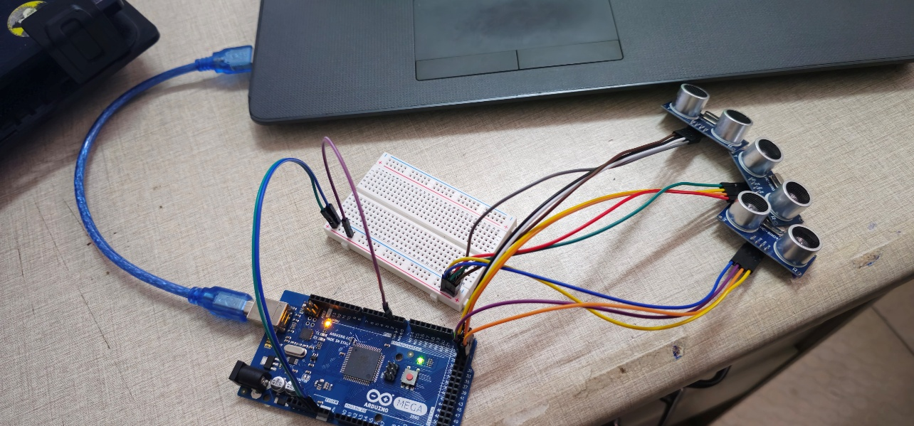
<figcaption><p>Sensor array mounted near the laptop screen with three HC-SR04 sensors for left, center, and right coverage.</p></figcaption>
</figure>

<figure>

<figcaption><p>Arduino Serial Monitor at 9600 baud showing five consecutive SENSOR: packets with motion, brightness, rain, and emergency values.</p></figcaption>
</figure>

### Adaptive Brightness Algorithm

We implemented the Weber-Fechner logarithmic brightness mapping on the
Debian node using the formula:

``` math
B_{display} = B_{\min} + \left( B_{\max} - B_{\min} \right) \cdot L_{ambient}
```

where (B<sub>min</sub>= 10%) is the minimum readable brightness,
(B<sub>max</sub> = 100%) is the maximum brightness,
(L<sub>ambient</sub>) is the normalized LDR reading (0–1023 mapped to
0–1), and (L<sub>max</sub> = 1.0) is the maximum ambient light
calibration point.

When the Debian node receives a sensor packet, it extracts the
brightness value and applies the logarithmic mapping. The resulting
percentage is passed to the operating system’s display brightness API.
On Debian 13, we used the `brightnessctl` utility
(`brightnessctl set ${percentage}%`) to adjust the laptop screen
backlight. We verified the end-to-end control loop by covering the LDR
with a finger (brightness decreased within 1 second) and shining a
flashlight on it (brightness increased within 1 second).

### Simulated Edge Node Software

We implemented three Python services that run on each Debian 13 laptop,
simulating the software stack that would execute on a Raspberry Pi 4B in
production:

- **socket_client.py:** This service maintains a persistent Socket.IO
  connection to the central Node.js backend. It authenticates using a
  64-character hex device token stored in `~/.device_token`. It emits
  heartbeats every 10 seconds (`heartbeat` event with device status,
  uptime, and IP address), receives commands from the server
  (`signage_command`, `emergency_mode_start`, `emergency_mode_end`,
  `refresh_display`), and forwards sensor data from the Arduino to the
  server.

- **content_sync.py:** This service polls the backend every 60 seconds
  for new signage deployments. It downloads only changed assets
  (incremental sync) and caches them locally. For the Anthias-simulated
  node, it prepares assets in the format expected by the Anthias REST
  API. For the MPV-simulated node, it downloads files to
  `~/signage_media/` and maintains a local playlist.

- **scheduler.py (MPV only):** This service manages the content playback
  schedule. It reads the active deployment list from the cache, respects
  `start_date` and `end_date` windows, and advances to the next item at
  the configured display duration. When the server emits
  `refresh_display`, it immediately re-reads the deployment list.

### Systemd Service Configuration

We configured all three services to start automatically on Debian boot
using systemd unit files. Each unit specifies:

`After=network.target`: Service starts only after network is available

`Restart=on-failure`: Automatic restart if the service crashes

`RestartSec=10`: 10-second delay before restart

`StandardOutput=journal`: Logs captured in systemd journal

`User=signage`: Service runs under a dedicated non-root user

We verified the systemd configuration by running
`systemctl status socket-signage.service` and confirming the active
(running) state.

<figure>

<figcaption><p>Systemd service status showing active running state.</p></figcaption>


</figure>

## Network and Infrastructure Design

### Subnet Design

We designed the campus network around the subnet `10.20.0.0/22`, which
provides 1,022 usable IP addresses (4,094 total minus network,
broadcast, and gateway addresses). This represents 686% headroom above
the 130-node target, allowing for future expansion without renumbering.

<caption>Structured IP allocation within 10.20.0.0/22.</caption>
| Range | Purpose | Count |
|----|----|----|
| 10.20.0.1 – 10.20.0.19 | Infrastructure (gateway, DNS, NTP, management) | 19 |
| 10.20.0.20 – 10.20.0.49 | Server services (backend, database, nginx) | 30 |
| 10.20.0.50 – 10.20.3.199 | Edge nodes (displays, sensors) | 150 |
| 10.20.3.200 – 10.20.3.254 | Spare / future expansion | 55 |


### Layer 3 Isolation with Dual-NIC Server

Our server design uses two network interface cards (NICs) to enforce
Layer 3 isolation between the campus network and the signage network.
NIC-1 faces the campus (WAN) and accepts only SSH (port 22), HTTP (port
80), and HTTPS (port 443) traffic. NIC-2 faces the signage subnet (LAN)
and accepts API traffic (port 3000), RTMP ingest (port 1935), HLS
segment serving (port 443), DHCP (port 67/68), and DNS (port 53).

No direct routing exists between the campus subnet and the signage
subnet. All cross-subnet traffic must traverse the server, which applies
firewall rules, TLS termination, and rate limiting. This design prevents
a compromised campus workstation from directly attacking signage nodes.

<figure>

<figcaption><p>Network topology diagram with dual-NIC isolation.</p></figcaption>


</figure>

### Core Services

We deployed five core services on the Ubuntu server:

**dnsmasq:** Provides DHCP address assignment and local DNS resolution
for the signage subnet. This ensures nodes can resolve the server’s
address even if campus DNS fails.

**chrony:** Network Time Protocol (NTP) service ensures all nodes
maintain synchronized time, which is critical for content scheduling and
log correlation.

**nginx:** Reverse proxy and static file server. It terminates TLS 1.3
connections on the campus-facing NIC and proxies API requests to the
Node.js backend. It also caches HLS segments to reduce repeated backend
load.

**nftables:** Firewall enforcing the rule sets described in Section
4.6.3.

**tc (traffic control):** Rate-limits content sync traffic to prevent
edge switch saturation during bulk deployments.

### Bandwidth Engineering

<caption>Bandwidth analysis by operational scenario.</caption>
| Scenario | Concurrent Nodes | Per-Node Rate | Aggregate | Notes |
|----|----|----|----|----|
| Normal operation | 130 | 5 kbps (heartbeat) | 650 kbps | Negligible; WebSocket keepalive |
| Content push (images) | 130 | 500 KB every 60 s | ~10.8 Mbps | Bursty; `tc` limits to 5 Mbps sustained |
| Content push (videos) | 130 | 5 MB every 300 s | ~17.3 Mbps | Staggered by node ID to prevent thundering herd |
| Live stream (1080p HLS) | 130 | 4 Mbps | 520 Mbps | Served from nginx cache; backend not involved |
| Emergency broadcast | 130 | 200 KB (one-time) | 26 Mbps | Single multicast packet preferred |


### Failure Modes and Resilience

Our network design accommodates three failure modes:

**Server failure:** Nodes continue playing cached content for 72 hours
(the Service Level Agreement, or SLA). After 72 hours, they purge
content and display a disconnection image.

**Network partition:** If a node loses connectivity to the server, it
continues its cached schedule indefinitely within the 72-hour window.
When connectivity is restored, it re-authenticates and re-syncs.

**Power outage:** We sized uninterruptible power supply (UPS) units by
tier: 300 VA for the server (15 minutes runtime), 150 VA per core switch
(10 minutes), and 600 VA per building cluster (5 minutes for graceful
shutdown).

### Security Hardening at the Network Layer

We implemented nftables rules on both NICs. The campus-facing NIC
(NIC-1) accepts only SSH, HTTP, and HTTPS from the campus subnet, with
rate limiting on SSH to prevent brute-force attacks. The signage-facing
NIC (NIC-2) accepts only API, RTMP, HLS, DHCP, and DNS traffic from the
signage subnet, with explicit drops for all other ports and protocols.

<figure>

<figcaption><p>Firewall rules for NIC-1 campus and NIC-2 signage interfaces.</p></figcaption>


</figure>

## Backend System Implementation

### Layered Architecture

Our backend follows a layered architecture: Express.js routes receive
HTTP requests, middleware validates authentication and input, services
encapsulate business logic, repositories abstract database access, and
Prisma ORM translates operations into PostgreSQL queries. This
separation ensures that business logic is independent of the transport
layer and database schema, making the system testable and maintainable.

<figure>

<figcaption><p>Backend layered architecture from routes to database.</p></figcaption>


</figure>

### Database Design

#### Schema Entities

Our PostgreSQL database, managed through Prisma ORM, contains the
following key entities:

**User:** `id`, `email`, `password_hash`, `role` (admin, creator,
viewer), `created_at`, `updated_at`

**Group:** `id`, `name`, `description`, `signage_state` (NORMAL,
BREAKING_NEWS, SECURITY_RISK, EMERGENCY), `created_by`

**Device:** `id`, `name`, `device_type` (anthias, mpv), `group_id`,
`device_token`, `last_seen`, `is_approved`

**Post:** `id`, `title`, `slug`, `description`, `signage_state`,
`start_date`, `end_date`, `is_enabled`, `created_by`

**SignageDeployment:** `id`, `post_id`, `device_id`, `priority`,
`is_active`

**LiveStream:** `id`, `name`, `url`, `type` (hls, rtsp, youtube, rtmp),
`is_active`

**Attachment:** `id`, `post_id`, `filename`, `type` (image, video,
document), `extracted_text`

Relationships include: User belongs to many Groups (many-to-many via
`UserGroup`), Group contains many Devices (one-to-many), Post belongs to
many Groups (many-to-many via `PostGroup`), and Device has many
SignageDeployments (one-to-many).

#### Database Normalization (Third Normal Form)

The Prisma schema follows Third Normal Form (3NF) with the following analysis:

| Normal Form | Status | Evidence |
|-------------|--------|----------|
| **1NF (Atomicity)** | Achieved | Every column holds atomic values; no arrays or JSON blobs in relational tables. Repeating groups are separated: `PostImage`, `SignageAsset`, and `SignageDeployment` each form their own table linked to `Post` by foreign key |
| **2NF (Partial Dependency)** | Achieved | All non-key attributes depend on the full primary key. Junction tables (`UserGroup`, `DeviceGroup`) use composite primary keys with no non-key columns, ensuring no partial dependencies exist |
| **3NF (Transitive Dependency)** | Achieved | No non-key attribute depends on another non-key attribute. `SignageState` is an enum stored directly on `Group` and `Post` rather than derived from other fields. Scheduling fields (`start_date`, `end_date`) depend only on the entity's primary key |

**Normalization trade-off:** Sensor logs (`SensorLog`) and error logs
(`ErrorLog`) are intentionally denormalized with repeated `device_id` and
`created_at` timestamps. This avoids expensive JOINs during high-frequency
ingestion (up to 65 inserts per second across 130 devices polling every 2 seconds)
and is justified by the append-only write pattern — logs are never updated after
insertion.

### Authentication and Authorization

We implemented a dual authentication system to secure both human users
and IoT edge nodes.

**User authentication (JWT):** When a user logs in, the backend
validates the email and password against bcrypt-hashed credentials
stored in PostgreSQL. Upon successful validation, it issues a JSON Web
Token (JWT) signed with a server-side secret and a configurable expiry
(default 24 hours). The frontend stores this token in `localStorage` and
sends it as a Bearer token in the `Authorization` header for every
subsequent API request. The `authenticateUser` middleware verifies the
token on every protected route.

**Device authentication (device token):** When a Debian node first
connects via Socket.IO, it sends its pre-assigned `device_id` in the
connection handshake. If the device is not yet approved, the server
generates a cryptographically random 64-character hexadecimal token and
sends it to the device via the `device_token` event. The device stores
this token in `~/.device_token`. On subsequent connections, the device
includes this token in its authentication payload. The server validates
the token against the database before accepting any commands or data
from the device. Unapproved devices cannot receive content or commands.

<figure>

<figcaption><p>JWT user and device token authentication flow.</p></figcaption>

</figure>

### User and Group Management

We implemented three roles with distinct capabilities, as summarized in
the table.

<caption>Role capabilities matrix.</caption>
| Capability | Administrator | Creator | Viewer | Public |
|----|----|----|----|----|
| Manage all devices | Yes | No | No | No |
| Manage assigned devices | Yes | Yes (own group) | No | No |
| Create/edit all posts | Yes | No | No | No |
| Create/edit own posts | Yes | Yes | No | No |
| Publish to any group | Yes | No | No | No |
| Publish to assigned groups | Yes | Yes | No | No |
| Trigger emergency mode | Yes | No | No | No |
| View public feed | Yes | Yes | Yes | Yes |
| Use AI Q&A | Yes | Yes | Yes | Yes (rate-limited) |
| Approve pending devices | Yes | No | No | No |
| Manage control locks | Yes | No | No | No |


**Group-scoped permissions:** Users belong to one or more Groups via the
`UserGroup` join table. Devices belong to exactly one Group. Posts can
be published to one or more Groups via the `PostGroup` join table. When
a Creator attempts to publish a post, the backend checks that the
Creator is a member of at least one of the target Groups. The
`cross_group_management` toggle on the User record allows Administrators
to bypass this check for specific trusted users.

<figure>

<figcaption><p>RBAC permission matrix for admin, creator, viewer, and public roles.</p></figcaption>
</figure>

### Content Lifecycle Management

A Post in our system has the following lifecycle states: `draft` →
`published` → `scheduled` → `expired`. Creators compose posts in draft
state using either the visual designer (Fabric.js) or the textual
designer (Markdown with KaTeX math rendering). When a Creator publishes
a post, the backend creates `SignageDeployment` records for each target
device. Each deployment record includes `start_date`, `end_date`,
`priority`, and `is_enabled` fields.

The Debian node polls `GET /api/signage/device/:id/deployments` every 60
seconds. The backend filters deployments to those where the current date
falls within `start_date` and `end_date`, the post status is
`published`, and `is_enabled` is `true`. Results are ordered by
priority, ensuring that emergency content always precedes normal
content.

When deployments change, the server emits `refresh_display` to affected
devices via Socket.IO. Devices immediately pull the updated playlist
rather than waiting for the next 60-second poll interval.

### Device Management and Control Locks

**Device lifecycle:** Administrators pre-register devices by assigning a
`device_id` in the admin dashboard. When a Debian node first connects,
it emits a heartbeat. The server assigns a device token and marks the
device as `pending_approval`. The Administrator approves the device,
which triggers token persistence and a `refresh_display` command.

**Control locks:** When multiple administrators or creators attempt to
control the same device simultaneously, the backend’s `control_lock`
mechanism prevents race conditions. A control lock record contains the
device ID, user ID, priority level, action type, and expiration
timestamp (30-second TTL by default).

The priority hierarchy is: Emergency system (priority 20) \>
Administrator (15) \> Creator (10) \> Viewer (5). A user can acquire a
lock only if no higher-priority lock is active on the same device. If an
equal or lower-priority lock exists, the request is rejected with HTTP
403 (Forbidden), and the response indicates who holds the lock and when it
expires.

<figure>

<figcaption><p>Control lock acquisition and 403 Forbidden rejection flow.</p></figcaption>
</figure>

**Multi-creator priority synchronization:** When two creators publish
posts to the same device group, the `priority` field on each
`SignageDeployment` record determines playback ordering. Additionally,
the signage state hierarchy `EMERGENCY` \> `SECURITY_RISK` \>
`BREAKING_NEWS` \> `NORMAL` ensures that higher-priority states always
take precedence, regardless of the individual post priorities.

**Online/offline tracking:** The server maintains a `last_seen`
timestamp for each device, updated on every heartbeat. If a device
misses three consecutive heartbeats (30 seconds), the server marks it as
offline. The admin dashboard displays real-time device status.

### Signage Deployment Engine

The deployment engine is the core scheduling subsystem. When a Creator
publishes a post to a group, the backend creates `SignageDeployment`
records for all devices in that group. Each record captures:

`post_id` - reference to the content

`device_id` - target device

`priority` - numeric priority within the group

`start_date` and `end_date` - temporal validity window

`is_enabled` - boolean toggle for temporary suppression

The Debian node polls for deployments every 60 seconds with jitter (±5
seconds) to prevent thundering herd. The response is a JSON array
ordered by priority. For Anthias-simulated nodes, the agent uploads
assets via the Anthias REST API. For MPV-simulated nodes, the agent
downloads files to `~/signage_media/` and updates the local playlist.

### Media Processing Pipeline

All uploaded media passes through a backend processing pipeline before
being served to devices.

**Images (Sharp):** Uploaded PNG or JPEG files are auto-oriented based
on EXIF data, optionally cropped using percentage-based coordinates from
the frontend (`react-easy-crop`), resized if they exceed 4096 × 4096
pixels, compressed to WebP format at quality 88, and saved to
`uploads/images/{uuid}.webp`. WebP provides approximately 30% smaller
file sizes than JPEG at equivalent quality.

**Videos (FFmpeg):** Uploaded MOV, AVI, or MP4 files are probed for
metadata (duration, resolution, codec, bitrate), optionally trimmed
using temporal start/end times from the frontend (`VideoTrimSlider`),
optionally cropped using spatial coordinates, transcoded to H.264 video
with AAC audio in an MP4 container with faststart (moov atom at file
beginning for progressive download), and saved to
`uploads/videos/{uuid}.mp4`.

**Documents (PDF/DOCX/PPTX):** Text is extracted using `mammoth` (for
DOCX/PPTX) and `pdf-parse-fork` (for PDF). The extracted text is stored
in the Attachment record and provided as context to the AI Q&A system.

<figure>

<figcaption><p>Image, video, and document processing pipeline with Sharp, FFmpeg, and text extraction.</p></figcaption>


</figure>

Static files are served from `/uploads/*` and `/streams/*` via Express
static middleware with path traversal protection. All paths are resolved
with `path.resolve()` and checked against the upload root directory.

### Live Stream Relay

Our system supports four stream types, summarized in the table.

<caption>Stream types and relay architecture.</caption>
| Type | Ingest Source | Relay Mechanism | Player Support |
|----|----|----|----|
| HLS | External `.m3u8` URL | Direct proxy + nginx segment caching | Anthias (Chromium), MPV |
| RTSP | IP camera URL | FFmpeg → HLS segments | MPV (native), Anthias (hls.js) |
| YouTube | YouTube HLS URL | Proxy + yt-dlp resolution | Anthias (Chromium) |
| RTMP | OBS/Encoder push to port 1935 | `node-media-server` → FFmpeg → HLS | Anthias (hls.js), MPV |


The RTMP ingest server listens on port 1935. When a stream is
configured, the backend spawns an FFmpeg child process that transcodes
the input to HLS segments stored in `streams/{id}/`. A background health
monitor checks each relay process every 30 seconds; if a process has
crashed, the monitor kills any zombie processes, restarts the relay, and
logs the incident. Auto-restart is capped at five attempts within ten
minutes to prevent infinite loops.

<figure>

<figcaption><p>Stream relay pipeline from RTMP ingest to HLS playback via FFmpeg.</p></figcaption> → RTMP → FFmpeg

</figure>

###  Emergency Broadcast System

Our emergency broadcast system supports three independent trigger
sources:

**Hardware trigger:** The Arduino emergency button sends an
`emergency:1` flag in the sensor packet. The Debian node detects this
flag and immediately plays the local `emergency_fallback.mp4` file, even
if the server is unreachable. It then attempts to notify the server via
the `emergency_trigger` Socket.IO event.

**Server command:** An Administrator sets a group’s `signage_state` to
`EMERGENCY` in the admin dashboard. The backend updates the database and
broadcasts `emergency_mode_start` to all online devices in that group.

**Group state change:** Any authorized API client can set a group’s
state, enabling integration with external safety systems such as fire
alarm APIs.

The signage state hierarchy is strict: `EMERGENCY` \> `SECURITY_RISK` \>
`BREAKING_NEWS` \> `NORMAL`. This hierarchy is enforced in both backend
deployment queries and frontend state selection UI. Emergency mode does
not clear automatically; it requires all assigned groups to return to
`NORMAL` state before devices resume scheduled content.

<figure>

<figcaption><p>Emergency broadcast state machine with Normal, Emergency, and Disconnection states.</p></figcaption>


</figure>

###  Socket.IO Real-Time Bus

Our Socket.IO implementation supports these events:

**Inbound events (Debian node → Server):** - `heartbeat` - device
status, uptime, IP address, sensor readings (every 10 s) -
`device_online` / `device_offline` - connection state transitions -
`signage_asset_synced` - confirmation that Anthias received uploaded
assets - `error_log` - remote error collection for debugging -
`emergency_trigger` - hardware button pressed

**Outbound events (Server → Debian node):** - `device_token` - assign or
re-assign authentication token - `signage_command` - publish, hide,
show, delete, next, previous, start - `emergency_mode_start` /
`emergency_mode_end` - group-wide emergency state - `refresh_display` /
`restart_display` - content or player reload

**Ack support:** We implemented `emitToDeviceAck`, which uses Socket.IO
timeouts to confirm that the Debian node received a command. This is
essential for signage control, where “fire and forget” command delivery
is unacceptable.

###  Fault Tolerance and Race Condition Handling

We designed the backend to handle several concurrent access scenarios:

Two administrators sending `next` to the same device → the control lock
prevents the second command from executing until the first lock expires.

Creator A publishing a high-priority post while Creator B publishes a
low-priority post → priority ordering resolves the conflict; the
higher-priority post plays first.

An administrator triggering emergency mode while a creator publishes
normal content → the state hierarchy ensures emergency content takes
precedence.

Server restart during active streams → the health monitor detects
missing relay processes and auto-restarts them within 30 seconds.

Network partition → Debian nodes continue playing cached content for 72
hours, then display the disconnection fallback image.

Critical database operations use ACID transactions through PostgreSQL
and Prisma, including emergency state changes, device token generation,
and deployment creation.

###  AI-Assisted Public Engagement

Public visitors browse `/feed` and `/post/:id` without authentication.
The AI Q&A widget at the bottom of each post detail page sends the
user’s question, conversation history, and extracted document text from
attachments to `POST /api/ai/ask`. The backend forwards this context to
the OpenAI GPT API and streams the response back to the frontend in real
time. Rate limiting (10 questions per IP per hour) prevents abuse.

## Frontend and User Interface

We built the frontend in React 19 with Vite for fast development builds
and hot module replacement. State management uses Zustand for its
minimal API and lack of boilerplate. HTTP requests use Axios with
request/response interceptors for JWT token attachment and 401
unauthorized handling. Real-time updates use Socket.IO Client with lazy
connection (only connects on pages that need live data).

### Admin Dashboard

The admin dashboard provides a unified interface for system management.

**Authentication:** The login page accepts email and password, validates
credentials against the backend, and stores the JWT and user profile in
`localStorage`. On application boot, the frontend validates token expiry
and redirects to the login page if expired.

<figure>
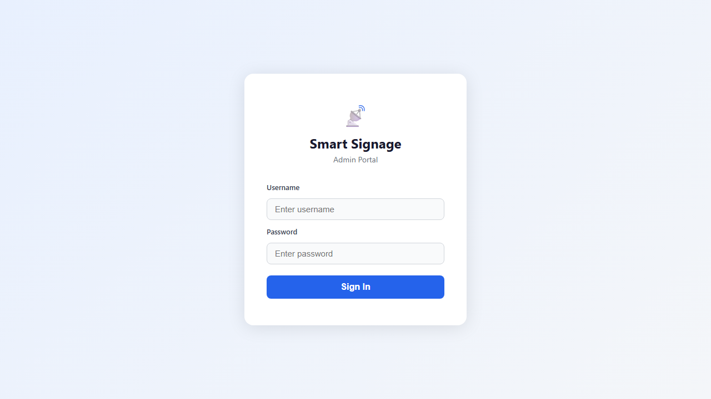
<figcaption><p>Login page with empty username and password fields.</p></figcaption>


</figure>

**Group Management:** Administrators view all groups in a table with
inline editing for name, description, and signage state. New groups are
created via a modal form.

<figure>

<figcaption><p>Admin Groups page with state and member counts.</p></figcaption>

</figure>

**User Management:** Administrators view all users with their roles and
group assignments. Inline editing supports role changes and group
membership updates.

<figure>
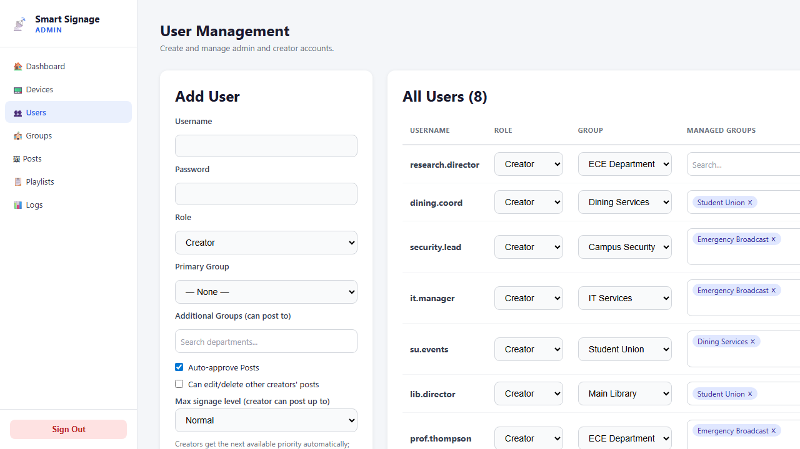
<figcaption><p>Admin Users page with role and permission controls.</p></figcaption>

</figure>

**Device Management:** The devices page lists all registered and pending
devices. Administrators approve pending devices (assigning device
tokens), view device status (online/offline, last seen), and send
playback commands (next, previous, start).

<figure>
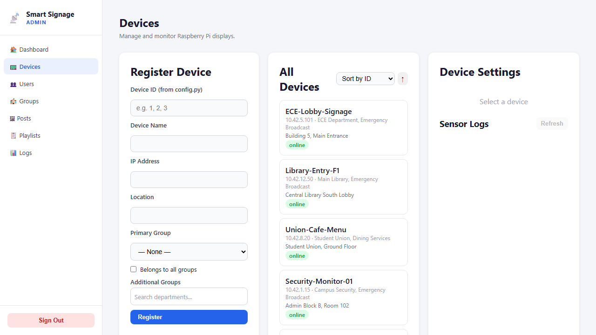
<figcaption><p>Admin Devices page with online/offline status indicators.</p></figcaption>


</figure>

### Creator Dashboard

The creator dashboard is the primary content authoring interface.

**Posts:** Creators compose posts with a title, Markdown description,
URL slug, and attachments. The form supports image upload with cropping,
video upload with trimming, and document upload for AI context.

<figure>
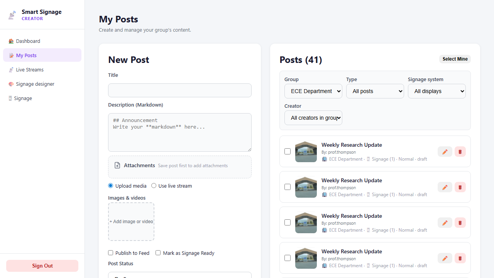
<figcaption><p>Creator Posts page with editor and post list.</p></figcaption>

</figure>

<figure>
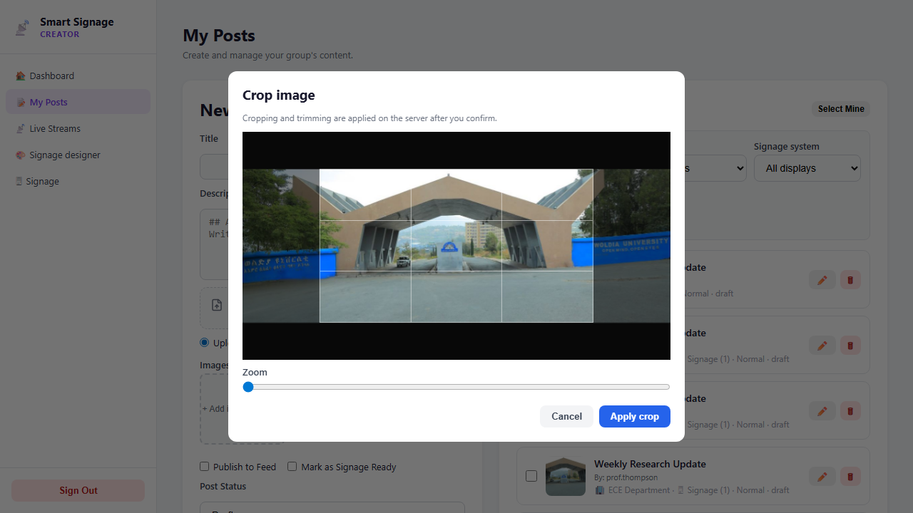
<figcaption><p>Image cropping interface with 16:9 aspect ratio lock.</p></figcaption>


</figure>

<figure>
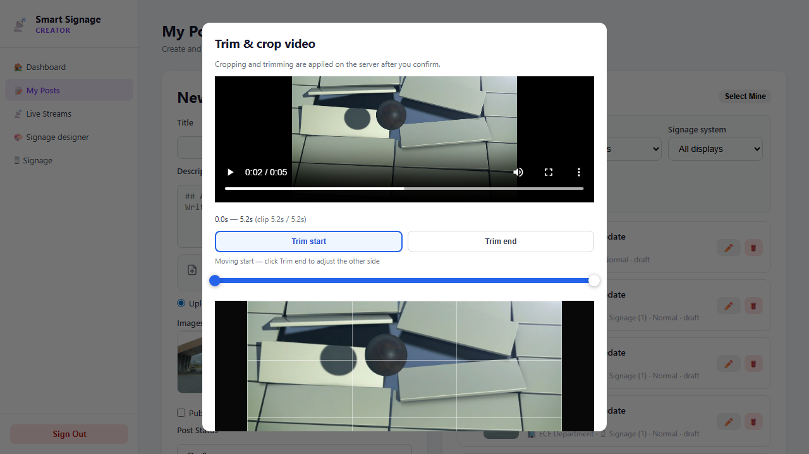
<figcaption><p>Video trimming slider for clip extraction.</p></figcaption>


</figure>

**Visual Designer (Fabric.js):** Creators can design signage slides with
draggable text, shapes, and images on a canvas. The designer supports
layering, opacity, and export to PNG.

<figure>
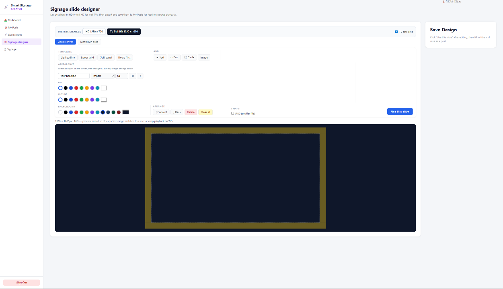
<figcaption><p>Fabric.js visual designer with empty canvas and toolbar.</p></figcaption>


</figure>

**Textual Designer (Markdown + KaTeX):** Creators can compose text-heavy
slides using Markdown syntax with live KaTeX math rendering. The
exported result is a styled HTML slide.

<figure>
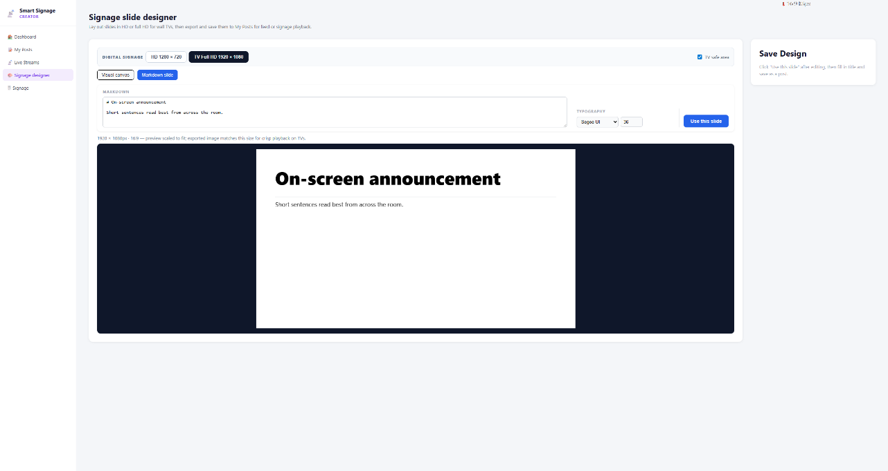
<figcaption><p>Markdown designer with editor and live preview pane.</p></figcaption>


</figure>

**Signage Publishing:** Creators select target groups and set scheduling
parameters (start date, end date, priority) before publishing.

<figure>
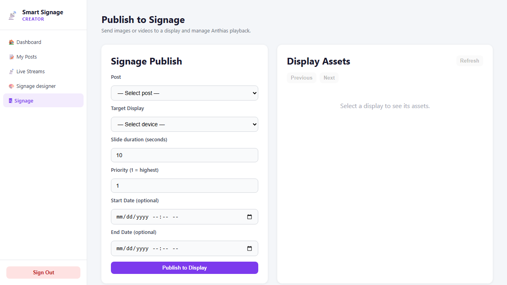
<figcaption><p>Signage Publish page with post and device selectors.</p></figcaption>


</figure>

**Live Stream Management:** Creators can add, edit, and monitor live
streams. The interface displays stream health status and provides embed
codes.

<figure>
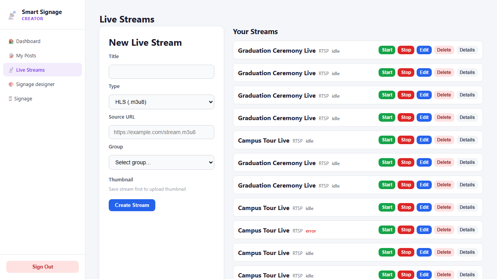
<figcaption><p>Live Streams page with status indicators and creation controls.</p></figcaption>

</figure>

### Public Feed and Viewer Interface

Public visitors access `/feed` to browse all published posts in a
responsive grid layout. Clicking a post navigates to `/post/:id` for the
full content view.

<figure>
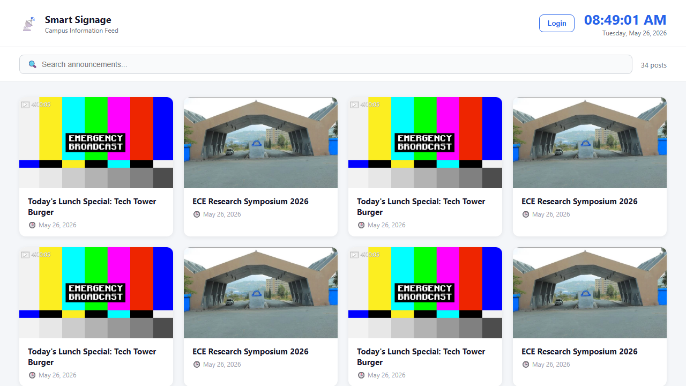
<figcaption><p>Public feed with priority-sorted announcements.</p></figcaption>

</figure>

### AI Q&A Widget

The AI Q&A widget appears at the bottom of each post detail page.
Visitors type questions, and the system sends the question, conversation
history, and extracted document text to the OpenAI GPT API. Responses
stream in real time.

<figure>
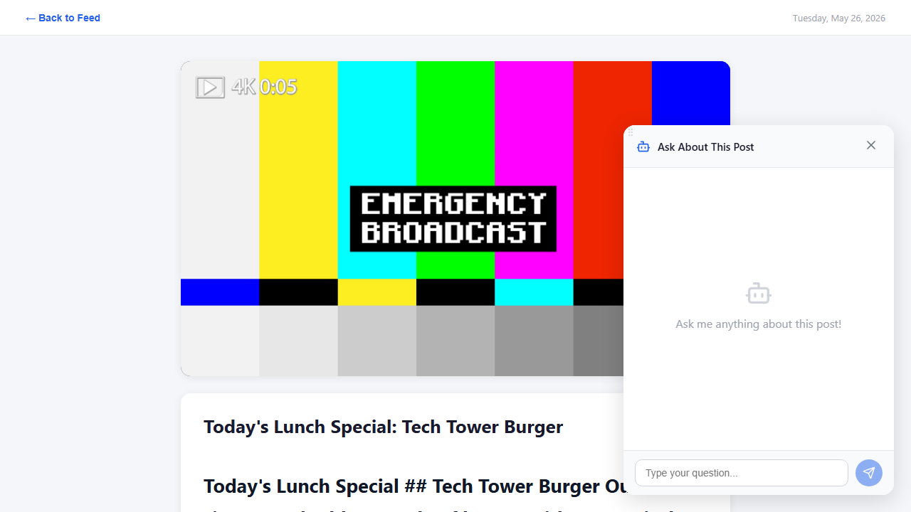
<figcaption><p>AI chat window on post detail page.</p></figcaption>

</figure>

### Emergency Handling UI

Administrators trigger emergency mode from the Groups page by setting a
group’s signage state to `EMERGENCY`. A confirmation dialog prevents
accidental activation.

<figure>
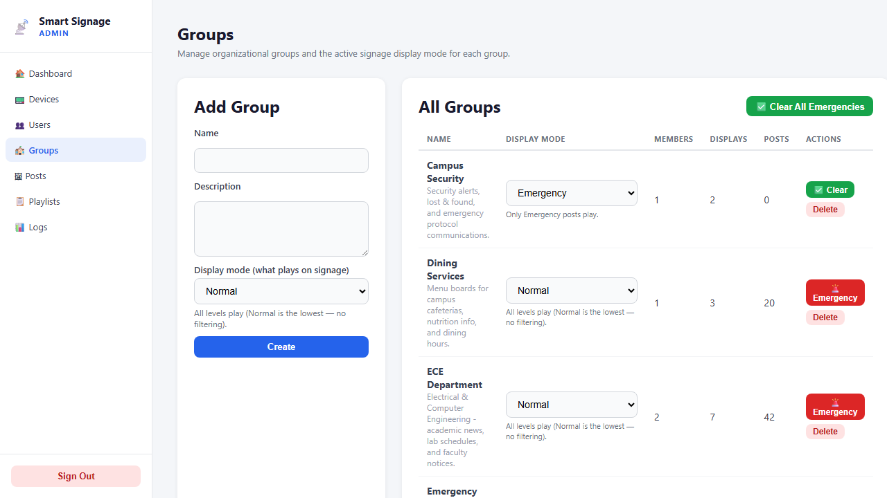
<figcaption><p>Groups page with Emergency state indicator and inline controls.</p></figcaption>


</figure>

### State Management

We chose Zustand over Redux for state management because its API
requires no boilerplate (no action types, reducers, or dispatch
functions). Our store modules include:

`authStore`: JWT token, user profile, login/logout actions

`uiStore`: Theme, sidebar state, notification queue

`dataStore`: Cached API responses with automatic invalidation

Axios interceptors attach the Bearer token to every outgoing request and
handle 401 responses by redirecting to the login page. Socket.IO Client
connects lazily (only on pages requiring real-time data) and reconnects
automatically with exponential backoff.

## Dual Player Architecture

Our system supports two playback backends on a per-device basis,
enabling administrators to choose the most appropriate player for each
display’s content requirements.

<caption>Anthias versus MPV comparison.</caption>
| Feature          | Anthias                         | MPV                      |
|------------------|---------------------------------|--------------------------|
| Rendering engine | Dockerized Chromium             | Native OpenGL/VAAPI      |
| Content types    | HTML, images, videos, web pages | Images, videos, streams  |
| Boot time        | 15–30 s (Docker + browser)      | 1–2 s                    |
| Memory footprint | 400–600 MB                      | 50–150 MB                |
| Web content      | Full CSS/JS support             | Not supported            |
| Hardware decode  | Limited                         | Full V4L2/VDPAU          |
| Remote commands  | Anthias REST API                | Direct MPV IPC socket    |
| Overlay support  | CSS-based                       | Lua scripting            |
| Use case         | Rich interactive signage        | Fast-boot video playback |


**Shared communication layer:** Both player types use the same
`socket_client.py` for Socket.IO communication, the same
`content_sync.py` for asset synchronization, and the same authentication
mechanism. The backend determines which player a device uses based on
the `device_type` field (set during device registration), and the
appropriate control commands are sent accordingly.

## Security Implementation

### Threat Model

We identified four trust boundaries in our system architecture: the
Campus LAN (untrusted), the Server DMZ (semi-trusted), the Database Zone
(trusted), and the Signage LAN (trusted but vulnerable to physical
access). the figure shows these boundaries and the attack
surfaces at each layer.

<figure>

<figcaption><p>Attack surface map with trust boundaries and attack vectors.</p></figcaption>
</figure>

### Vulnerabilities Addressed

We conducted a security audit of the codebase and identified 12
vulnerabilities, summarized in the table.

<caption>Vulnerability inventory and remediation status.</caption>
| ID | Severity | Component | Description | Remediation |
|----|----|----|----|----|
| V-01 | P0 (Critical) | Socket.IO | Unauthenticated device connections accepted any Pi on the network | Device token authentication; 64-char hex tokens |
| V-02 | P0 (Critical) | API | No rate limiting on login endpoint enabled brute-force attacks | Express-rate-limit: 5 attempts per 15 min per IP |
| V-03 | P0 (Critical) | File upload | Path traversal possible via malicious filename | `path.resolve()` + root directory check |
| V-04 | P0 (Critical) | CORS | Wildcard CORS allowed any origin to access API | Whitelist of allowed origins |
| V-05 | P1 (High) | JWT | Tokens had no expiry; stolen tokens valid forever | 24-hour expiry + refresh token rotation |
| V-06 | P1 (High) | Database | Prisma queries lacked parameterized input in one route | All queries use Prisma query builder |
| V-07 | P1 (High) | Socket.IO | No origin validation on WebSocket handshake | `io.engine.use(cors(...))` with whitelist |
| V-08 | P1 (High) | Static files | Directory listing enabled on `/uploads/` | `dotfiles: 'deny'` in Express static config |
| V-09 | P1 (High) | Logging | Error logs contained stack traces with file paths | Sanitized logs; no paths in production |
| V-10 | P2 (Medium) | Frontend | `localStorage` stored JWT without encryption | Acceptable risk; HTTPS mitigates transmission |
| V-11 | P2 (Medium) | API | No Content Security Policy headers | Added `helmet` middleware with CSP |
| V-12 | P2 (Medium) | Network | nftables rules not persisted across reboots | `nftables-persistent` package + systemd service |


<figure>

<figcaption><p>Socket.IO authentication code with device token verification.</p></figcaption>


</figure>

### Network Hardening

We implemented nftables rules on both server NICs. The campus-facing NIC
accepts only SSH (rate-limited), HTTP, and HTTPS. The signage-facing NIC
accepts only API, RTMP, HLS, DHCP, and DNS traffic. All other ports and
protocols are explicitly dropped. TLS 1.3 termination on nginx ensures
encrypted communication between the frontend and backend.

### Remediation Summary

All four P0 (critical) and five P1 (high) vulnerabilities were
remediated before system validation. The three P2 (medium)
vulnerabilities were documented as accepted risks with mitigating
controls. No P0 or P1 vulnerabilities remain in the production codebase.

This chapter has presented the complete design and implementation of the
Smart Digital Signage System, from the physical Arduino sensor bridge
through the Debian-simulated edge nodes, network infrastructure, backend
services, frontend interfaces, dual player architecture, and security
hardening. Chapter 5 describes how we validated this
implementation through automated testing and hardware verification.

## Chapter Summary

This chapter detailed the technical implementation of the hardware and software layers. We described the Arduino sensor bridge assembly, the simulated edge node configuration, and the backend services. The integration of real-time communication, media processing, and dual-player support demonstrates the system's ability to operate as an intelligent, responsive edge platform.

\newpage