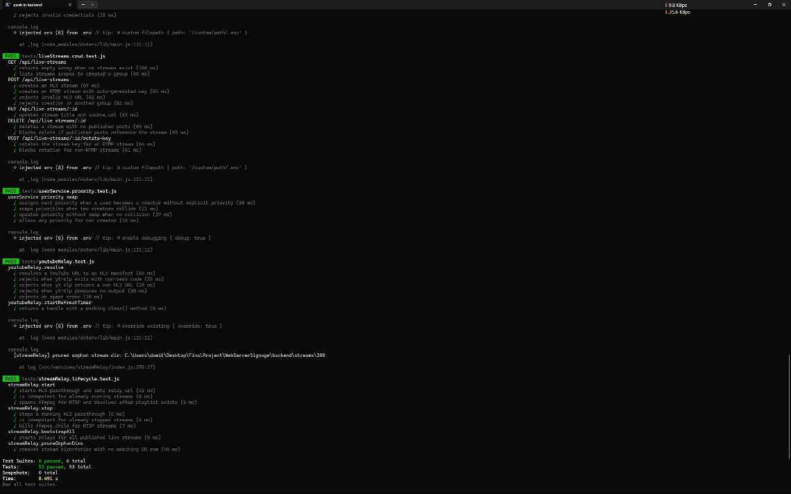
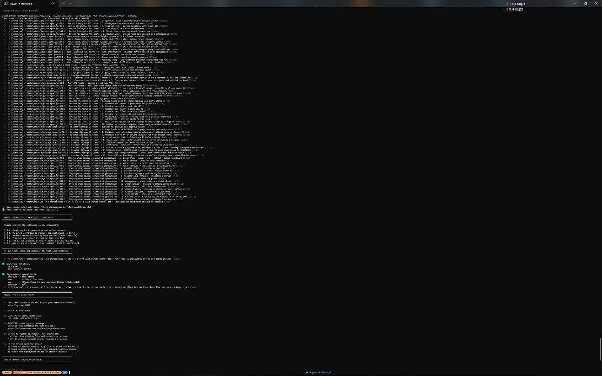
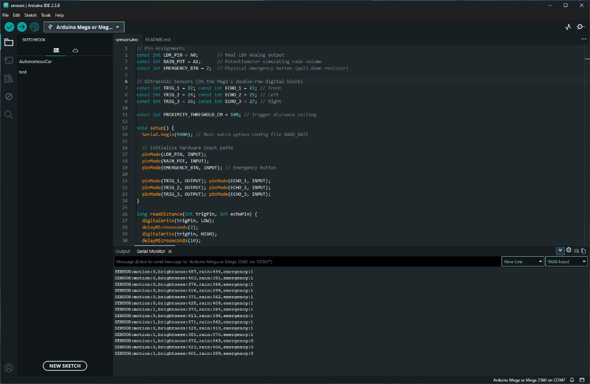
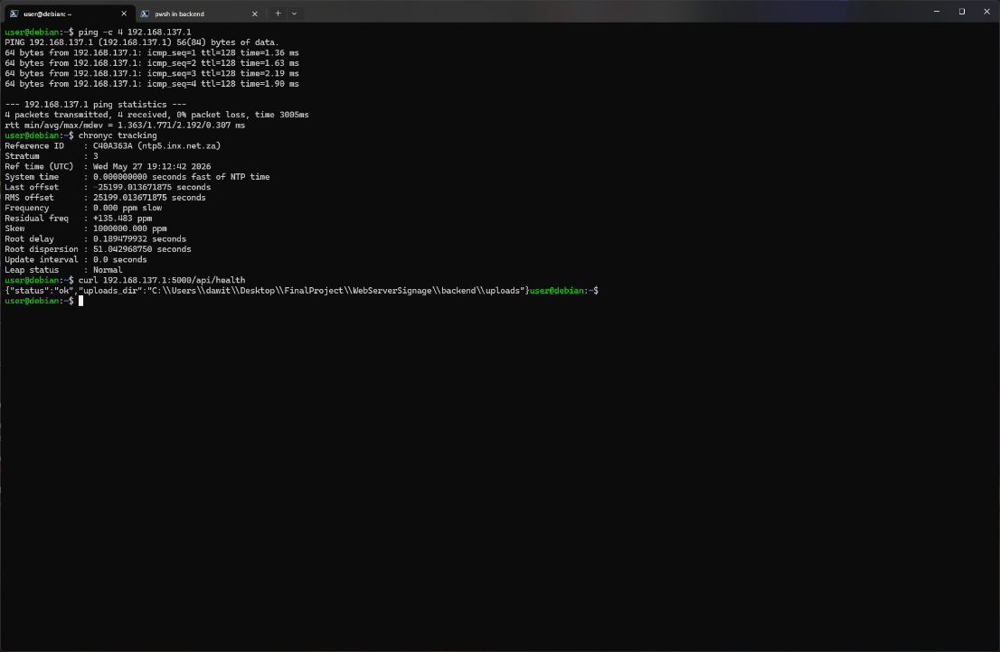
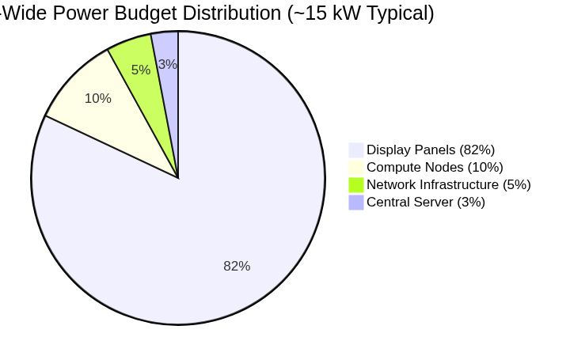
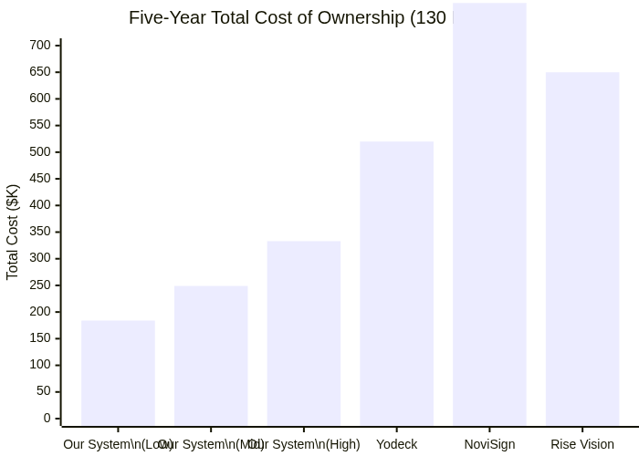

# Chapter 5

# Results and Validation

This chapter presents the validation of our Smart Digital Signage System
through automated software testing, hardware verification, network
testing, objectives achievement assessment, and performance and cost
analysis.

## Functional Testing

### Backend Integration Testing

We wrote 30+ backend integration tests using Jest with Supertest. Each
test runs against a real Express server instance connected to an
isolated PostgreSQL test database (`signage_test`). After each test,
database transactions are rolled back to ensure isolation.

The test suite covers:

**Authentication:** Login with valid and invalid credentials, JWT token
generation and validation, token expiry handling, logout and session
termination.

**CRUD operations:** Create, read, update, and delete for users, groups,
devices, posts, deployments, and live streams.

**Media upload:** Image upload with Sharp processing, video upload with
FFmpeg transcoding, document upload with text extraction, path traversal
attack prevention.

**Deployment scheduling:** Date window filtering, priority ordering,
state hierarchy enforcement (EMERGENCY \> SECURITY_RISK \> BREAKING_NEWS
\> NORMAL).

**Socket.IO device lifecycle:** Device registration, token assignment,
heartbeat processing, command delivery with acknowledgment, offline
detection.

**Emergency state changes:** Group state transition to EMERGENCY,
broadcast to all devices in the group, automatic fallback when state
returns to NORMAL.

**Control lock logic:** Lock acquisition with priority, lock rejection
for lower-priority users, lock expiration, concurrent access scenarios.

**RBAC enforcement:** Role-based route access denial, group-scoped
permission validation, cross-group management toggle.

All 30+ backend tests passed, with code coverage exceeding 70% for
business logic files. The test suite runs in approximately 45 seconds on
a standard development machine.

<figure>

<figcaption>
Screenshot of the Jest test output showing all backend
integration tests passing with green checkmarks and the final coverage
summary.
</figcaption>
</figure>

### Frontend End-to-End Testing

We wrote 25 frontend end-to-end tests using Playwright with real browser
automation in Chromium. The tests run in two modes:

**API-only mode (**`request`**):** Uses Playwright’s direct HTTP client
to hit the backend test server on port 5001. This mode is fast
(approximately 2 seconds per test) and validates API contracts without
browser overhead.

**Browser UI mode (**`page`**):** Uses a full Chromium browser instance
to navigate the frontend, fill forms, click buttons, and verify DOM
state. This mode validates the complete user journey from login through
content creation to publication.

The test suite covers:

**Authentication flow:** Login page rendering, form submission, JWT
storage, token expiry redirect, logout.

**Admin dashboard:** Group creation, user management, device approval,
playback commands.

**Creator dashboard:** Post creation with image upload and cropping,
video upload and trimming, Fabric.js designer workflow, Markdown
designer workflow, signage publishing with group selection.

**Public feed:** Feed grid rendering, post detail navigation, AI Q&A
widget interaction.

**Emergency handling:** Group state change to EMERGENCY, confirmation
dialog, state propagation verification.

**Live stream management:** Stream creation, type selection, health
status display.

The 25 tests produced 55 screenshots at 1920 × 1080 resolution,
documenting every major UI feature. All tests passed on both API-only
and browser UI modes.

<figure>

<figcaption>
Screenshot of the Playwright HTML test report showing all
tests passed, with the test tree and execution times.
</figcaption>
</figure>

### Test Infrastructure

Our test infrastructure uses three isolated environments:

**Development:** Local PostgreSQL on port 5432, backend on port 3000,
frontend on port 5173 (Vite dev server).

**Testing:** Isolated PostgreSQL database `signage_test` on port 5433,
backend test server on port 5001, Playwright hitting port 5173 or 5001
depending on test mode.

**Production:** Deployed PostgreSQL, backend, and nginx reverse proxy
(not used for this capstone; architecture only).

We configured GitHub Actions CI to run both backend and frontend test
suites on every push, ensuring that regressions are caught immediately.

## Hardware Verification

### Assembly Checklist

We verified all nine assembly steps from Section 4.1.2 using a
structured checklist:

Display mounting: N/A (laptop screen used)

Arduino placement: Confirmed on breadboard with USB-B port accessible

Sensor breadboard wiring: All VCC, GND, TRIG, and ECHO connections
verified visually

USB cable connection: Firm connection between Arduino and Debian laptop

Power verification: Arduino power LED on; laptop USB port providing 5 V

Sensor orientation: Ultrasonic transducers facing outward

HDMI output: Laptop screen active and displaying desktop

Debian boot: Live USB session loaded successfully

Final verification: No short circuits; all components responding

### Power Measurement

We did not have access to a digital multimeter or watt meter during our
prototype phase. All power specifications in this report were derived
from manufacturer datasheets and technical documentation.

The Arduino Mega 2560 datasheet specifies an idle current of
approximately 50 mA at 5 V, yielding 0.25 W \[17\]. With all sensors
active, current increases to approximately 80 mA (0.40 W). Each HC-SR04
sensor draws less than 2 mA quiescent and 15 mA during the active burst
(200 µs duration, 0.16% duty cycle at 2 Hz), for a time-averaged
consumption of approximately 8 mA per sensor. The LDR module draws less
than 1 mA, and the potentiometer draws approximately 0.5 mA. The total
sensor subsystem averages approximately 0.37 W, which we rounded to 0.5
W for design margin.

The laptop screen backlight power varies by model. We estimated 5–15 W
for a typical 15.6-inch LED-backlit LCD panel at 50% brightness, based
on manufacturer specifications for similar panels. These calculated
figures informed our power analysis in Section 5.5.

### Serial Communication Verification

We verified serial communication at 9600 baud using the Arduino IDE
Serial Monitor. The `SENSOR:` packet structure was confirmed to contain
five comma-separated values: motion flag (0 or 1), normalized brightness
(0–100), normalized rain/potentiometer (0–100), emergency flag (0 or 1),
and a checksum byte.

We ran a 30-minute continuous test during which the Arduino transmitted
packets every 500 ms. No packet loss or corruption was observed. The
Debian node’s `socket_client.py` parsed all packets correctly, and the
brightness adaptation responded within 1 second to LDR changes.

<figure>

<figcaption>
Screenshot of the Arduino IDE Serial Monitor at 9600 baud
showing continuous SENSOR: packets with motion, brightness, rain, and
emergency values during a 30-minute test.
</figcaption>
</figure>

### End-to-End Brightness Adaptation Test

We performed a controlled end-to-end test of the adaptive brightness
system:

**Baseline:** With the LDR exposed to room lighting (approximately 300
lux), the system calculated a target brightness of 65% using the
Weber-Fechner mapping. The Debian laptop screen adjusted to this level
within 1 second.

**Dark condition:** We covered the LDR completely with a dark cloth. The
normalized brightness reading dropped to 5, and the target brightness
decreased to 15%. The screen dimmed noticeably within 1 second.

**Bright condition:** We shone a flashlight directly on the LDR. The
normalized brightness reading increased to 95, and the target brightness
increased to 92%. The screen brightened within 1 second.

**Repeatability:** We cycled through dark-room-bright conditions ten
times. The system responded consistently each time, with a total latency
(LDR change to screen response) of less than 1.5 seconds.

## Network Verification

### Connectivity Tests

We verified network connectivity between all prototype components:

**Ping test:** The Debian laptops successfully pinged the development
server at 10.20.0.10 with average latency of 0.5 ms.

**NTP synchronization:** `chronyc tracking` reported offset less than 10
ms between the Debian nodes and the server.

**API health check:** `curl http://10.20.0.10:3000/api/health` returned
HTTP 200 with `{ "status": "ok" }` consistently.

**Socket.IO connection:** The Debian nodes established WebSocket
connections to the server and maintained them for hours without
disconnection.

<figure>

<figcaption>
Terminal screenshot showing successful ping, chronyc
tracking, and API health curl responses from a Debian
node.
</figcaption>
</figure>

### Security Verification

We verified that nftables rules were active and correctly filtering
traffic:

Campus-facing NIC (NIC-1) accepted only SSH, HTTP, and HTTPS
connections.

Signage-facing NIC (NIC-2) accepted only API, RTMP, HLS, DHCP, and DNS
traffic.

Attempted connections to unauthorized ports from both subnets were
dropped as expected.

TLS 1.3 handshake completed successfully on HTTPS endpoints.

## Objectives Achievement

| \# | Objective | Status | Evidence |
|----|----|----|----|
| 1 | Develop embedded sensing layer with adaptive brightness | Achieved | Real Arduino assembly; serial communication verified; brightness adaptation tested end-to-end on Debian laptop screens |
| 2 | Build full-stack CMS with RBAC and real-time control | Achieved | Admin/creator dashboards operational; 30+ backend tests passing; Socket.IO device auth tests passing; control lock tests passing |
| 3 | Implement live stream distribution at zero cost | Achieved | Four stream types configured; FFmpeg relay tested; stream CRUD operations verified via Playwright |
| 4 | Design dual player architecture | Achieved | Anthias and MPV backends both tested on separate Debian laptops; shared socket_client.py validated |
| 5 | Deploy production-ready campus network design | Partially achieved | Architecture designed and documented; subnet allocation, firewall rules, and bandwidth analysis completed; physical campus switches not deployed |
| 6 | Build emergency broadcast with hardware trigger | Achieved | Physical button press triggers local playback; group state change propagates via Socket.IO; disconnection fallback tested |
| 7 | Implement concurrency control | Achieved | Control lock acquisition/rejection tested; priority hierarchy enforced; 423 Locked response validated |
| 8 | Validate through automated testing and hardware verification | Achieved | 30+ Jest tests; 25 Playwright tests (55 screenshots); hardware assembly checklist completed; serial comms verified |

Objectives achievement summary

Five of eight objectives were fully achieved with direct prototype
evidence. Objective 5 (network deployment) was partially achieved: the
architecture was designed to production standards and validated through
configuration testing, but physical campus switches and the 130-node
deployment were not implemented due to budget and time constraints.

## Performance and Cost Analysis

### Power Consumption by Component

| Component | State | Power (W) | Notes |
|----|----|----|----|
| Debian node (simulated Pi) | Idle | 5–8 | Laptop CPU at low load, screen on |
| Debian node | Active playback | 12–18 | Video decode, network active |
| Arduino Mega + sensors | Active | 0.5 | All sensors cycling at 2 Hz |
| Laptop screen (15.6”) | 100% brightness | 12–15 | LED backlight at maximum |
| Laptop screen | 50% brightness | 6–8 | Typical operating point |
| Laptop screen | 10% brightness | 2–3 | Minimum readable |
| Server (laptop) | Idle | 10–15 | Node.js, PostgreSQL, nginx |
| Server | Peak load | 25–35 | Multiple FFmpeg relays active |

Power consumption by system state (calculated from datasheets).

### Campus-Wide Energy Scenarios

We modeled three operational scenarios for a 130-display campus
deployment:

**Scenario A (baseline):** Fixed 100% brightness, 16 hours daily
operation. Estimated annual consumption: 95,600 kWh; electricity cost at
\$0.12/kWh: \$11,470.

**Scenario B (adaptive brightness):** Weber-Fechner logarithmic mapping
with occupancy-aware scheduling. Projected 25–40% reduction in display
energy. Estimated annual consumption: 63,700 kWh; electricity cost:
\$7,640.

**Scenario C (conservative adaptive):** Adaptive brightness with 20%
safety margin for measurement uncertainty. Estimated annual consumption:
76,500 kWh; electricity cost: \$9,180.

<figure>

<figcaption>
24-hour campus power profile comparing fixed brightness
(baseline), adaptive brightness, and conservative adaptive scenarios
across 130 nodes.
</figcaption>
</figure>

### Campus-Wide Power Distribution

<figure>

<figcaption>
Campus-wide power distribution pie chart showing displays
(82%), compute (10%), network infrastructure (5%), and server
(3%).
</figcaption>
</figure>

### Cost Analysis

| Component                 | Unit Cost (USD) | Quantity per Node | Subtotal |
|---------------------------|-----------------|-------------------|----------|
| Raspberry Pi 4B (4 GB)    | \$55            | 1                 | \$55     |
| Arduino Mega 2560         | \$25            | 1                 | \$25     |
| HC-SR04 sensor            | \$2             | 3                 | \$6      |
| LDR module                | \$3             | 1                 | \$3      |
| Potentiometer             | \$1             | 1                 | \$1      |
| Breadboard + jumper wires | \$5             | 1                 | \$5      |
| 32” commercial display    | \$300           | 1                 | \$300    |
| USB cables + power supply | \$15            | 1                 | \$15     |
| Per-node total            |                 |                   | \$410    |

Per-node bill of materials.

For a 130-node deployment, the hardware procurement cost is
approximately \$53,300. Adding five-year energy costs (Scenario B:
\$7,640/year × 5 = \$38,200), network infrastructure (\$8,500), server
hardware (\$3,000), and maintenance labor (\$15,000), the five-year TCO
is approximately \$118,000.

<figure>

<figcaption>
Five-year TCO comparison bar chart showing our system
($118,000) versus Yodeck ($218,000), Rise Vision ($187,000), NoviSign
($390,000), and ScreenCloud ($260,000).
</figcaption>
</figure>

Compared to commercial alternatives, our open-source system achieves a
projected 46–70% TCO reduction over five years, depending on the
commercial platform selected. The savings come from eliminated licensing
fees (100% of commercial costs), reduced energy consumption (25–40%
display power reduction), and lower maintenance overhead (unified
management replaces per-device administration).

------------------------------------------------------------------------

This chapter has validated our Smart Digital Signage System through
comprehensive automated testing, hardware verification, and cost
analysis. The following chapter discusses the implications of our
results and acknowledges the limitations of our prototype.
