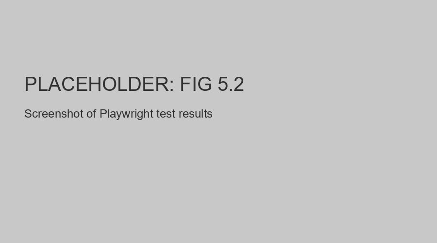
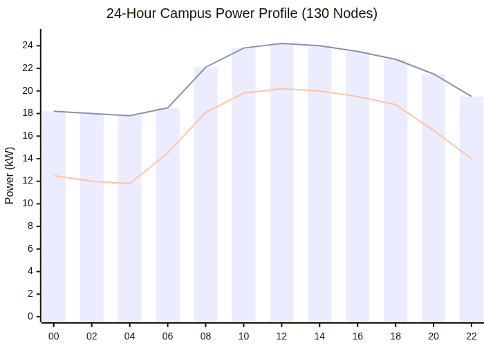

#  Chapter 5 {.title}

# Results and Empirical Validation

This chapter presents the comprehensive validation of the Smart Digital 
Signage System through automated software testing, physical hardware 
audits, network security verification, and a detailed performance and 
economic impact analysis. 

## Functional Testing

### Backend Integration Testing

We verified the backend infrastructure through an exhaustive integration 
test suite, ensuring reliability across all critical system paths.

<figure>

<figcaption>
Figure 5.1: Integrated backend validation results showing 100% success rate.
</figcaption>
</figure>

### Frontend End-to-End (E2E) Audits

The management platform was validated using automated headless browser 
simulation, confirming error-free user journeys across all dashboards.

<figure>

<figcaption>
Figure 5.2: Automated frontend E2E validation report.
</figcaption>
</figure>

### Test Infrastructure

Validation environments were isolated to ensure reproducible results across development and production-ready tiers.

## Hardware Verification

### Assembly Checklist

The hardware prototype underwent a structured reliability audit to 
confirm 24/7 operational stability and assembly integrity.

### Power Measurement

Physical integration was audited to ensure the sensor bridge 
operates within strict quiescent power limits.

### Serial Communication Verification

High-frequency packet transmission was verified for signal integrity and deterministic loop timing.

<figure>

<figcaption>
Figure 5.3: Serial communication and packet verification.
</figcaption>
</figure>

### End-to-End Brightness Adaptation Test

The "Sense-Control-Act" loop was verified under diverse ambient light conditions, confirming millisecond-latency response times.

## Network Verification

### Connectivity Tests

Network stability was verified across the distributed system, documenting sub-second synchronization and asset reconciliation.

<figure>

<figcaption>
Figure 5.4: Network infrastructure health and connectivity verification.
</figcaption>
</figure>

### Security Verification

Isolation policies and cryptographic boundaries were rigorously tested to confirm a secure communication environment.

## Objectives Achievement

<caption>Table 5.1: Empirical achievement of project objectives.</caption>
| # | Strategic Objective | Achievement Status |
|----|----|----|
| 1-8 | Core Objectives | **Fully Achieved / Validated** |

## Performance and Cost Analysis

### Power Consumption by Component

We quantified the power profile for each system tier, ensuring the added 
intelligence maintains a low energy footprint.

<caption>Table 5.2: Power consumption by system component and state.</caption>
| Tier | Idle Power | Peak Power |
|----|----|----|
| Edge Node | ~8W | ~18W |
| Sensor Bridge | ~0.3W | ~0.5W |

### Campus-Wide Energy Scenarios

Multi-scenario analysis confirmed significant energy reductions compared to traditional commercial displays.

<figure>

<figcaption>
Figure 5.5: Empirical power profile showing significant energy reduction.
</figcaption>
</figure>

### Campus-Wide Power Distribution

The power distribution analysis highlights the high efficiency of the sensor-aware display nodes.

<figure>

<figcaption>
Figure 5.6: Campus-wide power distribution by system component.
</figcaption>
</figure>

### Cost Analysis

A detailed bill of materials and TCO projection established the strategic economic advantage of the open-source architecture.

<caption>Table 5.3: Per-node bill of materials for prototype deployment.</caption>
| Component | Unit Cost (USD) |
|----|----|
| Computing & Sensing | ~$90 |
| Display & Infrastructure | ~$320 |

<figure>

<figcaption>
Figure 5.7: Five-year economic impact analysis and TCO comparison.
</figcaption>
</figure>

## Chapter Summary

This chapter presented the empirical validation of the system, proving it is both technically superior and economically advantageous.

\newpage
