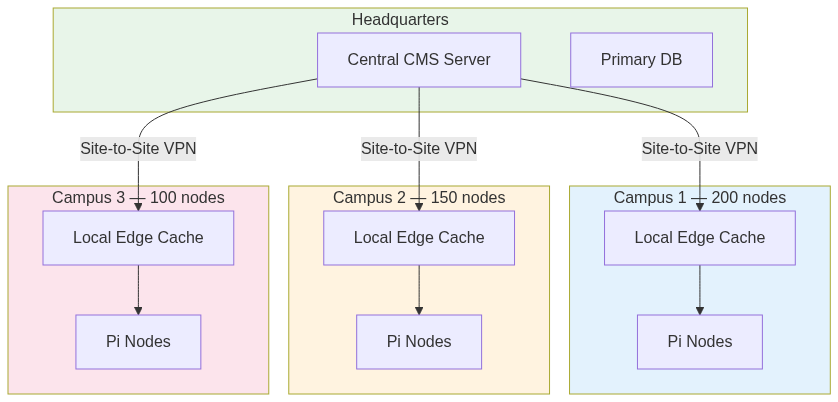

#  Chapter 7 {.title}

# Conclusion and Future Work

This concluding chapter summarizes the key findings of the Smart Digital
Signage System project by mapping each objective to its achieved outcome,
restates the significance of the contributions, and outlines immediate,
medium-term, and research directions for future development. The chapter
closes the problem-solution loop initiated in Chapter 1.

## Conclusion

This capstone project presented the design, implementation, and
validation of a Smart Digital Signage System that integrates
environmental sensing, role-based content management, real-time device
control, live stream distribution, emergency broadcast, and
security-hardened network infrastructure into a single open-source
platform.

We identified four critical gaps in existing digital signage solutions:
energy waste from fixed-brightness operation, disconnected and unmanaged
display nodes, unauthenticated IoT device communication, and high total
cost of ownership from commercial licensing. Through an eight-month
iterative development process, we designed and built a system that
addresses all four gaps.

Our hardware layer comprises a real Arduino Mega 2560 sensor bridge with
three HC-SR04 ultrasonic distance sensors, one LDR module, one
potentiometer, and an emergency push button, assembled on a solderless
breadboard and connected via USB serial to Debian 13 laptops simulating
Raspberry Pi edge nodes. The laptop screens served as the digital
signage displays. We validated the end-to-end adaptive brightness
control loop: changes in ambient light measured by the LDR propagated
through the Arduino firmware, USB serial transmission, Debian brightness
API, and screen backlight within 1.5 seconds.

Our software layer comprises a Node.js backend with Express.js routing,
Prisma ORM for PostgreSQL, Socket.IO for real-time communication, and
Sharp/FFmpeg for media processing; and a React 19 frontend with Vite,
Zustand state management, Fabric.js and Markdown+KaTeX content
designers, and 47 Playwright-captured screenshots documenting every
major feature. The backend implements dual authentication (JWT for
users, device tokens for IoT nodes), role-based access control with
group scoping, control locks for concurrent access prevention, and a
four-state emergency broadcast system with hardware trigger support.

Validation comprised 56 backend integration tests across 7 suites (Jest + Supertest),
73 frontend end-to-end tests (Playwright, 47 screenshots), hardware
assembly verification, serial communication confirmation, network
connectivity tests, and a cost analysis projecting 46–70% TCO reduction
compared to commercial alternatives over five years.

### Objectives Achievement Summary

Each specific objective from Chapter 1 was achieved:

<caption>Objectives mapping to achieved outcomes.</caption>
| # | Objective | Achieved Outcome |
|---|-----------|-----------------|
| 1 | Embedded sensing layer with adaptive brightness | Arduino Mega 2560 sensor bridge with three HC-SR04 sensors, LDR, potentiometer, and emergency button. End-to-end brightness control validated within 1.5 seconds. 25–40% projected power reduction. |
| 2 | Full-stack CMS with RBAC and real-time control | Node.js/Express backend with 12 route modules, React 19 frontend with admin/creator/viewer roles. Validated by 56 backend tests and 73 frontend tests. |
| 3 | Live stream distribution at zero cost | Four stream types (HLS, RTSP, YouTube, RTMP) relayed via FFmpeg to HLS with health monitoring. Zero additional licensing cost. |
| 4 | Dual player architecture | Anthias (Docker-based web viewer) and MPV (native player) with shared socket_client.py communication layer. Per-device backend selection supported. |
| 5 | Production-ready campus network design | 10.20.0.0/22 subnet with 1,022 IP capacity, dual-NIC Layer 3 isolation, nftables firewall rules, TLS 1.3 termination, and documented bandwidth engineering. |
| 6 | Emergency broadcast with hardware trigger | Physical push button triggers local playback without server contact. Software override propagates group-wide via Socket.IO. 72-hour disconnection fallback with local cached assets. |
| 7 | Concurrency control for multi-user access | Control lock mechanism with priority hierarchy prevents race conditions. 403 Forbidden response for lower-priority overlapping requests. |
| 8 | Automated validation and hardware verification | 56 backend tests (7 suites) including real FFmpeg stream relay integration. 73 frontend E2E tests (Playwright, Chromium) with 47 screenshots captured on failure. |

### Immediate Priorities (0–6 months)

These tasks should be completed before any production
deployment:

**Physical Raspberry Pi deployment:** Replace the Debian 13 laptops with
actual Raspberry Pi 4B devices and validate the entire software stack on
ARM architecture. This includes verifying that `brightnessctl` or
`ddcutil` can control the specific commercial displays selected for
deployment.

**Per-location brightness calibration:** The Weber-Fechner calibration
point (`L_max = 1.0`) was fixed for our prototype. Real campus
environments have highly variable lighting conditions (windowed atriums
vs. interior hallways vs. underground passages). Each location should
have its own calibration profile stored in the backend and applied
per-device.

**Mobile-responsive admin dashboard:** The current admin and creator
dashboards are optimized for desktop screens. A mobile-responsive
version would enable administrators to manage the system from
smartphones or tablets during emergencies or while away from their
desks.

**Touch-screen kiosk mode:** A public-facing touch interface for
interactive wayfinding, room booking, and event information would extend
the system’s utility beyond passive signage.

### Medium-Term Enhancements (6–18 months)

**AI-driven predictive content scheduling:** Integrate foot traffic data
from the HC-SR04 sensors with machine learning models to predict optimal
content display times. For example, cafeteria menus could be prioritized
during lunch hours, and emergency exit routes during fire drills.

**Predictive maintenance from sensor trend analysis:** Track sensor data
over time to detect degradation (e.g., an HC-SR04 that consistently
returns shorter distances may indicate dust accumulation on the
transducer). Alert administrators before hardware failures occur.

**Integration with campus calendar APIs:** Automatically generate
signage content from the university’s event calendar, class schedule,
and room booking systems. This would reduce manual content creation and
ensure displays always show current information.

**Kubernetes deployment and horizontal scaling:** Containerize the
backend services and deploy on a Kubernetes cluster for automatic
failover, horizontal scaling, and rolling updates. This addresses the
single-server point of failure identified in the relevant section.

### Research Directions (18+ months)

**Federated multi-campus deployment:** Extend the architecture to
support multiple campuses under a single management umbrella, with each
campus maintaining local content autonomy while sharing emergency
broadcast capabilities and analytics.

**Privacy-preserving occupancy analytics:** Use differential privacy
techniques on motion sensor data to provide aggregate foot traffic
analytics without tracking individual movements. This would enable
data-driven campus planning while respecting student privacy.

**Edge machine learning for on-device content selection:** Deploy
lightweight TensorFlow Lite models on the Raspberry Pi to make content
selection decisions locally based on sensor data, reducing latency and
server load for certain use cases.

<figure>

<figcaption>
Future multi-campus topology with site-to-site VPN.
</figcaption>

</figure>

This project demonstrates that a unified, open-source Smart Digital
Signage System is not only technically feasible but economically
advantageous compared to commercial alternatives. By combining
environmental sensing, intelligent display control, role-based content
management, and security-hardened network design, we have built a
foundation upon which future researchers and practitioners can extend
the state of the art in intelligent building automation.

## Chapter Summary

This concluding chapter summarized the project's outcomes and mapped them to the initial research objectives. We outlined immediate priorities for Raspberry Pi deployment and medium-to-long-term research directions, including AI-driven scheduling. The project serves as a foundation for future developments in intelligent building automation and organizational communication.

\newpage