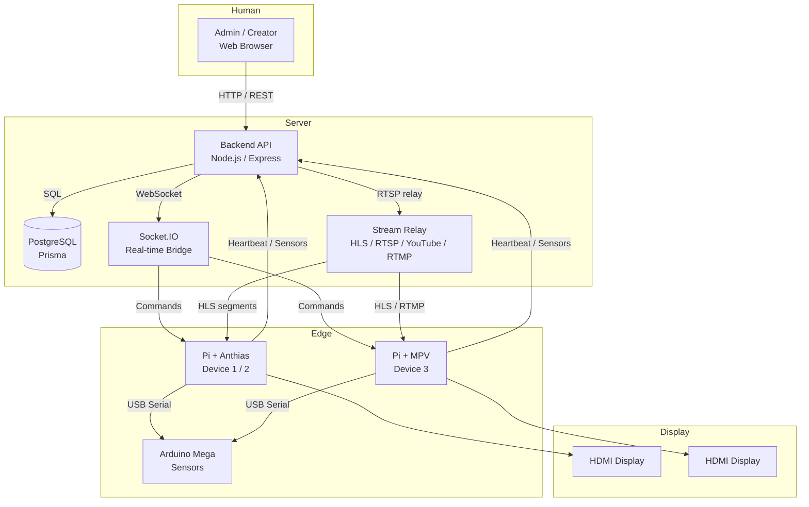

# 📡 Smart Digital Signage System

A **university campus digital signage platform** that distributes content to distributed displays over a LAN, manages those displays in real time, and operates autonomously at the edge even when the network is down.

The system is a full-stack application with three major subsystems — a **web backend** that manages content and devices, a **browser-based admin UI** for human operators, and **Raspberry Pi edge agents** that drive physical displays.

---

## Table of Contents

1. [What This Project Is](#what-this-project-is)
2. [System Architecture](#system-architecture)
3. [Project Structure](#project-structure)
4. [Documentation Map](#documentation-map)
5. [Quick Start](#quick-start)
6. [License](#license)

---

## What This Project Is

This system was built to solve a specific problem: **how do you manage dozens of digital displays across a university campus — lecture halls, lobbies, cafeterias, libraries — without manually updating each one?**

It provides:

- **Centralized content management** — Admins and content creators publish posts (images, videos, markdown, live streams) to specific displays or groups of displays from a single web dashboard.
- **Real-time device control** — Each display is a Raspberry Pi connected to the server via WebSocket. Admins can push updates, trigger emergency broadcasts, or restart devices remotely.
- **Offline resilience** — Edge devices cache content locally. If the server goes offline, they continue playing scheduled content for up to 72 hours, then fall back to a disconnection screen. Emergency content plays immediately without any server contact.
- **Sensor-driven behavior** — Arduino-connected sensors on each Pi detect motion (to wake sleeping displays), measure ambient brightness (to auto-adjust screen brightness), and provide a physical emergency button.
- **Live streaming** — The system can relay HLS, RTSP, YouTube Live, and RTMP ingest streams to displays, making it useful for event broadcasts, live lectures, or campus-wide announcements.

### Who Uses It

| Role | What They Do |
|------|-------------|
| **Administrator** | Approve devices, manage users and groups, configure emergency states, monitor system health |
| **Content Creator** | Design visual posts on a canvas, write articles, upload media, publish content to devices, manage live streams |
| **Public Viewer** | Browse a read-only feed of published content with AI-assisted Q&A |
| **Field Device (Pi)** | Autonomously plays scheduled content, reports sensor data, responds to server commands |

---

## System Architecture



### Data Flow at a Glance

1. **Content creation** — A creator designs a post in the web UI and clicks "Publish."
2. **Backend processing** — The backend stores the post, processes media (WebP images, MP4 videos), and records which devices should receive it.
3. **Edge sync** — Each Pi polls the backend every 60 seconds (or receives a push via Socket.IO) and downloads new content to a local cache.
4. **Display playback** — The Pi's player (Anthias or MPV) shows the content according to its schedule, duration, and validity window.
5. **Sensor feedback** — The Arduino sends motion/brightness/rain data every 2 seconds. The Pi forwards this to the server and may auto-adjust display brightness locally.

---

## Project Structure

```
WebServerSignage/
├── arduino/                 ← Arduino Mega sensor firmware
├── backend/                 ← Node.js API server, database, stream relay
├── frontend/                ← React 19 + Vite admin dashboard
├── pi-scripts/              ← Raspberry Pi edge agents
│   ├── anthiasDevice/       ← Template: Anthias-based player
│   ├── mvpDevice/           ← Template: MPV-based standalone player
│   ├── Device1/             ← Configured Anthias instance
│   ├── Device2/             ← Configured Anthias instance
│   ├── Device3/             ← Configured MPV instance
│   ├── setup-anthias.sh     ← Automated Anthias setup script
│   ├── setup-mvp.sh         ← Automated MPV setup script
│   ├── clear-anthias.sh     ← Uninstall Anthias device + service
│   ├── clear-mvp.sh         ← Uninstall MVP device + service
│   └── SETUP_SCRIPTS.md     ← Setup & uninstall script documentation
├── docs/
│   ├── backend/             ← Detailed backend component docs
│   ├── frontend/            ← Detailed frontend component docs
│   ├── api.md               ← Full REST API reference (snapshot)
│   └── TESTS.md             ← Complete test suite reference (backend + frontend)
└── README.md                ← This file
```

---

## Documentation Map

The project is documented at three levels:

### 1. Root README (this file)
- High-level overview of the system
- Architecture diagram
- Where to find detailed docs
- Quick start (bare minimum to get running)

### 2. Per-Subsystem Conceptual Guides

| Subsystem | File | What's Inside |
|-----------|------|---------------|
| **Backend** | `backend/README.md` | What the backend is, why it exists, architecture, design philosophy, request flow, auth model, tech stack |
| **Frontend** | `frontend/README.md` | What the frontend is, role-based UI, component architecture, auth flow, design tokens, tech stack |
| **Pi Agents** | `pi-scripts/ReadMe.md` | What the Pi does, player types (Anthias vs MPV), network topology, offline resilience |
| **Setup Scripts** | `pi-scripts/SETUP_SCRIPTS.md` | Automated bash setup scripts for rapid Pi deployment |

### 3. Component-Level Documentation

**Backend (`docs/backend/`)**

| Doc | Covers |
|-----|--------|
| `architecture.md` | Layered architecture, module dependencies, bootstrap sequence |
| `database.md` | Prisma schema, models, relationships, ER diagram |
| `api.md` | Full REST API reference with payloads and auth requirements |
| `websocket.md` | Socket.IO events, connection handshake, Pi bridge |
| `authentication.md` | JWT auth, device tokens, RBAC, control locks |
| `media-processing.md` | Image (Sharp), video (FFmpeg), document pipelines |
| `live-streaming.md` | Stream types, relay engine, health monitoring |
| `security.md` | Threat model, auth security, rate limiting, path traversal protection |
| `setup.md` | Installation, env vars, production deployment |

**Frontend (`docs/frontend/`)**

| Doc | Covers |
|-----|--------|
| `architecture.md` | Layered architecture, data flows, design decisions |
| `routing.md` | Route map, role guards, navigation structure |
| `state-management.md` | Zustand auth store, localStorage sync, profile hydration |
| `api-layer.md` | Axios interceptors, per-domain API modules |
| `components.md` | Component inventory, designer subsystem, design tokens |
| `authentication.md` | Login flow, JWT handling, 401 redirects |
| `real-time.md` | Socket.IO client, lazy connections, event handling |
| `designer.md` | Fabric.js canvas, templates, safe zones, export pipeline |
| `setup.md` | Installation, env vars, build, deployment, Playwright testing |

**Arduino**

| Doc | Covers |
|-----|--------|
| `arduino/README.md` | Sensor firmware, pin assignments, serial protocol, flashing |

**Pi Devices (manual setup)**

| Doc | Covers |
|-----|--------|
| `pi-scripts/anthiasDevice/setup.md` | Headless Pi, Anthias Docker, Python deps, serial config, systemd |
| `pi-scripts/mvpDevice/setup.md` | Headless Pi, MPV install, Python deps, serial config, systemd |
| `pi-scripts/Device3/setup.md` | Configured MPV instance with specific values |

---

## Quick Start

If you want to run the system locally, here are the one-line summaries. Each step links to the detailed documentation if you need more context.

### Prerequisites

| Requirement | Version | Notes |
|-------------|---------|-------|
| Node.js | 20+ | Backend and frontend |
| PostgreSQL | 14+ | Database |
| Python | 3.9+ | Pi agent (not needed for local server dev) |
| ffmpeg | 6.0+ | Stream relay (optional for basic dev) |

### 1. Database

```bash
sudo systemctl start postgresql
# Create user + databases — see backend/README.md § Setup for full SQL
```

### 2. Backend

```bash
cd backend
npm install
# Create .env — see backend/README.md § Environment Variables
npx prisma migrate deploy
npx prisma generate
npm run dev          # http://localhost:5000
```

### 3. Frontend

```bash
cd frontend
npm install
# Create .env with VITE_API_URL — see frontend/README.md § Setup
npm run dev          # http://localhost:5173
```

### 4. First Admin Account

```bash
curl -X POST http://localhost:5000/api/auth/register \
  -H "Content-Type: application/json" \
  -d '{"username":"admin","password":"YourStrongPassword123!","role":"admin"}'
```

### 5. Pi Device (Optional)

For deploying a Raspberry Pi display agent, use the automated scripts:

```bash
# Anthias-based device
./pi-scripts/setup-anthias.sh -d 1 -n "Lobby-Screen" -l "Main Lobby"

# MPV-based device
./pi-scripts/setup-mvp.sh -d 3 -n "Hall-Screen" -l "Conference Hall"
```

To remove a deployed device later:

```bash
./pi-scripts/clear-mvp.sh -f Device3
./pi-scripts/clear-anthias.sh -f Device1
```

See `pi-scripts/SETUP_SCRIPTS.md` for full script options, post-setup steps, and uninstall details.

---

## License

_MIT — Built for university campus environments._
