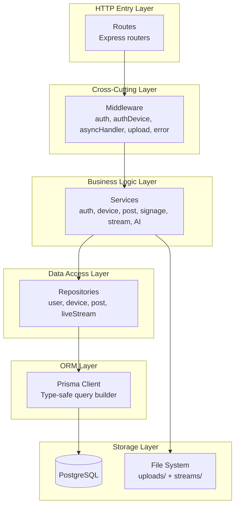
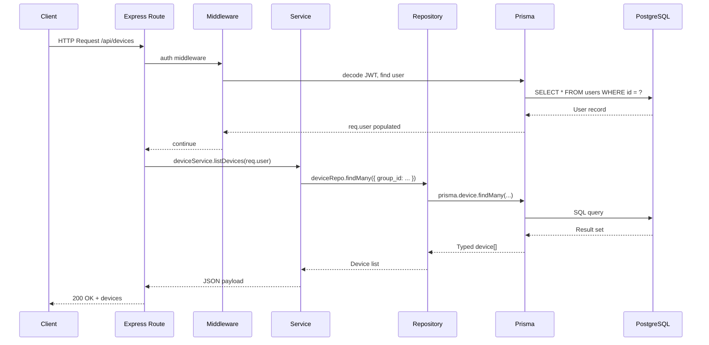
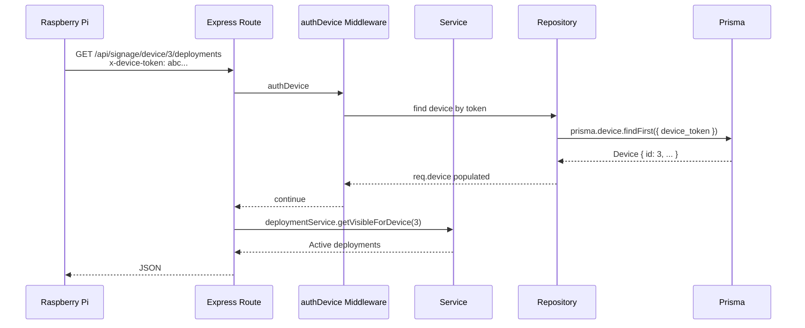
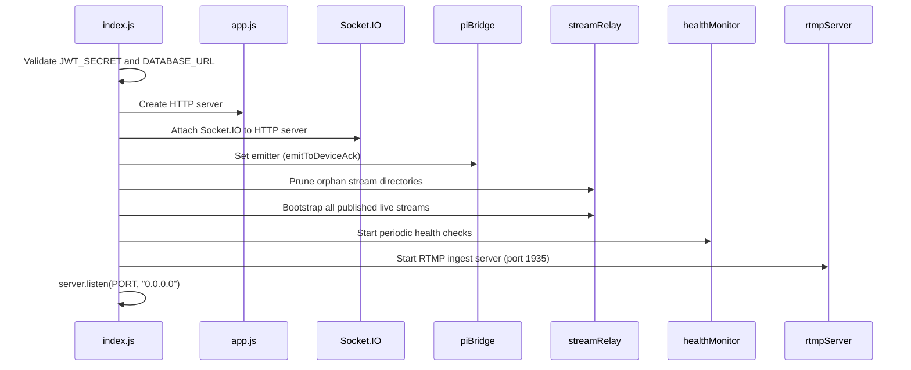
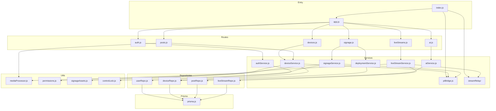

# Backend Architecture

This document describes the layered architecture, request/response flows, and design decisions of the Smart Signage backend.

---

## Layered Architecture

The backend follows a strict layered pattern. Each layer has exactly one responsibility and depends only on the layer beneath it.

### Layer Responsibilities

| Layer | Responsibility | Example |
|-------|---------------|---------|
| **Routes** | HTTP semantics, path mapping, parameter extraction | `POST /api/posts` → call `postService.create()` |
| **Middleware** | Authentication, authorization, error wrapping, file handling | `auth.js` sets `req.user`; `asyncHandler.js` catches promise rejections |
| **Services** | Business rules, workflow orchestration, validation | `deviceService.approveDevice()` applies pending changes and emits refresh |
| **Repositories** | Database queries, transaction boundaries | `deviceRepo.findByToken()` wraps `prisma.device.findFirst()` |
| **Prisma ORM** | Query construction, migration management, connection pooling | Generates type-safe client from `schema.prisma` |
| **PostgreSQL** | Persistent storage, ACID transactions, indexing | Stores all relational data |

---

## Request Flow

### Standard HTTP Request

### Device-Authenticated Request

Device endpoints use `authDevice.js` instead of `auth.js`. The middleware verifies the `x-device-token` header against `Device.device_token`.

---

## Bootstrap Sequence

When `src/index.js` starts, the following initialization occurs in order:

This ensures that:
1. The database connection is valid before accepting traffic
2. All previously-running stream relays are restored after a restart
3. The RTMP server is ready before any device attempts to push

---

## Module Dependency Graph

---

## Error Handling Strategy

1. **Synchronous errors** in Express routes are caught by Express's built-in error handler.
2. **Asynchronous errors** in route handlers are caught by `asyncHandler.js`, which forwards them to the global error middleware.
3. **Prisma errors** (P2002 unique constraint, P2025 record not found) are translated to appropriate HTTP status codes in `middleware/error.js`.
4. **Socket.IO errors** do not crash the server. Each event handler wraps its Prisma calls in `.catch(() => {})` to prevent unhandled promise rejections from disconnecting all sockets.

---

## Design Decisions

### Why Services and Repositories?

Splitting business logic (`services/`) from data access (`repositories/`) allows:
- **Unit testing** services by mocking repositories
- **Query optimization** in one place (repository files)
- **Business rule changes** without touching database queries

### Why a Single Process?

The backend runs as a single Node.js process. This simplifies deployment and state management (e.g., `deviceSockets` Map). If horizontal scaling is needed in the future, Socket.IO can be migrated to Redis Adapter, and `deviceSockets` replaced with a Redis-backed lookup.

### Why File System for Media?

Images and videos are stored on the local file system rather than object storage (S3) to reduce infrastructure complexity. For a university campus deployment with predictable storage needs, local SSD/NAS storage is sufficient. The `uploads/` and `streams/` directories are mounted volumes in production.

---

_This document is part of the Smart Signage backend documentation. See `backend/README.md` for the high-level overview._
