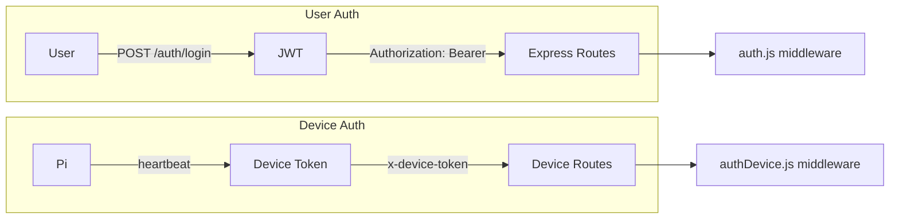
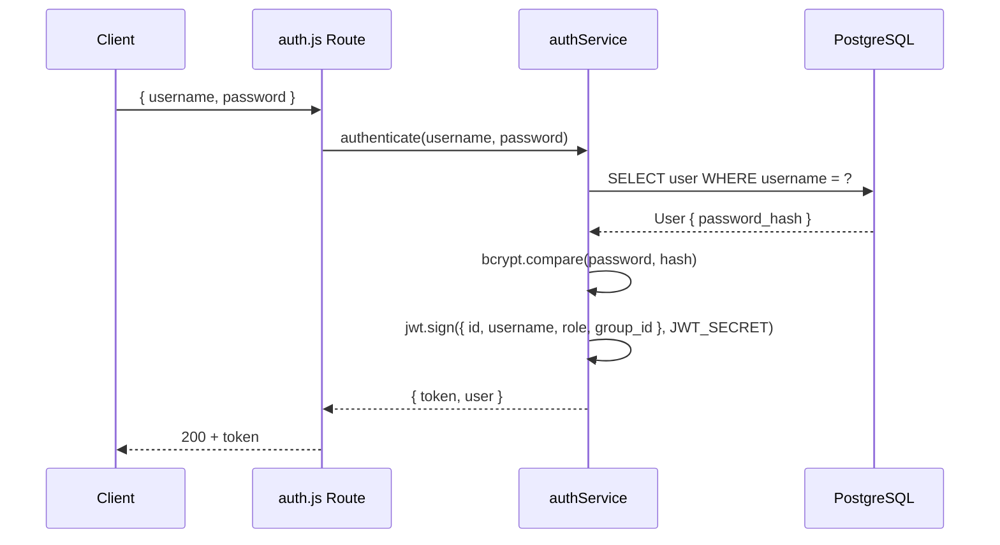
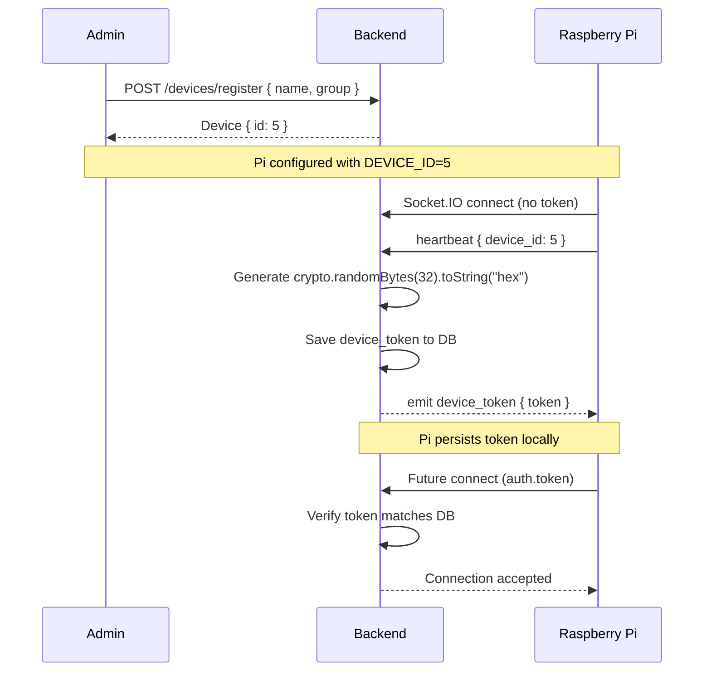
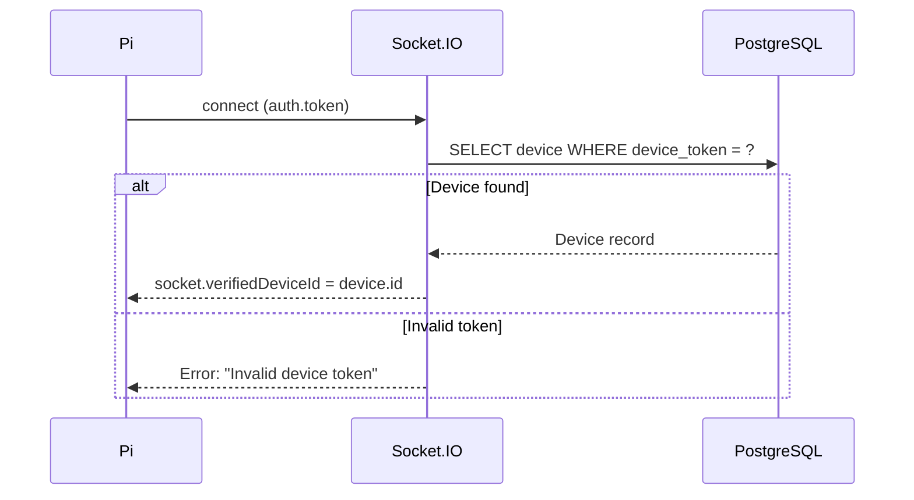
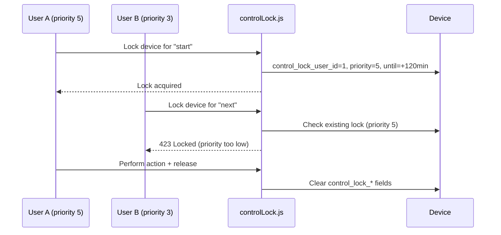

# Backend Authentication & Authorization

This document describes the dual authentication system (JWT for users, device tokens for Pis) and role-based access control.

---

## Dual Authentication Model

The backend serves two fundamentally different security principals:

1. **Human users** (admins, creators, viewers) who log in with passwords
2. **Device agents** (Raspberry Pis) who authenticate with pre-generated tokens

These systems are completely separate to prevent token confusion and allow different validation rules.



---

## User Authentication (JWT)

### Registration

`POST /api/auth/register`

- First user to register automatically becomes `role: admin`
- Subsequent registrations default to `role: creator`
- Password hashed with bcrypt (10 rounds)

### Login

`POST /api/auth/login`



### JWT Middleware (`middleware/auth.js`)

1. Extract `Authorization: Bearer <token>` header
2. Verify JWT signature with `JWT_SECRET`
3. Look up user in database to ensure still active
4. Populate `req.user` with `{ id, username, role, group_id }`
5. Reject with 401 if token invalid, expired, or user not found

---

## Device Authentication (Device Token)

### Token Lifecycle



### Token Security Properties

- **Length**: 64 hexadecimal characters (256 bits of entropy)
- **Generation**: `crypto.randomBytes(32).toString("hex")`
- **Storage**: Persisted in `Device.device_token` column (plain text; the token itself is the credential, not a hash)
- **Transmission**: Sent via Socket.IO `device_token` event over TLS (production) or local network
- **Scope**: Per-device; no two devices share the same token

### Device Auth Middleware (`middleware/authDevice.js`)

1. Extract `x-device-token` header
2. Query `prisma.device.findFirst({ where: { device_token } })`
3. Populate `req.device` with full device record
4. Reject with 401 if token not found or device not approved

### Socket.IO Token Validation

The Socket.IO server has its own handshake middleware:



**Additional hardening:**
- If `socket.verifiedDeviceId` is set and heartbeat claims a different `device_id` → disconnect immediately
- If device already has a token but socket presents none/invalid → disconnect

---

## Role-Based Access Control (RBAC)

### Roles

| Role | Description |
|------|-------------|
| `admin` | Full system access. Can manage all users, groups, devices, posts, and streams. |
| `creator` | Can create and manage content within their assigned group. Can view and control assigned devices. Cannot manage users or approve devices. |
| `viewer` | Read-only access. Can browse feed and signage content. Frontend-enforced. |

### Permission Helpers (`utils/permissions.js`)

```js
// Group scoping
isAdmin(user)          // user.role === 'admin'
getScopedQuery(user)   // { group_id: user.group_id } for creators

// Content ownership
canEditPost(user, post) // admin OR (creator AND post.created_by === user.id)
```

### Middleware Enforcement

Route-level protection:

```js
// Admin only
router.get("/users", auth, requireRole("admin"), ...);

// Admin or creator (group-scoped)
router.get("/devices", auth, requireRole("admin", "creator"), ...);

// Device only
router.get("/signage/device/:id/deployments", authDevice, ...);
```

---

## Control Locks

When multiple admins or creators attempt to control the same device simultaneously, control locks prevent race conditions.

### Lock Fields (`Device` table)

| Field | Description |
|-------|-------------|
| `control_lock_user_id` | User who acquired the lock |
| `control_lock_priority` | Priority level (higher wins) |
| `control_lock_until` | Lock expiration timestamp |
| `control_lock_action` | Action being performed |

### Lock Logic (`utils/controlLock.js`)

1. Check if device has an active lock (`control_lock_until > now()`)
2. If requesting user's priority > existing lock priority → steal the lock
3. If requesting user's priority <= existing → reject with 423 Locked
4. On successful action, release the lock



---

## Security Checklist

- [x] JWT secret minimum 32 characters, checked at startup
- [x] bcrypt password hashing (10 rounds)
- [x] Per-device unique tokens (256-bit entropy)
- [x] Device pre-registration required (no auto-accept)
- [x] Token mismatch detection and immediate disconnection
- [x] Path traversal protection on static file serving
- [x] Control locks prevent concurrent device manipulation
- [x] Rate limiting on AI endpoint (20 req/IP/min)
- [x] Role-based middleware on all mutating routes

---

_This document is part of the Smart Signage backend documentation. See `backend/README.md` for the high-level overview._
