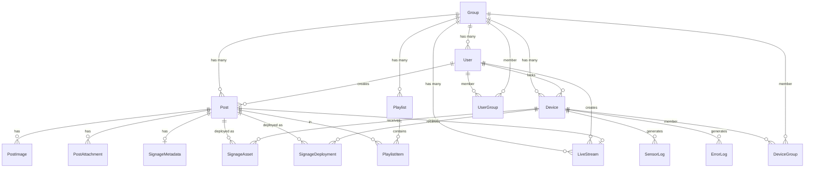
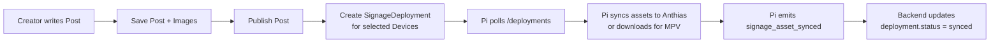
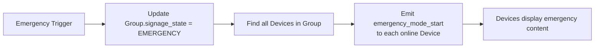

# Backend Database

This document describes the PostgreSQL database schema managed by Prisma, including all models, relationships, indexes, and enums.

---

## Overview

The database is a **relational PostgreSQL** instance accessed through **Prisma ORM**. It stores users, groups, content, devices, deployments, sensor logs, and live streams. The schema is defined in `backend/prisma/schema.prisma`.

---

## Entity Relationship Diagram

---

## Models

### Group

The top-level organizational unit. Users, devices, posts, and streams all belong to a group.

| Field | Type | Description |
|-------|------|-------------|
| `id` | Int (PK) | Auto-increment |
| `name` | String (UQ) | Group name |
| `description` | String? | Optional description |
| `signage_state` | SignageState | `NORMAL` by default; overridden during emergency |
| `created_at` | DateTime | Creation timestamp |

**Relations:**
- `devices` → `Device[]` (one-to-many)
- `posts` → `Post[]` (one-to-many)
- `users` → `User[]` (one-to-many)
- `live_streams` → `LiveStream[]` (one-to-many)
- `playlists` → `Playlist[]` (one-to-many)
- `device_memberships` → `DeviceGroup[]`
- `user_memberships` → `UserGroup[]`

### User

System users with role-based permissions.

| Field | Type | Description |
|-------|------|-------------|
| `id` | Int (PK) | Auto-increment |
| `username` | String (UQ) | Login name |
| `password_hash` | String | bcrypt hash |
| `role` | Role | `admin`, `creator`, or `viewer` |
| `group_id` | Int? | Primary group affiliation |
| `auto_approve` | Boolean | Auto-approve devices created by this user |
| `can_manage_other_posts` | Boolean | Can edit posts by other creators in the same group |
| `creator_priority` | Int | Used for control lock priority |
| `control_lock_minutes` | Int | Default lock duration |
| `max_signage_state` | SignageState | Highest state this user can set |
| `created_at` | DateTime | Creation timestamp |

**Relations:**
- `group` → `Group?`
- `posts` → `Post[]`
- `live_streams` → `LiveStream[]`
- `device_locks` → `Device[]` (one-to-many via `control_lock_user_id`)
- `managed_groups` → `UserGroup[]`

### Device

A Raspberry Pi display agent in the field.

| Field | Type | Description |
|-------|------|-------------|
| `id` | Int (PK) | Auto-increment |
| `device_name` | String | Human-readable name |
| `group_id` | Int? | Primary group |
| `ip_address` | String | Last known IP |
| `location` | String? | Physical location |
| `all_groups` | Boolean | Device serves all groups |
| `status` | String | `online` or `offline` |
| `last_seen` | DateTime? | Last heartbeat timestamp |
| `is_approved` | Boolean | Admin approval status |
| `pending_name` | String? | Staged name change |
| `pending_ip` | String? | Staged IP change |
| `pending_location` | String? | Staged location change |
| `device_token` | String? | 64-char hex auth token |
| `emergency_asset_path` | String? | Local path to emergency image/video |
| `control_lock_user_id` | Int? | User who locked controls |
| `control_lock_priority` | Int? | Lock priority level |
| `control_lock_until` | DateTime? | Lock expiration |
| `control_lock_action` | String? | Action being locked |
| `created_at` | DateTime | Creation timestamp |

**Relations:**
- `group` → `Group?`
- `groups` → `DeviceGroup[]` (multi-group membership)
- `sensor_logs` → `SensorLog[]`
- `error_logs` → `ErrorLog[]`
- `signage_assets` → `SignageAsset[]`
- `deployments` → `SignageDeployment[]`
- `control_lock_user` → `User?`

### Post

Content unit that can be published to the feed, signage, or both.

| Field | Type | Description |
|-------|------|-------------|
| `id` | Int (PK) | Auto-increment |
| `title` | String | Post title |
| `slug` | String (UQ) | URL-friendly identifier |
| `description_markdown` | String? | Rich text body |
| `group_id` | Int | Owning group |
| `created_by` | Int | Author user ID |
| `allowed_on_feed` | Boolean | Visible in public feed |
| `allowed_on_signage` | Boolean | Deployable to devices |
| `requested_feed` | Boolean | Creator requested feed visibility |
| `requested_signage` | Boolean | Creator requested signage visibility |
| `status` | PostStatus | `draft` or `published` |
| `signage_state` | SignageState | Urgency level |
| `live_stream_id` | Int? | Linked live stream |
| `created_at` / `updated_at` | DateTime | Timestamps |

**Relations:**
- `author` → `User`
- `group` → `Group`
- `images` → `PostImage[]`
- `attachments` → `PostAttachment[]`
- `signage_metadata` → `SignageMetadata?`
- `signage_assets` → `SignageAsset[]`
- `signage_deployments` → `SignageDeployment[]`
- `playlist_items` → `PlaylistItem[]`
- `live_stream` → `LiveStream?`

### SignageDeployment

Links a post to a specific device with scheduling and priority.

| Field | Type | Description |
|-------|------|-------------|
| `id` | Int (PK) | Auto-increment |
| `device_id` | Int | Target device |
| `post_id` | Int | Content post |
| `duration_seconds` | Int | Display duration |
| `start_date` | DateTime? | Activation start |
| `end_date` | DateTime? | Activation end |
| `priority` | Int | Playback order |
| `display_group` | String? | Display category |
| `is_enabled` | Boolean | Active flag |
| `play_order` | Int | Sequence order |
| `nocache` | Boolean | Skip caching |
| `skip_asset_check` | Boolean | Skip verification |
| `status` | String | `pending`, `synced`, `error` |
| `last_error` | String? | Last sync error |

**Unique constraint:** `device_id` + `post_id`

### SignageAsset

Tracks assets synced to a specific Anthias device.

| Field | Type | Description |
|-------|------|-------------|
| `id` | Int (PK) | Auto-increment |
| `device_id` | Int | Target device |
| `post_id` | Int? | Source post |
| `asset_id` | String | Anthias asset identifier |
| `asset_name` | String? | Display name |
| `image_url` | String? | Media URL |
| `mimetype` | String? | MIME type |
| `duration` | Int? | Duration seconds |
| `is_enabled` | Boolean | Visible in playlist |
| `is_active` | Boolean? | Currently playing |
| `play_order` | Int? | Sequence |
| `start_date` / `end_date` | DateTime? | Scheduling |
| `last_synced_at` | DateTime | Last sync timestamp |

### SignageMetadata

Scheduling and display settings for a post (not device-specific).

| Field | Type | Description |
|-------|------|-------------|
| `id` | Int (PK) | Auto-increment |
| `post_id` | Int (UQ) | One-to-one with Post |
| `duration_seconds` | Int | Default display time |
| `start_date` / `end_date` | DateTime? | Scheduling window |
| `priority` | Int | Urgency |
| `display_group` | String? | Category |
| `is_enabled` | Boolean | Active |
| `play_order` | Int | Sequence |
| `nocache` | Boolean | Skip cache |
| `skip_asset_check` | Boolean | Skip verification |

### LiveStream

Live video stream configuration.

| Field | Type | Description |
|-------|------|-------------|
| `id` | Int (PK) | Auto-increment |
| `title` | String | Stream name |
| `stream_type` | LiveStreamType | `HLS`, `RTSP`, `YOUTUBE`, `RTMP` |
| `source_url` | String? | Input URL |
| `relay_url` | String? | HLS output URL |
| `stream_key` | String? (UQ) | RTMP stream key |
| `thumbnail_path` | String? | Thumbnail image |
| `status` | LiveStreamStatus | `idle`, `starting`, `online`, `offline`, `error` |
| `last_error` | String? | Last failure reason |
| `last_seen` | DateTime? | Last health check |
| `group_id` / `created_by` | Int | Ownership |

### SensorLog

Environmental data from Arduino sensors.

| Field | Type | Description |
|-------|------|-------------|
| `id` | Int (PK) | Auto-increment |
| `device_id` | Int | Source device |
| `motion` | Boolean | PIR motion detected |
| `brightness` | Int | Ambient light level |
| `rain` | Boolean | Rain sensor triggered |
| `created_at` | DateTime | Timestamp |

### ErrorLog

Errors reported by Pi agents.

| Field | Type | Description |
|-------|------|-------------|
| `id` | Int (PK) | Auto-increment |
| `device_id` | Int | Source device |
| `error_type` | String | Error category |
| `message` | String | Error details |
| `created_at` | DateTime | Timestamp |

### Playlist / PlaylistItem

Ordered content sequences for a group.

| Model | Key Fields |
|-------|-----------|
| `Playlist` | `id`, `name`, `group_id` |
| `PlaylistItem` | `id`, `playlist_id`, `post_id`, `duration_seconds`, `order_index` |

### Junction Tables

| Model | Purpose |
|-------|---------|
| `UserGroup` | Many-to-many: users ↔ groups |
| `DeviceGroup` | Many-to-many: devices ↔ groups |

---

## Enums

| Enum | Values | Usage |
|------|--------|-------|
| `Role` | `admin`, `creator`, `viewer` | User permissions |
| `PostStatus` | `draft`, `published` | Content workflow |
| `SignageState` | `EMERGENCY`, `SECURITY_RISK`, `BREAKING_NEWS`, `NORMAL` | Urgency hierarchy |
| `LiveStreamType` | `HLS`, `RTSP`, `YOUTUBE`, `RTMP` | Stream protocol |
| `LiveStreamStatus` | `idle`, `starting`, `online`, `offline`, `error` | Stream lifecycle |
| `MediaType` | `IMAGE`, `VIDEO`, `LIVE_STREAM` | Post image classification |

---

## Indexes

Prisma automatically creates indexes for foreign keys and unique constraints. Key composite indexes include:

- `Device`: `status`, `group_id`, `is_approved`
- `Post`: `status`, `group_id`, `created_by`, `allowed_on_feed`, `allowed_on_signage`
- `SignageDeployment`: `device_id` + `status`, `post_id`
- `SignageAsset`: `device_id`, `post_id`
- `SensorLog`: `device_id`
- `ErrorLog`: `device_id`

---

## Data Flows

### Content Creation to Deployment

### Emergency State Change

---

_This document is part of the Smart Signage backend documentation. See `backend/README.md` for the high-level overview._
