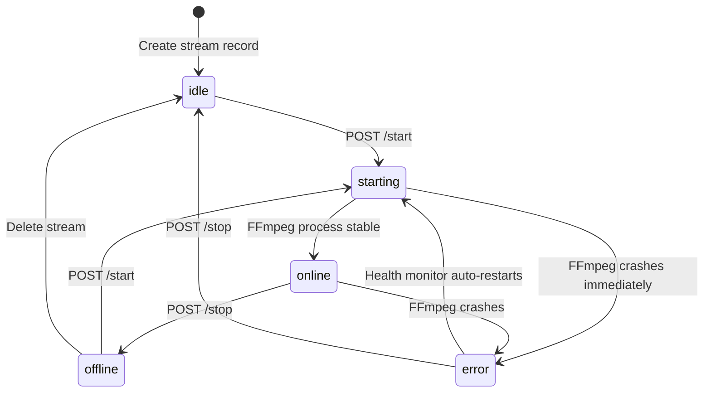
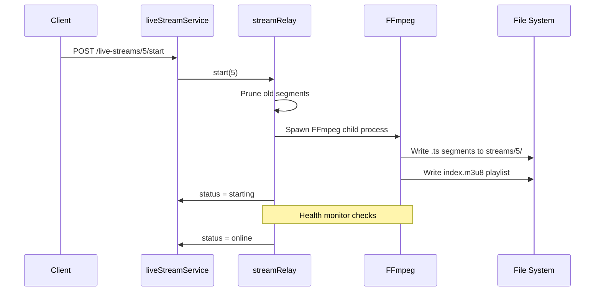
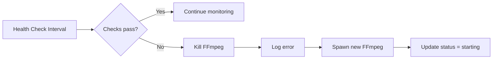

# Backend Live Streaming

This document describes how the backend ingests, relays, and serves live video streams to display devices.

---

## Overview

The backend supports four streaming protocols, unified into a single HLS output that Pi agents can consume.

| Type | Source | Ingest Method | Relay Output |
|------|--------|---------------|-------------|
| **HLS** | External URL | Pull | Direct proxy + cache |
| **RTSP** | IP Camera | Pull | FFmpeg → HLS segments |
| **YouTube** | YouTube HLS | Pull | Proxy + cache |
| **RTMP** | OBS / Encoder | Push to `rtmp://server:1935/live/<key>` | FFmpeg → HLS segments |

All streams ultimately serve HLS playlists and segments from `backend/streams/{stream_id}/`.

---

## Architecture

```mermaid
flowchart TB
    subgraph Sources
        OBS[OBS Studio<br/>RTMP Push]
        CAM[IP Camera<br/>RTSP URL]
        EXT[External CDN<br/>HLS .m3u8]
        YT[YouTube<br/>HLS URL]
    end

    subgraph Backend
        RTMP_S[RTMP Ingest<br/>node-media-server<br/>:1935]
        RELAY[FFmpeg Relay<br/>streamRelay/index.js]
        HLS[HLS Segments<br/>streams/{id}/]
        STATIC[Express Static<br/>/streams/{id}/index.m3u8]
    end

    subgraph Consumers
        PI1[Pi / Anthias]
        PI2[Pi / MPV]
        WEB[Web Browser]
    end

    OBS -->|RTMP push| RTMP_S
    CAM -->|RTSP pull| RELAY
    EXT -->|HLS pull| RELAY
    YT -->|HLS pull| RELAY
    RTMP_S -->|stream data| RELAY
    RELAY -->|segment files| HLS
    HLS --> STATIC
    STATIC --> PI1 & PI2 & WEB
```

---

## Stream Lifecycle



### State Descriptions

| State | Meaning |
|-------|---------|
| `idle` | Stream configured but not running |
| `starting` | FFmpeg process spawned, waiting for stable output |
| `online` | HLS segments being generated successfully |
| `offline` | Stopped by user or after error |
| `error` | FFmpeg exited unexpectedly |

---

## RTMP Ingest

### node-media-server Configuration

- Listens on port `1935`
- Accepts RTMP push from OBS, vMix, mobile apps
- Stream path: `rtmp://<server_ip>:1935/live/<stream_key>`
- Stream key is stored in `LiveStream.stream_key` (unique constraint)

### Key Rotation

`POST /api/live-streams/:id/rotate-key` generates a new random key and invalidates the old one. This forces any active broadcaster to reconnect with the new key.

---

## FFmpeg Relay

### Start Sequence



### FFmpeg Parameters (RTMP Example)

```bash
ffmpeg -i rtmp://localhost:1935/live/<key> \
  -c:v libx264 -preset fast -g 50 -sc_threshold 0 \
  -c:a aac -ar 48000 \
  -f hls -hls_time 2 -hls_list_size 10 \
  -hls_flags delete_segments+program_date_time \
  streams/5/index.m3u8
```

---

## Health Monitoring

`services/streamRelay/healthMonitor.js` runs periodic checks:

1. **Segment freshness**: Verify `.ts` files in `streams/{id}/` are being updated
2. **Playlist validity**: Verify `index.m3u8` exists and references valid segments
3. **Process liveness**: Check FFmpeg PID is still running

If any check fails:
- Log error to `LiveStream.last_error`
- Kill existing FFmpeg process
- Spawn new FFmpeg process
- Increment restart counter



---

## HLS Serving

Express serves HLS files from `/streams/*`:

```js
app.use("/streams", express.static(STREAMS_DIR, {
  setHeaders: (res, filePath) => {
    if (filePath.endsWith(".m3u8")) {
      res.setHeader("Cache-Control", "no-store");
    }
  },
}));
```

- **Playlist files** (`.m3u8`): `Cache-Control: no-store` to prevent stale playlists
- **Segment files** (`.ts`): Default cache behavior (browser may cache briefly)

---

## Stream Types in Detail

### HLS (Pull)

- Direct proxy of external `.m3u8` URL
- Minimal CPU usage (no transcoding)
- Useful for rebroadcasting existing HLS feeds

### RTSP (Pull)

- FFmpeg pulls from camera URL (`rtsp://camera_ip:554/stream`)
- Transcodes to H.264/AAC HLS
- Higher CPU usage due to transcoding

### YouTube (Pull)

- Extracts HLS manifest from YouTube URL
- Proxies segments with caching
- May break if YouTube changes their internal API

### RTMP (Push)

- Broadcaster pushes to `rtmp://server:1935/live/<key>`
- node-media-server receives the stream
- FFmpeg pulls from local RTMP and transcodes to HLS
- Best for live events with OBS/mobile broadcasters

---

## Cleanup

On server startup (`streamRelay.pruneOrphanDirs()`):
- Delete stream directories with no corresponding `LiveStream` DB record
- Prevents disk space leaks from deleted streams

---

_This document is part of the Smart Signage backend documentation. See `backend/README.md` for the high-level overview._
