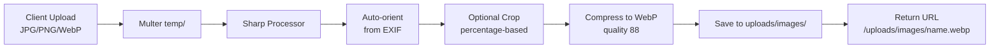

```mermaid
flowchart LR
    A[Client Upload<br/>MP4/MOV/AVI] --> B[Multer temp/]
    B --> C[FFprobe]
    C --> D[Extract metadata<br/>duration, codecs]
    D --> E[FFmpeg Transcode]
    E --> F[H.264 video<br/>AAC audio]
    F --> G[Apply crop if specified]
    G --> H[MP4 faststart<br/>moov atom at front]
    H --> I[Save to uploads/videos/]
    I --> J[Return URL<br/>/uploads/videos/name.mp4]
```

# Backend Media Processing

This document describes how the backend handles image, video, and document uploads.

---

## Overview

All media is processed before storage to ensure consistent formats, optimized file sizes, and compatibility with Raspberry Pi display agents.

- **Images**: Converted to WebP with Sharp
- **Videos**: Transcoded to H.264/AAC MP4 with FFmpeg
- **Documents**: Text extracted for AI context

---

## Image Processing (Sharp)

### Pipeline



### Supported Operations

| Feature | Implementation |
|---------|---------------|
| Input formats | JPG, PNG, WebP |
| Output format | WebP |
| Quality | 88 (balance of size vs. quality) |
| Crop | Percentage-based (`{ x, y, width, height }`) |
| Auto-orient | Reads EXIF Orientation tag |
| Max upload | Configured via Multer |

### Why WebP?

WebP provides ~30% smaller file sizes than JPEG at equivalent quality, reducing download time for Pi agents on limited bandwidth. Sharp is a native Node.js module that processes images significantly faster than pure-JavaScript alternatives.

---

## Video Processing (FFmpeg)

### Pipeline



### Supported Operations

| Feature | Implementation |
|---------|---------------|
| Input formats | MP4, MOV, AVI, MKV (anything FFmpeg supports) |
| Output format | MP4 (H.264 + AAC) |
| Video codec | libx264 or hardware equivalent |
| Audio codec | AAC |
| Faststart | `movflags +faststart` for web playback |
| Crop | Spatial crop with percentage coordinates |
| Trim | Temporal trim (`start`/`end` in seconds) |

### Why H.264 + Faststart?

Raspberry Pi hardware decoders (OMX/V4L2) have excellent H.264 support. The `faststart` flag moves the MP4 metadata to the beginning of the file, allowing playback to begin before the entire file is downloaded — critical for Pi agents streaming over WiFi.

---

## Document Processing

PDF, DOCX, and PPTX attachments are uploaded and their text is extracted for AI context.

| Format | Library | Purpose |
|--------|---------|---------|
| PDF | `pdf-parse-fork` | Extract text content |
| DOCX | `mammoth` | Convert to plain text |
| PPTX | `mammoth` | Convert to plain text |

Extracted text is stored in `PostAttachment.extracted_text` and included in OpenAI prompts when users ask questions about the post.

---

## File Storage Layout

```
backend/uploads/
├── images/
│   └── <uuid>.webp
├── videos/
│   └── <uuid>.mp4
├── attachments/
│   └── <uuid>.pdf
│   └── <uuid>.docx
└── temp/
    └── <incoming uploads before processing>
```

Static files are served from `/uploads/*` via Express static middleware with **path traversal protection**.

---

## Upload Middleware

### Image/Video (`middleware/upload.js`)

- Multer disk storage to `uploads/temp/`
- File size limits configurable
- MIME type filtering

### Attachments (`middleware/uploadAttachment.js`)

- Separate Multer config for PDF/DOCX/PPTX
- Validates MIME types

---

_This document is part of the Smart Signage backend documentation. See `backend/README.md` for the high-level overview._
