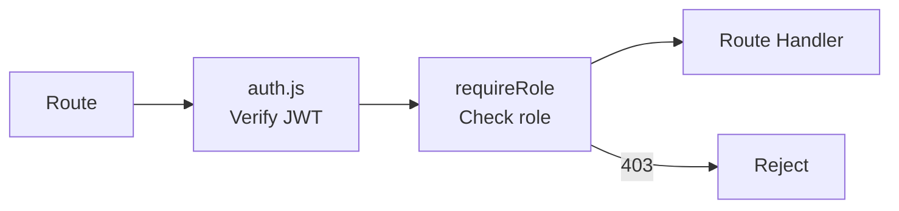
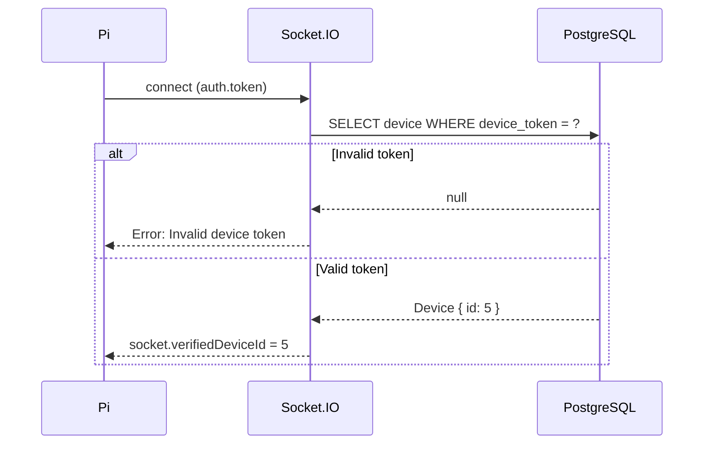
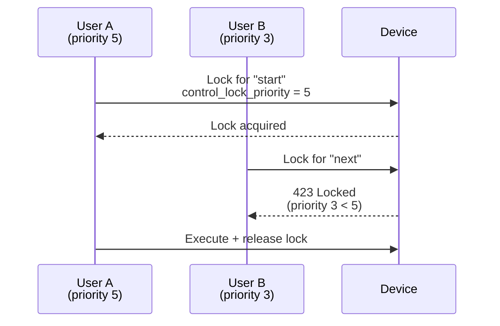

# Backend Security

This document describes the security model, hardening measures, and threat mitigations of the Smart Signage backend.

---

## Threat Model

| Threat | Mitigation |
|--------|-----------|
| Unauthorized admin access | bcrypt password hashing, JWT expiry, role enforcement |
| Device impersonation | Per-device tokens, pre-registration requirement, token mismatch detection |
| Replay attacks | Device tokens are stateful; JWTs have `iat` and `exp` claims |
| Path traversal on uploads | `uploads.js` middleware resolves and validates paths before serving |
| Concurrent device control | Control locks with priority-based override |
| Denial of service | AI endpoint rate limiting; upload size limits via Multer |
| Database injection | Prisma ORM parameterized queries (no raw SQL from user input) |
| Man-in-the-middle | HTTPS/TLS in production; device tokens over local network only |

---

## Authentication Security

### Password Storage

- Algorithm: bcrypt with 10 salt rounds
- Plain text passwords are never stored
- Password verification uses `bcrypt.compare()`

### JWT Security

- Minimum secret length: 32 characters (enforced at startup)
- Algorithm: HS256
- Payload contains non-sensitive data only: `id`, `username`, `role`, `group_id`
- No refresh token rotation implemented (short-lived tokens recommended for high-security environments)

### Device Token Security

- **Entropy**: 256 bits (`crypto.randomBytes(32).toString("hex")`)
- **Scope**: Per-device, non-transferable
- **Storage**: Plain text in `Device.device_token` column; the token itself is the credential
- **Transmission**: Socket.IO event and HTTP headers
- **Revocation**: Admin can reset the device, generating a new token

---

## Authorization Model

### Role Enforcement

Middleware chain enforces role checks before route handlers execute:



### Group Scoping

Creators can only access content and devices in their assigned group. Admins see everything. This is enforced in both service layer (`permissions.js`) and repository queries.

---

## Socket.IO Hardening

### Handshake Validation



### Runtime Validation

1. **Heartbeat rejection**: Unknown `device_id` → disconnect
2. **Token mismatch**: `device_id` in heartbeat differs from `socket.verifiedDeviceId` → disconnect
3. **Missing token on reconnect**: Device has a token but socket presents none → disconnect

---

## Control Locks

Prevents race conditions when multiple users control the same device.



Lock fields: `control_lock_user_id`, `control_lock_priority`, `control_lock_until`, `control_lock_action`

---

## Path Traversal Protection

The static file serving middleware (`routes/uploads.js`) prevents directory traversal:

1. Resolves requested path to absolute path
2. Verifies resolved path is within `UPLOADS_DIR`
3. Rejects with 403 if path escapes allowed directory

```js
const resolved = path.resolve(UPLOADS_DIR, req.params[0]);
if (!resolved.startsWith(UPLOADS_DIR)) {
  return res.status(403).json({ error: "Forbidden" });
}
```

---

## Rate Limiting

### AI Endpoint

- Limit: 20 requests per IP per 60-second window
- Implementation: In-memory map with IP-based tracking
- Response when exceeded: `429 Too Many Requests`

### Upload Endpoints

- File size limits enforced by Multer configuration
- Large file uploads (emergency asset) capped at 200 MB

---

## Data Integrity

### Prisma ORM

- All database queries are parameterized by Prisma
- No raw SQL injection vectors from user input
- Foreign key constraints with `onDelete: Cascade` / `onDelete: SetNull`
- Unique constraints prevent duplicate registrations (username, group name, stream key)

### Transaction Boundaries

Complex operations (device approval with pending changes, group deletion) use Prisma transactions to ensure atomic updates.

---

## Production Checklist

- [ ] `NODE_ENV=production`
- [ ] `JWT_SECRET` is at least 32 random characters
- [ ] PostgreSQL is not exposed to public internet
- [ ] `uploads/` and `streams/` directories have adequate disk space
- [ ] Nginx reverse proxy with SSL/TLS termination
- [ ] Firewall allows only necessary ports (80, 443, 1935 for RTMP)
- [ ] PM2 or systemd process management configured
- [ ] Log rotation enabled
- [ ] Database backups scheduled
- [ ] `OPENAI_API_KEY` rotated regularly

---

_This document is part of the Smart Signage backend documentation. See `backend/README.md` for the high-level overview._
