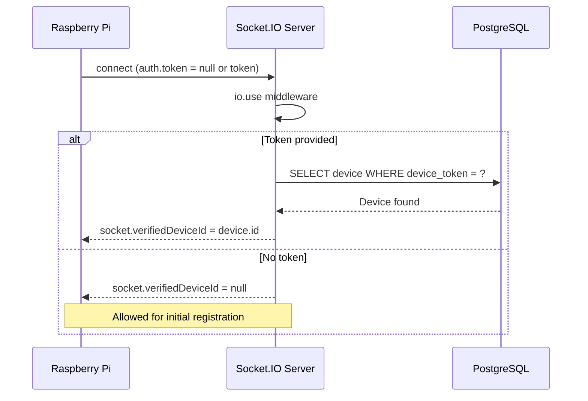
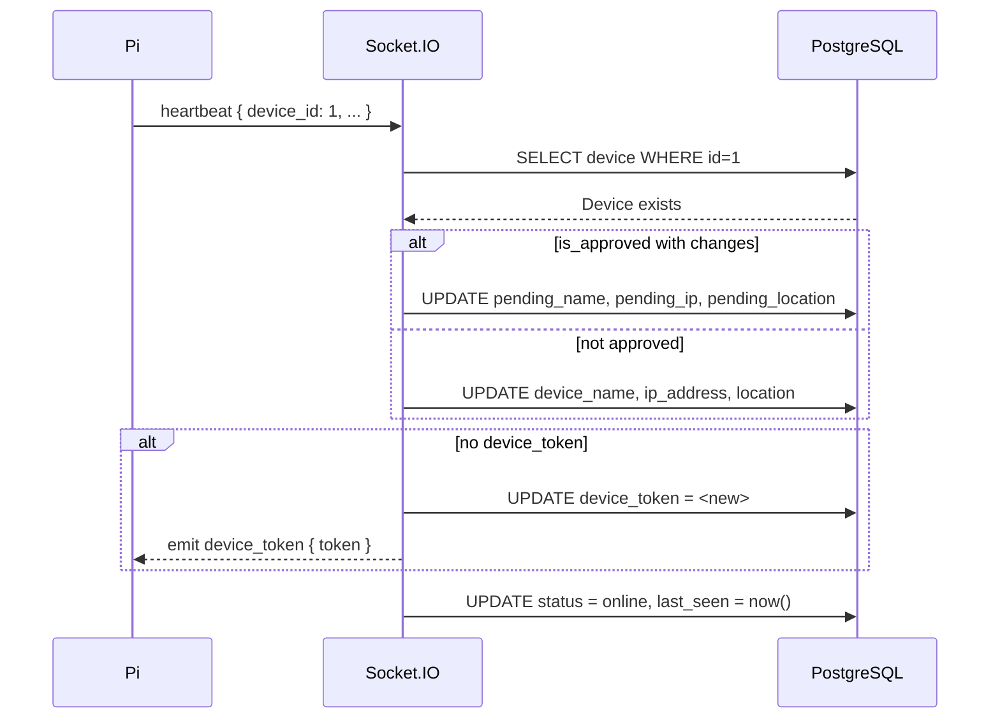
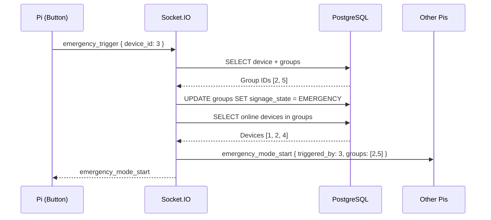

# Backend WebSocket (Socket.IO)

This document describes the real-time communication layer between the backend and Raspberry Pi display agents.

---

## Overview

Socket.IO is the **primary control plane** for field devices. While the REST API handles stateless requests (pulling deployments, uploading media), Socket.IO handles:

- Device registration and heartbeat
- Real-time command delivery (play next, emergency, refresh)
- Sensor data ingestion
- Error log collection
- Emergency broadcast propagation

The server maintains an in-memory `deviceSockets` Map (`device_id → socket.id`) for targeted emits.

---

## Connection Handshake



**Hardening rules:**
- Unknown device tokens are rejected immediately
- Once a device has a token, all future connections must present it
- Device ID in heartbeat must match `socket.verifiedDeviceId`
- Device ID in `sensor_update` and `error_log` must match `socket.verifiedDeviceId`

---

## Inbound Events (Pi → Server)

### `heartbeat`

Payload: `{ device_id, device_name, ip_address, location, status }`

**Approval workflow logic:**
- If device is `is_approved` and sends different name/IP/location → store as `pending_name`, `pending_ip`, `pending_location`
- If device is not approved → update basic info directly so admin sees current state

**Token management:**
- If device has no `device_token` → generate 64-char hex, save to DB, emit `device_token` event
- If device has token but socket presented none (e.g., Pi lost config) → emit existing token

**On disconnect:** status set to `offline`, socket removed from `deviceSockets`.



### `sensor_update`

Payload: `{ device_id, motion, brightness, rain }`

Verifies `device_id` matches `socket.verifiedDeviceId`, then inserts a `SensorLog` record. On mismatch the socket is disconnected immediately. Errors are silently caught (`.catch(() => {})`) to prevent socket disconnection on DB issues.

### `error_log`

Payload: `{ device_id, error_type, message }`

Verifies `device_id` matches `socket.verifiedDeviceId`, then inserts an `ErrorLog` record. On mismatch the socket is disconnected immediately.

### `playlist_ack`

Payload: `{ device_id }`

Logged to console. Confirms the Pi received a playlist update command.

### `signage_asset_synced`

Payload: `{ device_id, post_id, image_url, asset }`

1. Upserts a `SignageAsset` record via `utils/signageAssets.js`
2. Updates the corresponding `SignageDeployment` status to `synced`

### `emergency_trigger`

Payload: `{ device_id }`

**Critical path:**
1. Find device and all its groups (`group_id` + `DeviceGroup` memberships)
2. Update each group: `signage_state = "EMERGENCY"`
3. Find all online approved devices in those groups
4. Emit `emergency_mode_start` to each device's socket



---

## Outbound Events (Server → Pi)

| Event | Payload | Description |
|-------|---------|-------------|
| `device_token` | `{ device_id, token }` | Assign or re-emit auth token |
| `auth_error` | `{ error }` | Reject connection or heartbeat |
| `signage_command` | `{ action, ... }` | Playback/asset command |
| `emergency_mode_start` | `{ triggered_by, groups }` | Enter emergency playback |
| `emergency_mode_end` | `{}` | Exit emergency playback |
| `refresh_display` | `{}` | Reload current playlist |
| `restart_display` | `{}` | Restart Anthias/MPV player |

### `signage_command` Actions

| Action | Description |
|--------|-------------|
| `publish_asset` | New asset available for sync |
| `list` | Request current playlist |
| `next` | Advance to next item |
| `previous` | Go to previous item |
| `start` | Start playback |
| `hide_asset` | Hide an asset from rotation |
| `show_asset` | Show a hidden asset |
| `delete_asset` | Remove asset permanently |

---

## Server-Side Emit Helpers

### `emitToDevice(device_id, event, data)`

Fire-and-forget emit to a specific device. Returns `true` if device is online, `false` otherwise.

### `emitToDeviceAck(device_id, event, data, timeout)`

Acknowledged emit with timeout (default 10s). Returns a Promise resolving to:

```js
{ ok: true }           // Device acknowledged
{ ok: false, offline: true, error: "Device is offline" }
{ ok: false, error: "Device did not respond in time" }
```

Used for operations requiring confirmation, such as playback controls.

---

## Offline Detection

Every 15 seconds, a background interval queries:

```sql
UPDATE Device SET status = 'offline'
WHERE status = 'online' AND last_seen < NOW() - INTERVAL '30 seconds'
```

Devices are expected to send `heartbeat` every ~10 seconds. The 30-second grace period allows for network jitter without marking devices offline prematurely.

---

## Pi Bridge (`services/piBridge.js`)

HTTP routes cannot directly emit Socket.IO events. The `piBridge` module acts as a bridge:


During bootstrap (`index.js`):
```js
piBridge.setEmitter(emitToDeviceAck);
```

This allows services to send commands to devices in response to HTTP requests.

---

_This document is part of the Smart Signage backend documentation. See `backend/README.md` for the high-level overview._
