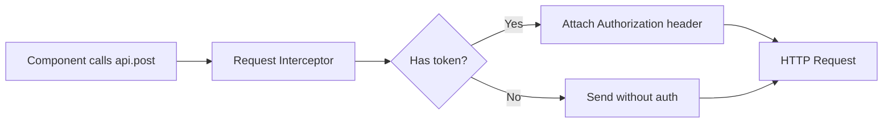

# Frontend API Layer

This document describes how the frontend communicates with the backend via Axios.

---

## Axios Instance

`src/api/axios.js` creates a single Axios instance used by all API modules.

```js
const api = axios.create({ timeout: 15000 });
```

### Request Interceptor

1. Sets `baseURL` dynamically via `apiBaseUrl()`
2. Attaches `Authorization: Bearer <token>` from `localStorage`



### Response Interceptor

1. On `401 Unauthorized`: clears auth store and redirects to `/login`
2. All other errors are passed through for component-level handling

```mermaid
flowchart TD
    A[HTTP Response] --> B{Status?}
    B -->|200-299| C[Return response.data]
    B -->|401| D[clearAuth()]
    D --> E[window.location.href = /login]
    B -->|Other| F[Reject with error]
```

---

## Dynamic Base URL

`config/apiBase.js` resolves the API origin based on environment:

| Environment | `apiBaseUrl()` | `assetOrigin()` |
|-------------|---------------|-----------------|
| Development | `/api` | `""` (same origin) |
| Production | `VITE_API_URL` | `VITE_API_URL` without `/api` |

### Vite Proxy (Development)

```js
// vite.config.js
proxy: {
  "/api": { target: "http://127.0.0.1:5000", changeOrigin: true },
  "/uploads": { target: "http://127.0.0.1:5000", changeOrigin: true },
  "/streams": { target: "http://127.0.0.1:5000", changeOrigin: true },
  "/socket.io": { target: "http://127.0.0.1:5000", changeOrigin: true, ws: true },
}
```

In development, the Vite dev server proxies all API, upload, stream, and WebSocket traffic to the backend running on port 5000. This avoids CORS issues.

---

## API Modules

Each backend domain has a dedicated module in `src/api/*.js`:

### auth.js

```js
export const login = (username, password) =>
  api.post("/auth/login", { username, password }).then((r) => r.data);

export const me = () => api.get("/auth/me").then((r) => r.data);
```

### devices.js

```js
export const getDevices = () => api.get("/devices").then((r) => r.data);
export const getDevice = (id) => api.get(`/devices/${id}`).then((r) => r.data);
export const registerDevice = (data) => api.post("/devices/register", data);
export const approveDevice = (id) => api.post(`/devices/${id}/approve`);
export const updateDevice = (id, data) => api.put(`/devices/${id}`, data);
export const deleteDevice = (id) => api.delete(`/devices/${id}`);
export const uploadEmergencyAsset = (id, formData) =>
  api.post(`/devices/${id}/emergency-asset`, formData, {
    headers: { "Content-Type": "multipart/form-data" },
  });
```

### posts.js

```js
export const listPosts = (params) => api.get("/posts", { params }).then((r) => r.data);
export const createPost = (data, opts = {}) => api.post("/posts", data, opts).then((r) => r.data);
export const updatePost = (id, data, opts = {}) => api.put(`/posts/${id}`, data, opts).then((r) => r.data);
export const deletePost = (id, deleteSignage = false) =>
  api.delete(`/posts/${id}`, { params: { delete_signage: deleteSignage } });
export const uploadAttachments = (postId, files) => {
  const fd = new FormData();
  for (const f of files) fd.append("attachments", f);
  return api.post(`/posts/${postId}/attachments`, fd, {
    headers: { "Content-Type": "multipart/form-data" },
    timeout: 120000,
  }).then((r) => r.data);
};
```

### signage.js

```js
export const getDeployments = (deviceId) =>
  api.get(`/signage/device/${deviceId}/deployments`).then((r) => r.data);
export const publish = (data) => api.post("/signage/publish", data);
export const controlDevice = (deviceId, action) =>
  api.post(`/signage/devices/${deviceId}/control`, { action });
export const toggleAsset = (deviceId, assetId, isEnabled) =>
  api.patch(`/signage/devices/${deviceId}/assets/${assetId}`, { is_enabled: isEnabled });
export const deleteAsset = (deviceId, assetId) =>
  api.delete(`/signage/devices/${deviceId}/assets/${assetId}`);
```

### liveStreams.js

```js
export const getStreams = () => api.get("/live-streams").then((r) => r.data);
export const getStream = (id) => api.get(`/live-streams/${id}`).then((r) => r.data);
export const createStream = (data) => api.post("/live-streams", data);
export const startStream = (id) => api.post(`/live-streams/${id}/start`);
export const stopStream = (id) => api.post(`/live-streams/${id}/stop`);
export const rotateKey = (id) => api.post(`/live-streams/${id}/rotate-key`);
export const getLogs = (id) => api.get(`/live-streams/${id}/logs`).then((r) => r.data);
```

### ai.js

```js
export const getStatus = () => api.get("/ai/status").then((r) => r.data);
export const ask = (postId, question, history = []) =>
  api.post("/ai/ask", { post_id: postId, question, history }).then((r) => r.data);
```

---

## Error Handling

Components handle API errors at the call site:

```jsx
const handleSubmit = async () => {
  try {
    await api.devices.approveDevice(deviceId);
    setMessage("✅ Device approved");
  } catch (err) {
    setMessage(`⚠️ ${err.response?.data?.error || err.message}`);
  }
};
```

The Axios response interceptor only handles `401` (global logout). All other errors are left to components for user-facing messages.

---

_This document is part of the Smart Signage frontend documentation. See `frontend/README.md` for the high-level overview._
