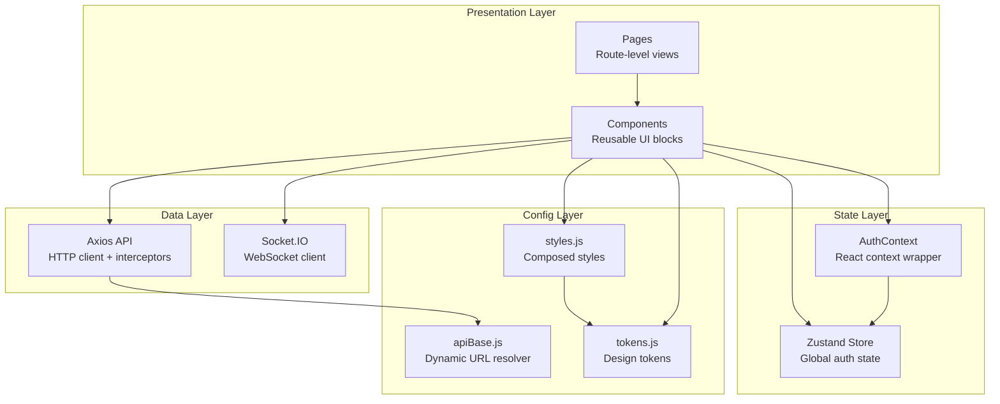
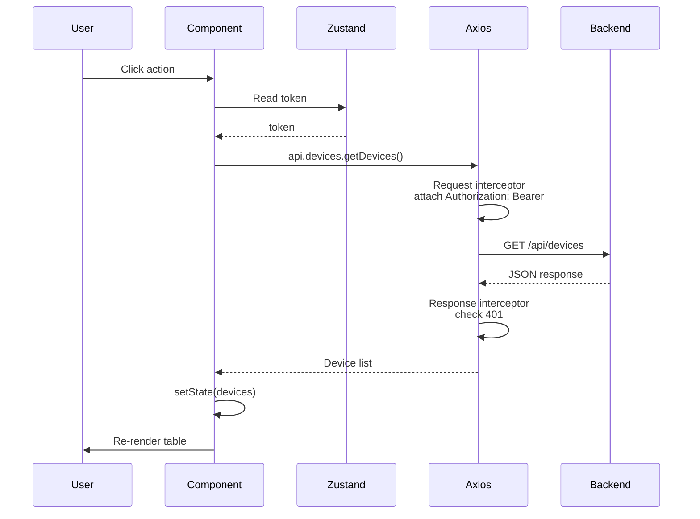
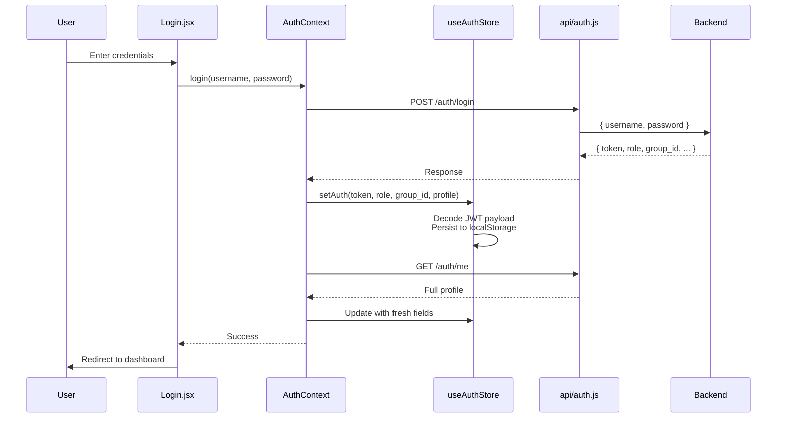
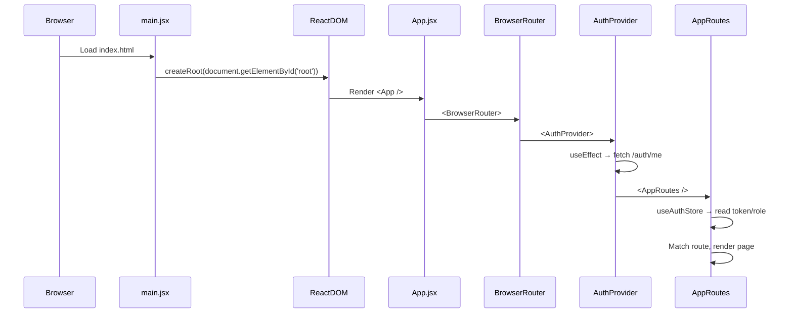
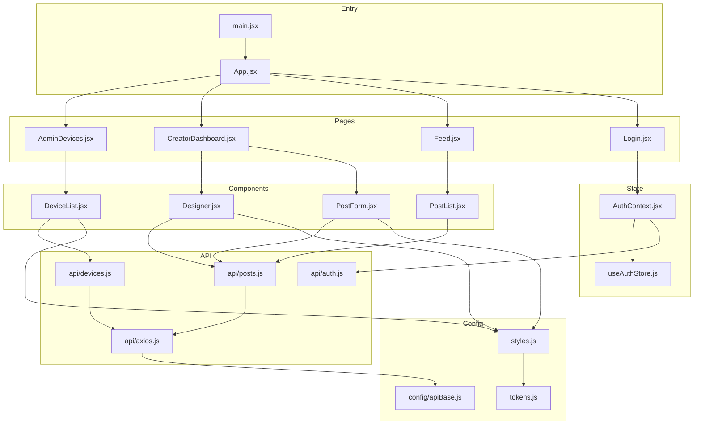

# Frontend Architecture

This document describes the layered architecture, data flows, and design decisions of the Smart Signage frontend.

---

## Layered Architecture

The frontend follows a strict layered pattern where each layer depends only on the layer beneath it.

### Layer Responsibilities

| Layer | Responsibility | Example |
|-------|---------------|---------|
| **Pages** | Route-level views, data fetching, layout composition | `AdminDevices.jsx` fetches devices on mount and renders `DeviceList` |
| **Components** | Reusable UI blocks, forms, editors, modals | `PostForm.jsx` handles form state and validation |
| **State** | Global auth state, localStorage sync | `useAuthStore.js` persists JWT and profile |
| **Data** | HTTP requests, WebSocket connections | `api/axios.js` attaches JWT to every request |
| **Config** | Environment URLs, design tokens, constants | `apiBase.js` resolves `/api` in dev, full URL in prod |

---

## Data Flow

### Standard API Request

### Authentication Flow

---

## Entry Point Bootstrap

On boot:
1. `main.jsx` mounts the React app
2. `AuthProvider` fetches `/auth/me` to refresh profile fields that may have changed since JWT issuance
3. `AppRoutes` reads the auth store and renders the appropriate route
4. If the token is expired, `useAuthStore` auto-purges it from `localStorage`

---

## Module Dependency Graph

---

## Design Decisions

### Why Zustand for Auth State

The auth state is a single object accessed by nearly every component. Zustand was chosen over Redux because:
- No reducers, actions, or action types
- No prop drilling (unlike Context)
- Built-in localStorage persistence with `persist` middleware pattern
- Bundle size ~1 KB vs Redux ~7 KB

### Why React Context Wraps Zustand

Zustand is used for the store, but `AuthContext.jsx` wraps it to provide:
- `login()` and `logout()` methods with side effects (API calls, localStorage)
- Profile hydration on mount via `useEffect`
- A stable API surface that components can import without knowing Zustand internals

### Why Per-Domain API Modules

Instead of a single `api.js` file, each backend domain has its own module (`api/devices.js`, `api/posts.js`, etc.):
- **Discoverability** — Developers know where to find device-related endpoints
- **Tree-shaking** — Unused API modules are excluded from the production bundle
- **Testing** — Easy to mock individual modules

---

_This document is part of the Smart Signage frontend documentation. See `frontend/README.md` for the high-level overview._
