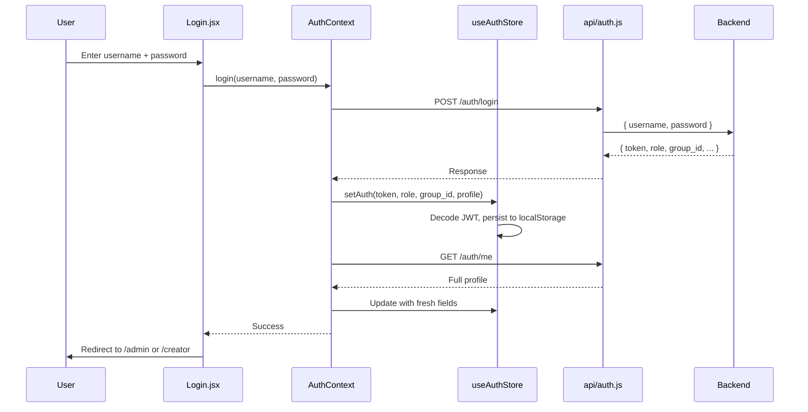
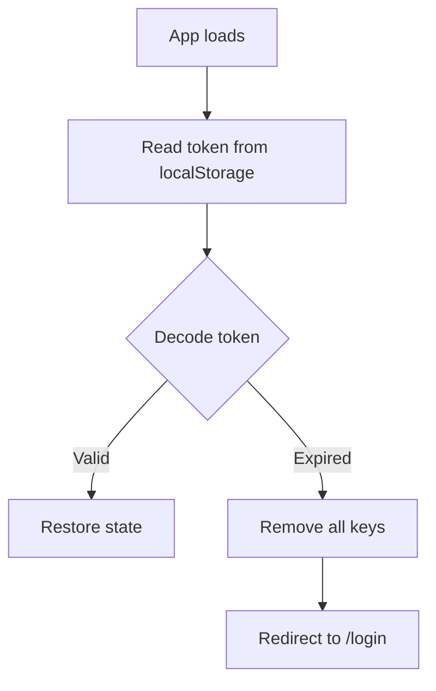
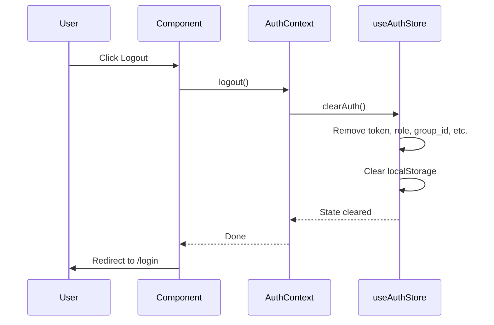

# Frontend Authentication

This document describes the login flow, JWT handling, and session management.

---

## Login Flow



### Profile Hydration

After login, `AuthContext` fetches `/auth/me` to refresh profile fields that may have changed since the JWT was issued. This ensures the frontend has the latest permissions even if the JWT payload is stale.

---

## JWT Handling

### Decoding

The frontend decodes JWTs manually without external libraries:

```js
const decodeToken = (token) => {
  const payload = token.split(".")[1];
  const normalized = payload.replace(/-/g, "+").replace(/_/g, "/");
  const bytes = Uint8Array.from(atob(normalized), (c) => c.charCodeAt(0));
  const parsed = JSON.parse(new TextDecoder("utf-8").decode(bytes));
  if (parsed.exp && parsed.exp * 1000 < Date.now()) return null;
  return parsed;
};
```

### Storage

| Key | Value | Purpose |
|-----|-------|---------|
| `token` | JWT string | API authentication |
| `role` | `"admin"` or `"creator"` | Role guard checks |
| `group_id` | Group ID string | Group scoping |
| `managed_group_ids` | JSON array | Multi-group management |
| `max_signage_state` | `"NORMAL"`, etc. | Permission ceiling |

### Expiration Handling



On every boot, the store checks token expiration. Expired tokens are purged automatically.

---

## 401 Handling

The Axios response interceptor catches `401 Unauthorized` globally:

```js
api.interceptors.response.use(
  (response) => response,
  (error) => {
    if (error.response?.status === 401) {
      useAuthStore.getState().clearAuth();
      window.location.href = "/login";
    }
    return Promise.reject(error);
  }
);
```

When a 401 occurs:
1. All auth state is cleared (token, role, profile)
2. All localStorage keys are removed
3. Browser redirects to `/login`

---

## Logout



---

_This document is part of the Smart Signage frontend documentation. See `frontend/README.md` for the high-level overview._
