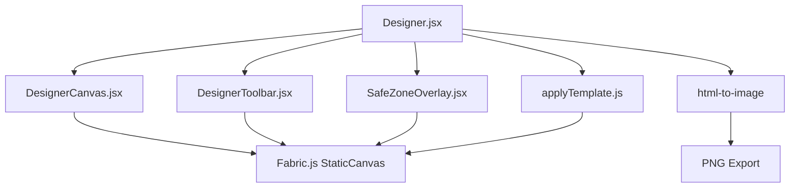
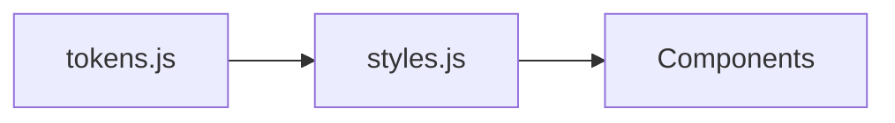

# Frontend Components

This document describes the reusable component library and major feature components.

---

## Component Inventory

### Layout & Navigation

| Component | File | Purpose |
|-----------|------|---------|
| `AdminSidebar.jsx` | `components/AdminSidebar.jsx` | Fixed left navigation for admin routes |
| `CreatorSidebar.jsx` | `components/CreatorSidebar.jsx` | Fixed left navigation for creator routes |

Both sidebars render role-aware links and are fixed at `width: 220px`. The main content area has `margin-left: 220px`.

### Content Creation

| Component | File | Purpose |
|-----------|------|---------|
| `Designer.jsx` | `components/Designer.jsx` | Full visual post editor (Fabric.js orchestrator) |
| `DesignerCanvas.jsx` | `components/designer/DesignerCanvas.jsx` | Fabric.js canvas instance manager |
| `DesignerToolbar.jsx` | `components/designer/DesignerToolbar.jsx` | Text, shape, image tools |
| `SafeZoneOverlay.jsx` | `components/designer/SafeZoneOverlay.jsx` | Guides for safe display areas |
| `MarkdownCanvas.jsx` | `components/MarkdownCanvas.jsx` | Markdown preview with KaTeX math |
| `MediaUploadField.jsx` | `components/MediaUploadField.jsx` | Upload with crop (images) and trim (videos) |
| `VideoTrimSlider.jsx` | `components/VideoTrimSlider.jsx` | Range slider for video start/end |
| `PostForm.jsx` | `components/PostForm.jsx` | Post metadata form (title, description, group, scheduling) |

### Device & Signage

| Component | File | Purpose |
|-----------|------|---------|
| `DeviceList.jsx` | `components/DeviceList.jsx` | Device table with online/offline status |
| `DeviceRegisterForm.jsx` | `components/DeviceRegisterForm.jsx` | Pre-register a new Pi device |
| `SignageAssetList.jsx` | `components/SignageAssetList.jsx` | Manage assets on a device |
| `SignagePanel.jsx` | `components/SignagePanel.jsx` | Side panel for signage actions |
| `SignagePublishForm.jsx` | `components/SignagePublishForm.jsx` | Publish post to devices form |
| `SignageStateSelect.jsx` | `components/SignageStateSelect.jsx` | Dropdown for signage state enum |

### Live Streaming

| Component | File | Purpose |
|-----------|------|---------|
| `LivePlayer.jsx` | `components/LivePlayer.jsx` | hls.js video player for stream previews |
| `LiveStreamForm.jsx` | `components/LiveStreamForm.jsx` | Create/edit stream form |
| `LiveStreamPicker.jsx` | `components/LiveStreamPicker.jsx` | Stream selection dropdown |

### Posts & Feed

| Component | File | Purpose |
|-----------|------|---------|
| `PostList.jsx` | `components/PostList.jsx` | Filterable post grid/table |
| `PostMedia.jsx` | `components/PostMedia.jsx` | Image/video carousel display |
| `PostAIChat.jsx` | `components/PostAIChat.jsx` | AI Q&A chat interface |
| `MultiSelect.jsx` | `components/MultiSelect.jsx` | Generic multi-select control |

### UI Primitives (`components/ui/`)

| Component | Purpose |
|-----------|---------|
| `Button.jsx` | Styled action button with variants |
| `Card.jsx` | Content container with shadow and padding |
| `Badge.jsx` | Status indicator (online, offline, pending, emergency) |
| `Message.jsx` | Alert/toast message with emoji prefixes |

---

## Designer Subsystem

### Capabilities

| Feature | Implementation |
|---------|---------------|
| Canvas | Fabric.js 5.3.0 `StaticCanvas` |
| Elements | Text boxes, rectangles, circles, images |
| Templates | Pre-built layouts via `applyTemplate.js` |
| Safe zones | Overlay guides for text-safe and action-safe areas |
| Export | `html-to-image` for PNG export |
| Modes | Toggle between visual designer and markdown editor |

---

## Design Tokens

All components consume styles from centralized tokens:

### Token Categories

| Category | File | Purpose |
|----------|------|---------|
| Colors | `tokens.js` | Primary, success, error, warning, page bg, card bg, text shades |
| Spacing | `tokens.js` | xs (4px) through xxxl (28px), page padding |
| Radii | `tokens.js` | sm (6px) through pill (99px) |
| Font sizes | `tokens.js` | xs (11px) through xl (24px) |
| Shadows | `tokens.js` | Card shadow definition |
| Composed styles | `styles.js` | Layout, card, table, button, input, badge, message presets |

---

_This document is part of the Smart Signage frontend documentation. See `frontend/README.md` for the high-level overview._
