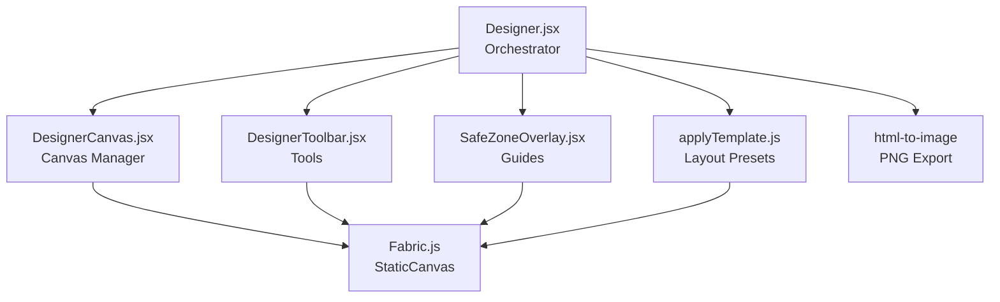
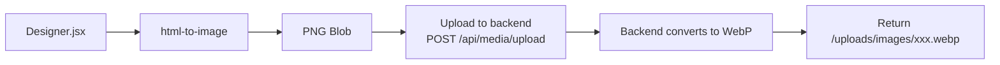

# Frontend Visual Post Designer

This document describes the Fabric.js-based canvas editor for creating visual signage posts.

---

## Overview

The `Designer.jsx` component is a full-featured canvas editor that allows creators to design visually rich signage posts without writing code. It supports text, shapes, images, templates, and safe-zone guides.

---

## Sub-System Architecture

---

## Components

### Designer.jsx

The orchestrator component that:
- Initializes and destroys the Fabric.js canvas
- Manages toolbar state (selected tool, active object)
- Handles template application
- Exports the canvas to PNG via `html-to-image`
- Toggles between visual mode and markdown mode

### DesignerCanvas.jsx

Manages the Fabric.js `StaticCanvas` instance:
- Creates the canvas on mount
- Handles object selection and deselection
- Provides methods to add text, shapes, and images
- Serializes/deserializes canvas state

### DesignerToolbar.jsx

Provides the tool palette:
- **Text** — Add draggable text boxes
- **Rectangle** — Add rectangles
- **Circle** — Add circles
- **Image** — Add uploaded images
- **Delete** — Remove selected object
- **Clear** — Clear entire canvas
- **Template** — Apply a pre-built layout

### SafeZoneOverlay.jsx

Renders semi-transparent overlays on the canvas to indicate:
- **Text-safe zone** — Area where text will not be clipped on displays
- **Action-safe zone** — Area where critical content should be placed

### applyTemplate.js

Contains pre-built layout presets:

| Template | Description |
|----------|-------------|
| `title_only` | Large centered title text |
| `title_body` | Title + body text stacked |
| `image_left` | Image on left, text on right |
| `image_right` | Image on right, text on left |
| `image_full` | Full-bleed image with overlay text |

---

## Export Pipeline

The canvas is exported as a PNG using `html-to-image`, then uploaded to the backend media endpoint where Sharp converts it to WebP for optimal file size.

---

## Fabric.js Configuration

- **Version**: 5.3.0 (pinned exactly)
- **Canvas type**: `StaticCanvas` for export quality
- **Object types**: `Textbox`, `Rect`, `Circle`, `Image`
- **Selection**: Enabled for editing, disabled for export
- **Background**: Configurable color or transparent

---

## Why Fabric.js 5.3.0?

Fabric.js provides an object model on top of HTML5 Canvas that makes interactive manipulation possible:
- Objects can be selected, dragged, resized, and rotated
- Text boxes support multi-line editing
- Images can be clipped and masked
- The entire canvas state can be serialized to JSON

Version 5.3.0 is pinned because newer versions changed the build system and caused compatibility issues with Vite.

---

_This document is part of the Smart Signage frontend documentation. See `frontend/README.md` for the high-level overview._
