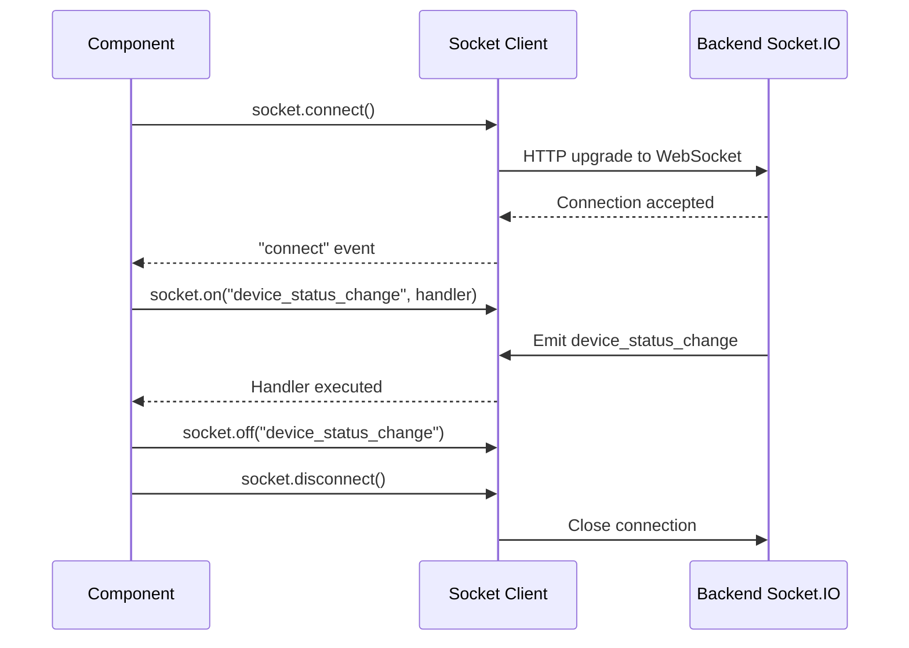

# Frontend Real-Time Communication

This document describes how the frontend uses Socket.IO for live updates.

---

## Overview

The frontend creates a Socket.IO client that connects to the backend's Socket.IO server. The connection is **lazy** (`autoConnect: false`) — pages that need real-time data explicitly connect and disconnect.

```js
// src/socket/socket.js
import { io } from "socket.io-client";
import { assetOrigin } from "../config/apiBase";

const origin = assetOrigin();
const socket = origin
  ? io(origin, { autoConnect: false })
  : io({ autoConnect: false });

export default socket;
```

---

## Why Lazy Connections?

Public pages (`/feed`, `/post/:id`) do not need WebSocket connections. By setting `autoConnect: false`, the frontend avoids unnecessary connections and battery drain on mobile devices. Only admin and creator pages establish Socket.IO connections.

```mermaid
flowchart TD
    A[User visits /admin/devices] --> B[Component mounts]
    B --> C[socket.connect()]
    C --> D[Listen for device_status_change]
    D --> E[Update UI on event]

    F[User leaves page] --> G[Component unmounts]
    G --> H[socket.disconnect()]
```

---

## Typical Usage Pattern

```jsx
import socket from "../socket/socket";

useEffect(() => {
  socket.connect();

  socket.on("connect", () => {
    console.log("Socket connected");
  });

  socket.on("device_status_change", (data) => {
    setDevices((prev) =>
      prev.map((d) => (d.id === data.device_id ? { ...d, status: data.status } : d))
    );
  });

  socket.on("emergency_mode_start", (data) => {
    setEmergencyAlert(data);
  });

  return () => {
    socket.off("device_status_change");
    socket.off("emergency_mode_start");
    socket.disconnect();
  };
}, []);
```

---

## Event Types

### Inbound (Backend → Frontend)

| Event | Payload | Description |
|-------|---------|-------------|
| `device_status_change` | `{ device_id, status }` | Device went online/offline |
| `emergency_mode_start` | `{ triggered_by, groups }` | Emergency triggered on a device |
| `emergency_mode_end` | `{}` | Emergency cleared |
| `stream_status_change` | `{ stream_id, status }` | Live stream status updated |

### Outbound (Frontend → Backend)

The frontend typically does not emit events directly. All commands (playback control, publish) go through the REST API, which the backend translates into Socket.IO emits via the `piBridge`.

---

## Connection Lifecycle



---

_This document is part of the Smart Signage frontend documentation. See `frontend/README.md` for the high-level overview._
