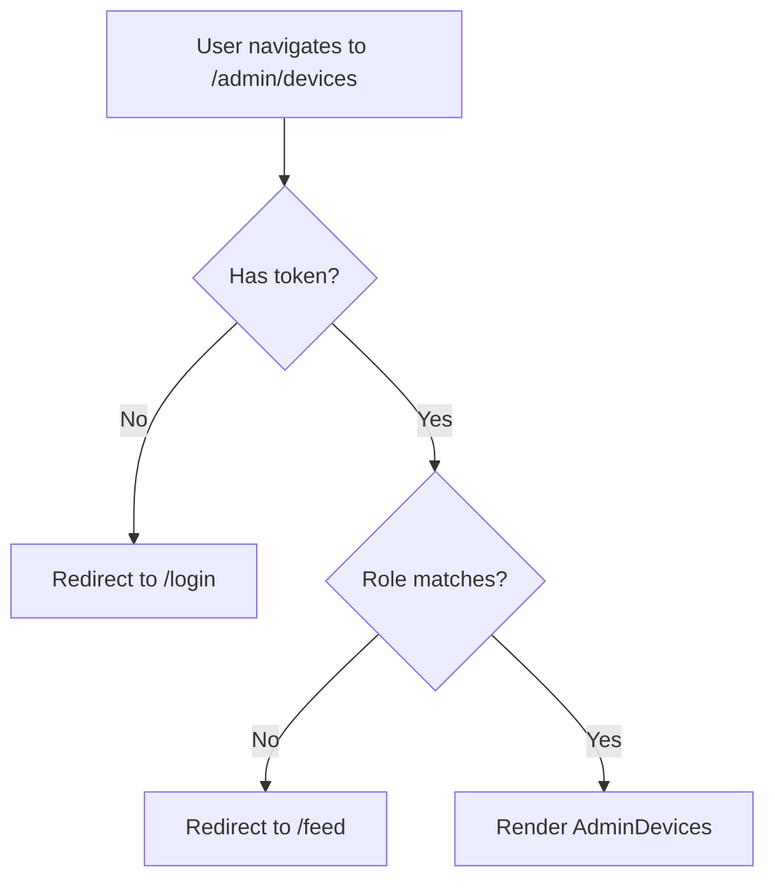
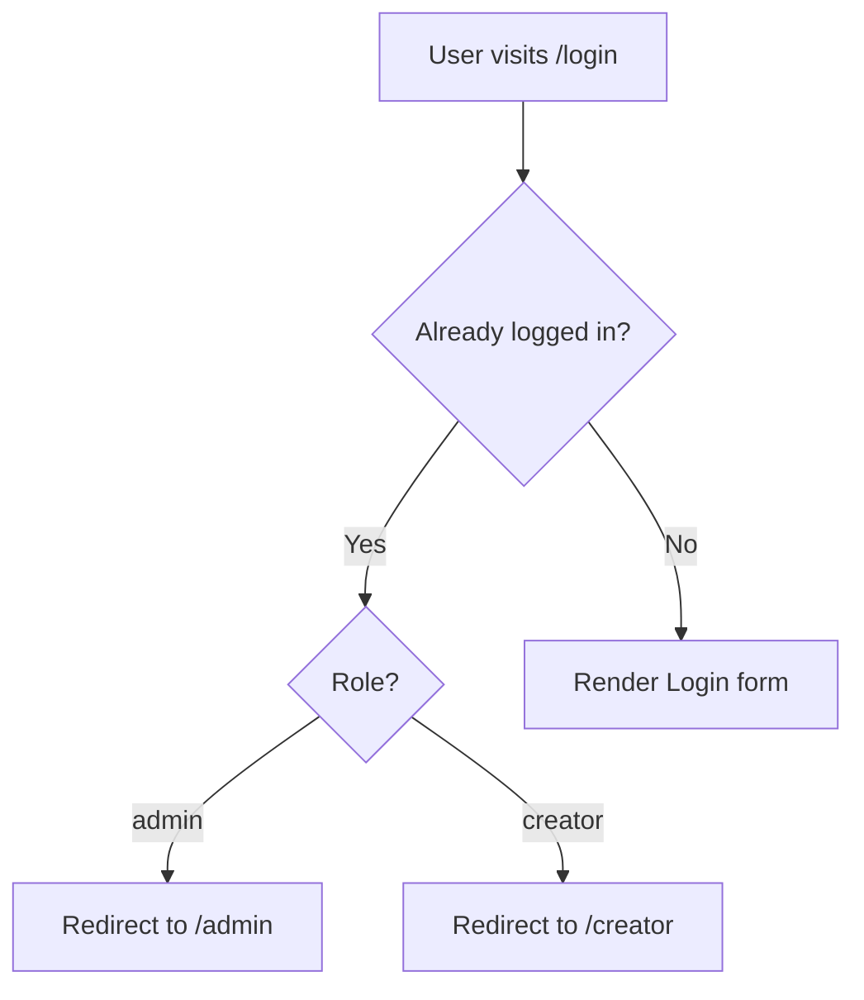
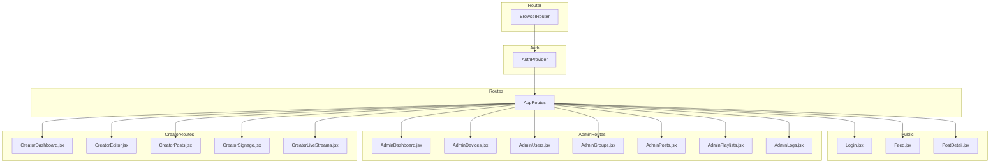

# Frontend Routing & Navigation

This document describes the route structure, role-based access control, and navigation design.

---

## Route Map

| Path | Component | Auth Required | Role Guard | Sidebar |
|------|-----------|---------------|------------|---------|
| `/login` | `Login.jsx` | No | — | None |
| `/feed` | `Feed.jsx` | No | — | None |
| `/post/:id` | `PostDetail.jsx` | No | — | None |
| `/admin` | `AdminDashboard.jsx` | Yes | `admin` | `AdminSidebar` |
| `/admin/devices` | `AdminDevices.jsx` | Yes | `admin` | `AdminSidebar` |
| `/admin/users` | `AdminUsers.jsx` | Yes | `admin` | `AdminSidebar` |
| `/admin/groups` | `AdminGroups.jsx` | Yes | `admin` | `AdminSidebar` |
| `/admin/posts` | `AdminPosts.jsx` | Yes | `admin` | `AdminSidebar` |
| `/admin/playlists` | `AdminPlaylists.jsx` | Yes | `admin` | `AdminSidebar` |
| `/admin/logs` | `AdminLogs.jsx` | Yes | `admin` | `AdminSidebar` |
| `/creator` | `CreatorDashboard.jsx` | Yes | `creator` | `CreatorSidebar` |
| `/creator/posts` | `CreatorPosts.jsx` | Yes | `creator` | `CreatorSidebar` |
| `/creator/editor` | `CreatorEditor.jsx` | Yes | `creator` | `CreatorSidebar` |
| `/creator/signage` | `CreatorSignage.jsx` | Yes | `creator` | `CreatorSidebar` |
| `/creator/live-streams` | `CreatorLiveStreams.jsx` | Yes | `creator` | `CreatorSidebar` |
| `/` | — | No | Redirect to `/feed` | None |
| `*` | — | No | Redirect to `/feed` | None |

---

## Role Guard (`RequireRole`)

```jsx
function RequireRole({ role, children }) {
  const { token, role: userRole } = useAuthStore();
  if (!token) return <Navigate to="/login" replace />;
  if (role && userRole !== role) return <Navigate to="/feed" replace />;
  return children;
}
```

### Guard Logic Flow



### Login Redirect Logic



---

## Navigation Structure

### Admin Sidebar (`AdminSidebar.jsx`)

```
Dashboard
├── Users
├── Groups
├── Devices
├── Posts
├── Playlists
└── Logs
```

### Creator Sidebar (`CreatorSidebar.jsx`)

```
Dashboard
├── Editor
├── Posts
├── Signage
└── Live Streams
```

Both sidebars are fixed-position left panels. The main content area has a left margin of `220px` to accommodate the sidebar.

---

## Route Architecture



---

## Client-Side Routing Notes

- **History API** — `BrowserRouter` uses the HTML5 history API for clean URLs (no `#` hash)
- **SPA behavior** — All routes are handled by React Router; the server must serve `index.html` for non-file routes
- **404 handling** — Unknown routes redirect to `/feed`
- **Deep linking** — `/post/42` works directly; the backend is not involved in routing

---

_This document is part of the Smart Signage frontend documentation. See `frontend/README.md` for the high-level overview._
