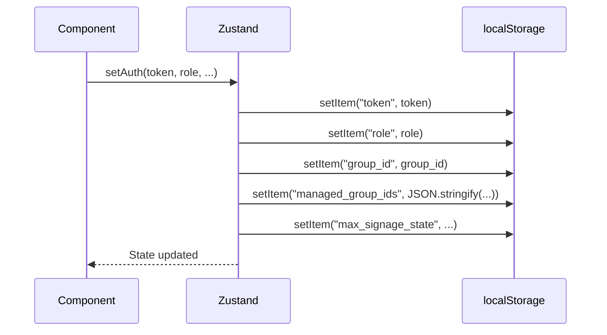
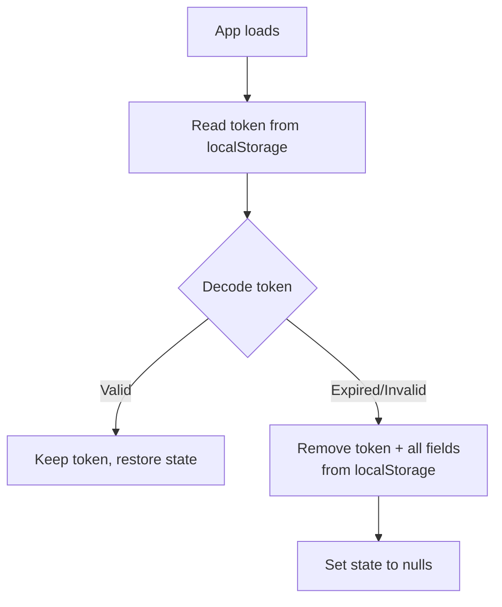
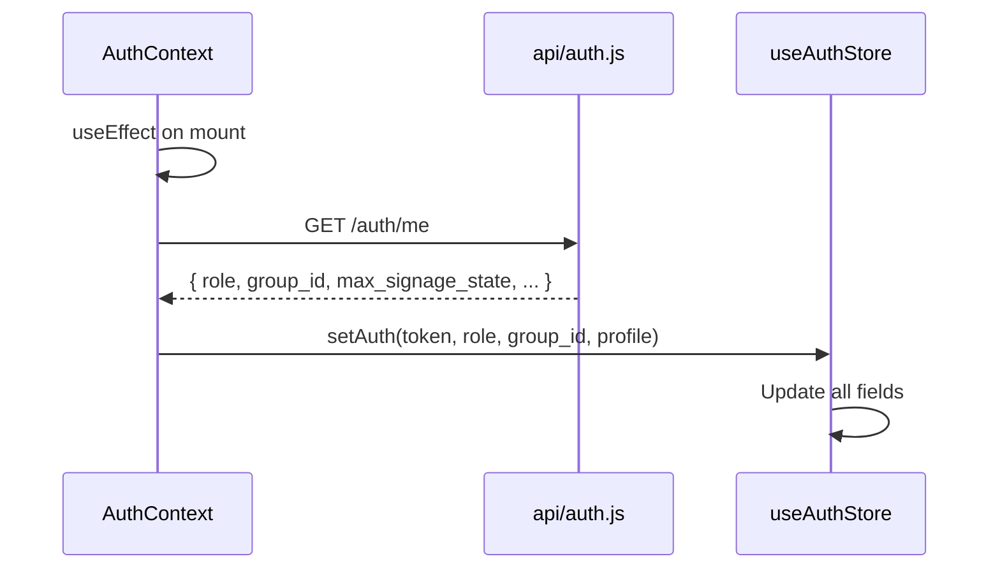

# Frontend State Management

This document describes how authentication state is managed via Zustand and React Context.

---

## Overview

The frontend uses a **hybrid state model**:
- **Zustand** (`useAuthStore.js`) — Global store for auth data, persisted to `localStorage`
- **React Context** (`AuthContext.jsx`) — Wrapper that provides `login()`, `logout()`, and profile hydration

Local component state (forms, modals, UI toggles) uses standard React `useState`. No global state library is needed beyond auth.

---

## Zustand Auth Store

### Store Fields

| Field | Type | Description |
|-------|------|-------------|
| `token` | string \| null | JWT from backend |
| `id` | number \| null | User ID (decoded from JWT) |
| `role` | string \| null | `"admin"` or `"creator"` |
| `group_id` | string \| null | Primary group affiliation |
| `managed_group_ids` | number[] | Groups this user manages |
| `max_signage_state` | string | Highest signage state user can set |
| `creator_priority` | number | Priority for control locks |
| `control_lock_minutes` | number | Default lock duration |
| `auto_approve` | boolean | Whether posts auto-approve |
| `can_manage_other_posts` | boolean | Cross-group post management |

### JWT Decoding (No External Library)

```js
const decodeToken = (token) => {
  const payload = token.split(".")[1];
  const normalized = payload.replace(/-/g, "+").replace(/_/g, "/");
  const bytes = Uint8Array.from(atob(normalized), (c) => c.charCodeAt(0));
  const parsed = JSON.parse(new TextDecoder("utf-8").decode(bytes));
  if (parsed.exp && parsed.exp * 1000 < Date.now()) return null;
  return parsed;
};
```

The frontend decodes JWTs manually without `jsonwebtoken` to avoid bundling a Node.js crypto library in the browser.

### localStorage Persistence



On application boot, the store reads from `localStorage` and initializes. If the token is expired, it is automatically purged.

### Auto-Purge on Boot



---

## Auth Context

The context wraps Zustand to provide a higher-level API for components.

### Provided Methods

| Method | Description |
|--------|-------------|
| `login(username, password)` | Calls API, stores token, hydrates profile |
| `logout()` | Clears all auth state and localStorage |

### Profile Hydration

On mount, `AuthContext` fetches `/auth/me` to refresh profile fields that may have changed since the JWT was issued:



This ensures the frontend always has the latest profile data, even if the JWT payload is stale.

---

## State Access Patterns

### Reading Auth State

```jsx
import useAuthStore from "../store/useAuthStore";

function MyComponent() {
  const { token, role, group_id } = useAuthStore();
  // ...
}
```

### Checking Permissions

```jsx
const { role, max_signage_state } = useAuthStore();
const canSetEmergency = role === "admin" || max_signage_state === "EMERGENCY";
```

---

_This document is part of the Smart Signage frontend documentation. See `frontend/README.md` for the high-level overview._
