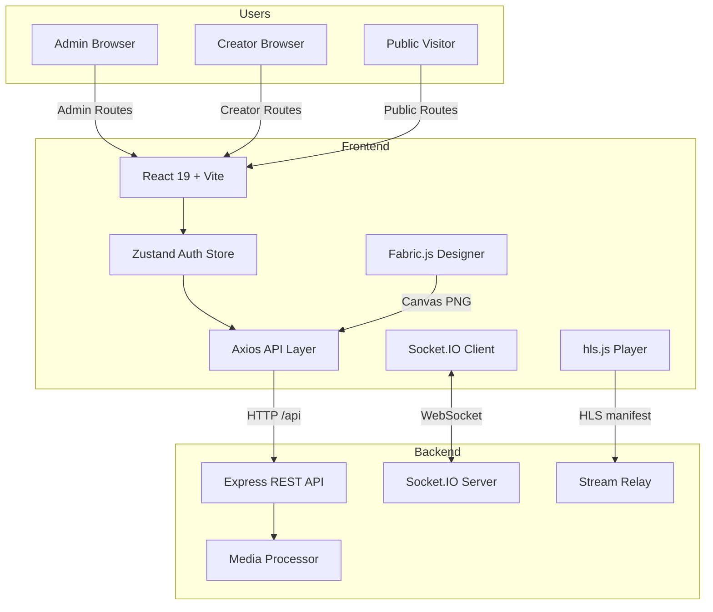
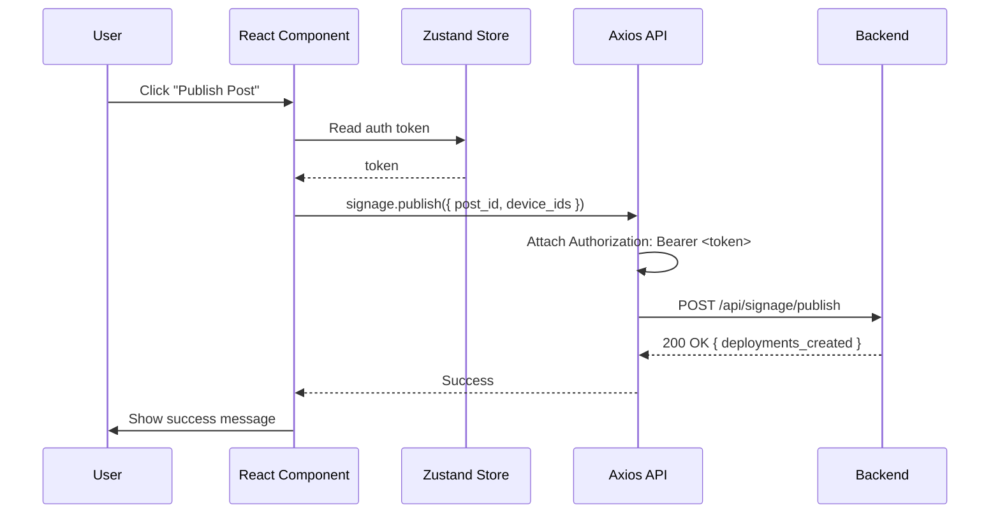
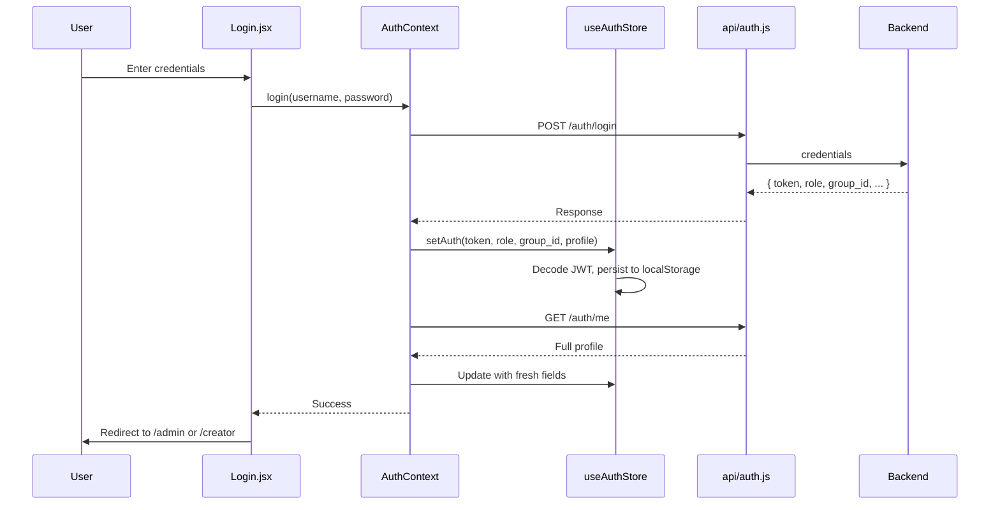
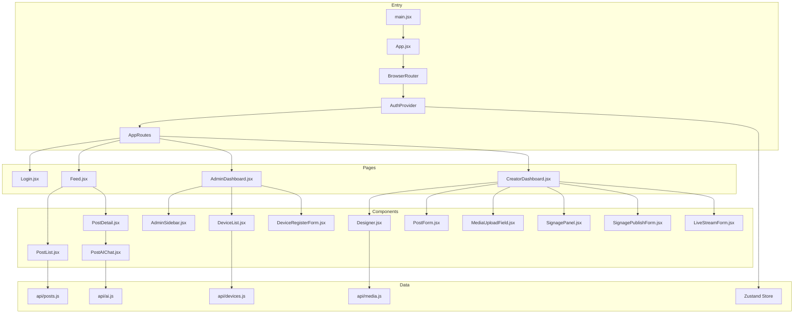
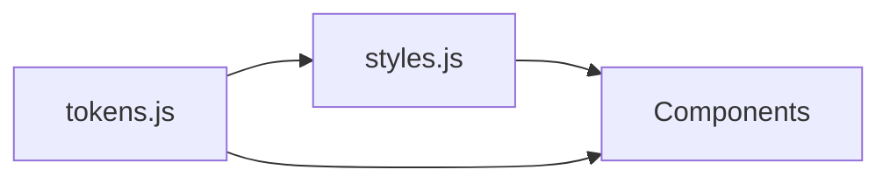

# Smart Signage — Frontend

The frontend is the **human interface** of the Smart Signage System. Built as a **React 19** single-page application (SPA) with **Vite**, it provides role-based dashboards for administrators and content creators, a visual canvas post designer, live stream management, real-time device control, and a public content feed with AI-powered Q&A.

---

## What the Frontend Is

The frontend is a browser-based application that translates human intent into backend API calls. It serves three distinct audiences simultaneously:

1. **Administrators** — Manage the entire signage ecosystem: approve new devices, configure groups, control emergency states, manage users, and monitor system health.
2. **Content Creators** — Produce and deploy content: design visual posts on a canvas, write markdown articles, upload media with crop and trim, publish to specific devices, and manage live streams.
3. **Public Viewers** — Browse a read-only feed of published content and ask AI-powered questions about posts.

Every button click, form submission, canvas stroke, device command, and AI question originates in this frontend and flows to the Node.js backend via REST or WebSocket.

---

## What the Frontend Does

The frontend performs six core functions:

### 1. Role-Based Dashboard Interface

The entire UI is gated by user role. The `RequireRole` component enforces that only authenticated users with matching roles can access admin or creator pages.

| Role | Primary Pages |
|------|--------------|
| `admin` | Dashboard, Users, Groups, Devices, Posts, Playlists, Logs |
| `creator` | Dashboard, Editor, Posts, Signage, Live Streams |
| Public (no auth) | Feed, Post Detail |

Logged-in users visiting `/login` are redirected to their role-appropriate dashboard. Unauthenticated users hitting protected routes are redirected to `/login`. Users with the wrong role are redirected to `/feed`.

### 2. Content Creation & Design

Posts are the atomic unit of signage content. Creators can build them in two modes:

- **Visual Designer** (`Designer.jsx`) — A Fabric.js 5.3.0 canvas where users drag, drop, resize, and style text boxes, shapes, and images. Templates provide pre-built layouts. Safe-zone overlays ensure designs fit display screens. The canvas exports to PNG via `html-to-image`.
- **Markdown Editor** — Rich text composition with live preview, supporting GitHub Flavored Markdown, math (KaTeX), and wiki-links via `react-markdown`.

Media uploads (images and videos) support:
- Percentage-based cropping (`react-easy-crop`)
- Temporal trimming for videos (`VideoTrimSlider.jsx`)
- Automatic WebP/MP4 conversion by the backend

### 3. Device & Signage Control

Creators and admins interact with field devices through the UI:

- **Device List** — View all devices with real-time online/offline status, IP address, location, and group membership.
- **Device Registration** — Admins pre-register devices by assigning a `device_id` before the Pi connects.
- **Approval Workflow** — Pending devices appear in the admin panel; approval triggers a `refresh_display` command to the Pi.
- **Signage Publishing** — Select a post, choose target devices, set scheduling (`start_date`, `end_date`, `priority`), and deploy.
- **Playback Controls** — Send `next`, `previous`, and `start` commands to individual devices via the backend's Socket.IO bridge.
- **Asset Management** — Hide/show or permanently delete assets synced to Anthias devices.
- **Emergency Asset Upload** — Admins upload emergency image/video files (up to 200 MB) that devices display during emergency mode.

### 4. Live Stream Management

Creators configure and monitor four types of live streams:

| Type | Ingest | Frontend Action |
|------|--------|-----------------|
| HLS | External URL | Paste `.m3u8` URL, preview with `hls.js` |
| RTSP | Camera URL | Enter camera URL, backend relays to HLS |
| YouTube | YouTube HLS | Paste YouTube URL, backend proxies |
| RTMP | OBS push | Backend generates stream key; OBS pushes to `rtmp://server:1935/live/<key>` |

The frontend displays stream status (`idle`, `starting`, `online`, `offline`, `error`), relay logs, and an `hls.js` video player for preview. Admins can rotate RTMP stream keys for security.

### 5. Real-Time Device Monitoring

The frontend optionally connects to the backend via Socket.IO to receive live updates:

- Device connection/disconnection events
- Emergency mode broadcasts
- Live stream status changes

The Socket.IO client is created lazily (`autoConnect: false`) and connected only on pages that need real-time data, avoiding unnecessary connections on public pages.

### 6. Public Feed & AI Q&A

The public-facing `/feed` and `/post/:id` routes are accessible without authentication:

- **Feed** — Grid of all published posts with `allowed_on_feed = true`
- **Post Detail** — Full markdown rendering with image/video carousel, attachment downloads, and an AI chat interface
- **AI Q&A** — Visitors ask questions about the post content. The frontend sends the question + conversation history to `POST /api/ai/ask` and streams back the OpenAI-generated answer.

---

## Where the Frontend Fits



The frontend is a **thin client** in the architectural sense. It holds no business logic beyond form validation and role-based UI gating. All authoritative state lives in the backend. The frontend's job is to:
- **Render** backend data into human-readable interfaces
- **Capture** human input and translate it into API calls
- **Display** real-time updates pushed from the backend

---

## Who Uses the Frontend

| Consumer | Authentication | Primary Interface |
|----------|---------------|-------------------|
| **Admin** | JWT (`role: admin`) | Full system control via `/admin/*` routes |
| **Creator** | JWT (`role: creator`) | Content production via `/creator/*` routes |
| **Public Viewer** | None | Read-only feed and AI Q&A via `/feed` and `/post/:id` |

---

## How the Frontend Is Built

### Design Philosophy

- **Role-first routing** — The URL structure mirrors the RBAC model. `/admin/*` is for admins, `/creator/*` is for creators, and `/feed` is public.
- **Thin client, thick backend** — The frontend renders what the backend provides. No business rules are hard-coded beyond form validation and role guards.
- **Local-first auth state** — JWTs and profile data are persisted to `localStorage` so users stay logged in across reloads. Expired tokens are auto-purged on boot.
- **Lazy real-time connections** — Socket.IO connects only when needed (admin/creator pages), not on public routes.
- **Design token consistency** — Colors, spacing, radii, and typography are centralized in `tokens.js` and composed in `styles.js` for a uniform UI.

### Tech Stack

| Layer | Technology | Why |
|-------|-----------|-----|
| Framework | React 19 | Concurrent features, latest hooks API, modern JSX transform |
| Build Tool | Vite 8 | Instant HMR, optimized production builds, native ESM |
| Routing | React Router DOM 7 | Declarative routes, nested layouts, programmatic navigation |
| State | Zustand 5 | Minimal boilerplate, no reducers/actions ceremony, localStorage sync |
| HTTP | Axios 1.16 | Request/response interceptors, multipart uploads, timeout handling |
| Real-time | Socket.IO Client 4.8 | Auto-reconnection, room-based events, ack support |
| Visual Editor | Fabric.js 5.3.0 | Canvas manipulation, text/shape objects, template system |
| Media Player | hls.js 1.6 | HLS playback in browsers without native support |
| Markdown | react-markdown 10 | GFM, math, wiki-links with modular plugin architecture |
| Icons | lucide-react | Tree-shakeable SVG icons, consistent stroke width |
| Crop | react-easy-crop | Touch-friendly crop UI with zoom and rotation |
| Testing | Playwright 1.48 | Real browser E2E tests, auto-wait, screenshot comparison |

### Request Flow



### Authentication Flow



### Component Architecture



### Design Tokens

All visual styling flows from centralized tokens:



| Token Category | Examples |
|----------------|----------|
| `colors` | Primary `#2563eb`, success `#16a34a`, error `#dc2626`, page bg `#f4f6f9` |
| `spacing` | `xs: 4`, `sm: 8`, `md: 12`, `lg: 16`, `xl: 20`, `page: 32px 36px` |
| `radii` | `sm: 6`, `md: 8`, `lg: 10`, `xl: 12`, `pill: 99` |
| `fontSize` | `xs: 11`, `sm: 12`, `md: 13`, `lg: 14`, `xl: 24` |
| `shadows` | `card: 0 1px 6px rgba(0,0,0,0.07)` |

---

## Why These Design Choices

### Why Zustand over Redux/Context

The auth state is simple (a single user object) but accessed by nearly every component. Zustand provides:
- No prop drilling (unlike Context)
- No reducers or action types (unlike Redux)
- Built-in localStorage persistence
- Tiny bundle size (~1 KB)

### Why Axios over Fetch

Axios provides request/response interceptors for attaching JWTs and handling 401 redirects globally. It also handles multipart uploads (emergency assets, media) with progress tracking and automatic JSON serialization.

### Why Vite over Create React App

Vite uses native ESM in development (no bundling step), resulting in sub-second cold starts and instant HMR. Production builds use Rollup for optimized tree-shaking and code splitting.

### Why Fabric.js for the Designer

Fabric.js provides an object model on top of HTML5 Canvas, allowing users to interactively manipulate text, shapes, and images. The `StaticCanvas` mode is used for export-quality rendering without the overhead of interactive events in the final image.

### Why Role-First Routing

By splitting admin and creator into separate route namespaces (`/admin/*` vs `/creator/*`), the frontend can:
- Lazy-load role-specific code chunks
- Apply route-level role guards in one place (`RequireRole`)
- Render role-appropriate sidebars and navigation

---

## Project Structure

```
frontend/
├── public/                        # Static assets (favicon, etc.)
├── src/
│   ├── api/                       # Per-domain Axios wrappers
│   │   ├── axios.js               # Axios instance: auth interceptor + 401 redirect
│   │   ├── auth.js                # login, me
│   │   ├── devices.js             # list, register, approve, emergency-asset
│   │   ├── groups.js              # CRUD, states
│   │   ├── liveStreams.js         # CRUD, start/stop, rotate-key, logs
│   │   ├── media.js               # image/video upload
│   │   ├── playlists.js           # list, create, update, delete
│   │   ├── posts.js               # CRUD, publish, attachments, bulk actions
│   │   ├── signage.js             # publish, deployments, controls, assets
│   │   ├── users.js               # list users
│   │   └── ai.js                  # status, ask
│   │
│   ├── assets/                    # Static images, fonts
│   ├── components/                # Reusable React components
│   │   ├── ui/                    # Primitive UI kit (Button, Card, Badge, Message)
│   │   ├── designer/              # Fabric.js sub-components
│   │   │   ├── DesignerCanvas.jsx
│   │   │   ├── DesignerToolbar.jsx
│   │   │   ├── SafeZoneOverlay.jsx
│   │   │   ├── applyTemplate.js
│   │   │   └── designerConstants.js
│   │   ├── AdminSidebar.jsx       # Admin navigation sidebar
│   │   ├── CreatorSidebar.jsx     # Creator navigation sidebar
│   │   ├── Designer.jsx           # Full visual post editor (orchestrator)
│   │   ├── DeviceList.jsx         # Device table with status/actions
│   │   ├── DeviceRegisterForm.jsx # Pre-register a new Pi device
│   │   ├── FabricCanvas.jsx       # Low-level Fabric canvas wrapper
│   │   ├── LivePlayer.jsx         # hls.js video player for stream previews
│   │   ├── LiveStreamForm.jsx     # Create/edit stream form
│   │   ├── LiveStreamPicker.jsx   # Stream selection dropdown
│   │   ├── MarkdownCanvas.jsx     # Markdown preview renderer
│   │   ├── MediaUploadField.jsx   # Upload with crop (images) and trim (videos)
│   │   ├── MultiSelect.jsx        # Group/device multi-selection control
│   │   ├── PostAIChat.jsx         # AI Q&A chat interface for posts
│   │   ├── PostForm.jsx           # Post metadata form
│   │   ├── PostList.jsx           # Post grid/table with filters
│   │   ├── PostMedia.jsx          # Image/video carousel display
│   │   ├── SignageAssetList.jsx   # Device asset management table
│   │   ├── SignagePanel.jsx       # Side panel for signage actions
│   │   ├── SignagePublishForm.jsx # Publish post to devices form
│   │   ├── SignageStateSelect.jsx # Dropdown for signage state enum
│   │   └── VideoTrimSlider.jsx    # Video duration trim UI
│   │
│   ├── config/
│   │   └── apiBase.js             # Dynamic API base URL + asset origin
│   ├── constants/
│   │   └── (shared constants)
│   ├── context/
│   │   └── AuthContext.jsx        # React context: login/logout, profile refresh
│   ├── hooks/
│   │   └── (custom React hooks)
│   ├── pages/                     # Route-level page components
│   │   ├── Login.jsx              # Authentication page
│   │   ├── admin/                 # Admin dashboard pages
│   │   │   ├── AdminDashboard.jsx
│   │   │   ├── AdminDevices.jsx
│   │   │   ├── AdminGroups.jsx
│   │   │   ├── AdminLogs.jsx
│   │   │   ├── AdminPlaylists.jsx
│   │   │   ├── AdminPosts.jsx
│   │   │   └── AdminUsers.jsx
│   │   ├── creator/               # Creator dashboard pages
│   │   │   ├── CreatorDashboard.jsx
│   │   │   ├── CreatorEditor.jsx
│   │   │   ├── CreatorLiveStreams.jsx
│   │   │   ├── CreatorPosts.jsx
│   │   │   └── CreatorSignage.jsx
│   │   └── public/                # Public-facing pages
│   │       ├── Feed.jsx
│   │       └── PostDetail.jsx
│   │
│   ├── socket/
│   │   └── socket.js              # Socket.IO client singleton (autoConnect: false)
│   ├── store/
│   │   └── useAuthStore.js        # Zustand auth state + localStorage sync
│   ├── styles/
│   │   └── (CSS/style utilities)
│   ├── styles.js                  # Composed design tokens for components
│   ├── tokens.js                  # Raw design tokens (colors, spacing, radii, fonts)
│   ├── App.css                    # Global app styles
│   ├── index.css                  # Base CSS resets + utilities
│   ├── App.jsx                    # Root: Router + AuthProvider + Routes
│   └── main.jsx                   # Entry point: ReactDOM render
│
├── tests/                         # Playwright E2E tests
│   ├── admin/                     # Admin dashboard tests
│   ├── auth.spec.js               # Login flow tests
│   ├── creator/                   # Creator workflow tests
│   ├── smoke/
│   │   └── pi-live-stream.spec.js # Pi/Anthias smoke tests
│   ├── globalSetup.cjs            # Auto-create DB, push schema, seed accounts
│   ├── helpers/
│   │   └── test-helpers.js        # loginTestAdmin, loginAs, loginViaApi, resetState, seed helpers
│   └── test-results/              # Screenshots captured on test failure (auto-generated)
│
├── .env                           # VITE_API_URL, VITE_PROXY_TARGET
├── vite.config.js                 # Dev proxy to backend, HMR
├── playwright.config.js           # E2E test configuration (screenshot: only-on-failure)
├── eslint.config.js
├── prettier.config.js
├── index.html
└── package.json
```

---

## Quick Start

```bash
cd frontend
npm install

# Create .env
cat > .env <<EOF
VITE_API_URL=http://localhost:5000/api
EOF

# Run dev server
npm run dev   # http://localhost:5173
```

---

## Component Documentation

For deep-dive documentation on each subsystem, see the component guides in `docs/frontend/`:

| Guide | Covers |
|-------|--------|
| `docs/frontend/architecture.md` | Layered architecture, data flow, design decisions |
| `docs/frontend/routing.md` | Route map, role guards, navigation structure |
| `docs/frontend/state-management.md` | Zustand auth store, localStorage sync, profile hydration |
| `docs/frontend/api-layer.md` | Axios instance, interceptors, per-domain API modules |
| `docs/frontend/components.md` | Component inventory, designer subsystem, UI primitives |
| `docs/frontend/authentication.md` | Login flow, JWT handling, 401 redirects, logout |
| `docs/frontend/real-time.md` | Socket.IO client, lazy connections, event handling |
| `docs/frontend/designer.md` | Fabric.js canvas, templates, safe zones, export |
| `docs/frontend/setup.md` | Installation, environment variables, build, production deploy |

---

_See `backend/README.md` for the backend overview._
