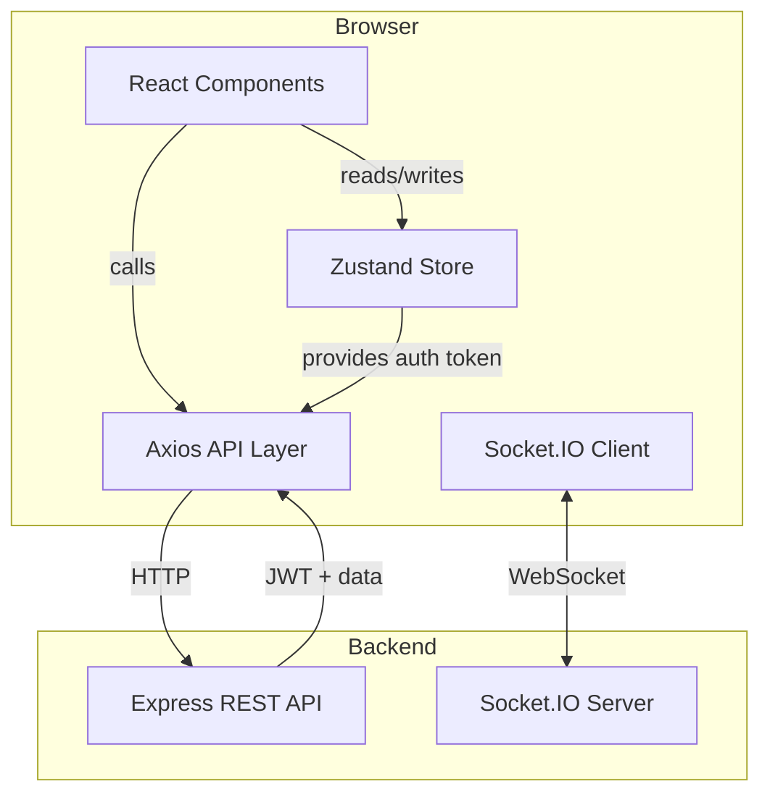
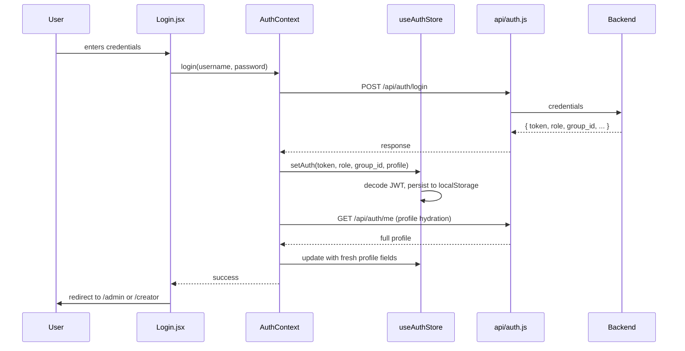

# Smart Digital Signage — Frontend

A modern **React 19 + Vite** single-page application (SPA) for managing a university-campus digital signage system. Provides role-based dashboards for admins and creators, a visual post designer powered by Fabric.js, live stream management, real-time device control, and AI-assisted content Q&A.

---

## Table of Contents

1. [Overview](#overview)
2. [Tech Stack](#tech-stack)
3. [Features](#features)
4. [Architecture](#architecture)
5. [Project Structure](#project-structure)
6. [Routing & Access Control](#routing--access-control)
7. [State Management](#state-management)
8. [API Layer](#api-layer)
9. [Component Inventory](#component-inventory)
10. [Authentication Flow](#authentication-flow)
11. [Real-Time Communication](#real-time-communication)
12. [Visual Post Designer](#visual-post-designer)
13. [Environment Variables](#environment-variables)
14. [Setup & Development](#setup--development)
15. [Testing](#testing)
16. [Build & Production](#build--production)
17. [Troubleshooting](#troubleshooting)

---

## Overview

The frontend is the primary human interface for the Smart Digital Signage system. It serves three distinct audiences:

- **Admins** — Full system control: user management, group configuration, device approval, playlist curation, system logs
- **Creators** — Content production: post creation with visual editor, live stream management, signage deployment to devices
- **Public viewers** — Read-only feed of published content with AI Q&A capability

The app communicates with the backend via a typed REST API layer and optionally connects via Socket.IO for real-time device events.

---

## Tech Stack

| Layer | Technology | Purpose |
|-------|-----------|---------|
| Framework | React 19 | UI rendering with functional components + hooks |
| Build Tool | Vite 8 | Fast dev server, HMR, optimized production builds |
| Routing | React Router DOM 7 | Declarative route definitions with role guards |
| State | Zustand 5 | Lightweight global store for auth, no prop drilling |
| HTTP | Axios 1.16 | REST API client with request/response interceptors |
| Real-time | Socket.IO Client 4.8 | WebSocket connection to backend for live device events |
| Visual Editor | Fabric.js 5.3.0 | Canvas-based drag-and-drop post designer |
| Media | hls.js 1.6 | In-browser HLS playback for live stream previews |
| Markdown | react-markdown 10 | Rich text rendering with GFM, math (KaTeX), wiki-links |
| Icons | lucide-react | Consistent SVG iconography |
| Crop | react-easy-crop | Image upload cropping UI |
| Testing | Playwright 1.48 | End-to-end browser automation |
| Linting | ESLint 10 + Prettier 3 | Code quality and formatting |

---

## Features

### Admin Dashboard (`/admin`)
- **Dashboard overview** — System status, device counts, recent activity
- **User management** (`/admin/users`) — Create, edit, delete users; assign roles and managed groups
- **Group management** (`/admin/groups`) — Create groups, set signage states (`NORMAL`, `EMERGENCY`, etc.)
- **Device management** (`/admin/devices`) — Approve pending devices, assign groups, upload emergency assets, reset/remove devices
- **Post oversight** (`/admin/posts`) — View all posts across groups, moderate content
- **Playlist management** (`/admin/playlists`) — Create ordered playlists for device rotation
- **System logs** (`/admin/logs`) — Error logs and sensor data from field devices

### Creator Dashboard (`/creator`)
- **Dashboard overview** — Personal post count, live stream status, quick actions
- **Post editor** (`/creator/editor`) — Visual canvas designer (Fabric.js) + markdown mode; upload images/videos with crop and trim
- **Post management** (`/creator/posts`) — Draft, publish, unpublish, delete posts; manage signage deployments
- **Live streams** (`/creator/live-streams`) — Create HLS/RTSP/YouTube/RTMP streams; start/stop relays, rotate stream keys, upload thumbnails
- **Signage control** (`/creator/signage`) — View device status, publish posts to specific devices, control playback (next/previous/start), hide/show assets

### Public Feed (`/feed`)
- **Public content feed** — All published posts marked `allowed_on_feed`
- **Post detail** — Full markdown rendering with attachments, images, videos
- **AI Q&A** — Ask questions about any published post using OpenAI integration

---

## Architecture

### High-Level Data Flow



### Component Hierarchy

```
App.jsx (BrowserRouter)
├── AuthProvider (Context)
│   └── AppRoutes (Routes)
│       ├── /login → Login.jsx
│       ├── /feed → Feed.jsx
│       ├── /post/:id → PostDetail.jsx
│       ├── /admin → AdminDashboard.jsx
│       │   ├── /admin/devices → AdminDevices.jsx
│       │   ├── /admin/users → AdminUsers.jsx
│       │   ├── /admin/groups → AdminGroups.jsx
│       │   ├── /admin/posts → AdminPosts.jsx
│       │   ├── /admin/playlists → AdminPlaylists.jsx
│       │   └── /admin/logs → AdminLogs.jsx
│       └── /creator → CreatorDashboard.jsx
│           ├── /creator/posts → CreatorPosts.jsx
│           ├── /creator/editor → CreatorEditor.jsx
│           ├── /creator/signage → CreatorSignage.jsx
│           └── /creator/live-streams → CreatorLiveStreams.jsx
```

### Layered Architecture

```
┌─────────────────────────────────────────────┐
│  Pages (Route-level views)                   │  ← Data fetching, layout composition
├─────────────────────────────────────────────┤
│  Components (Reusable UI blocks)             │  ← Forms, lists, editors, modals
├─────────────────────────────────────────────┤
│  API Modules (Axios wrappers)                  │  ← Typed endpoint functions
├─────────────────────────────────────────────┤
│  Store (Zustand) + Context (AuthProvider)    │  ← Global auth state, localStorage sync
├─────────────────────────────────────────────┤
│  Config / Utils / Constants / Styles         │  ← Environment, tokens, helpers
└─────────────────────────────────────────────┘
```

---

## Project Structure

```
frontend/
├── public/                        # Static assets (favicon, etc.)
├── src/
│   ├── api/                       # Backend API wrappers (per-domain modules)
│   │   ├── axios.js               # Axios instance with auth interceptor + 401 handler
│   │   ├── auth.js                # login, me
│   │   ├── devices.js             # list, register, approve, update, emergency-asset upload
│   │   ├── groups.js              # list, create, update, delete, states
│   │   ├── liveStreams.js         # CRUD, start/stop, rotate-key, thumbnail, logs
│   │   ├── media.js               # image/video upload endpoint
│   │   ├── playlists.js         # list, create, update, delete
│   │   ├── posts.js               # CRUD, publish, unpublish, attachments
│   │   ├── signage.js             # publish, deployments, asset list, playback controls
│   │   ├── users.js               # list users
│   │   └── ai.js                  # AI status, ask question
│   │
│   ├── assets/                    # Static images, fonts
│   ├── components/                # Reusable React components
│   │   ├── ui/                    # Primitive UI kit (Button, Card, Badge, Message)
│   │   ├── designer/              # Fabric.js designer sub-components
│   │   │   ├── DesignerCanvas.jsx
│   │   │   ├── DesignerToolbar.jsx
│   │   │   ├── SafeZoneOverlay.jsx
│   │   │   ├── applyTemplate.js
│   │   │   └── designerConstants.js
│   │   ├── AdminSidebar.jsx       # Admin navigation sidebar
│   │   ├── CreatorSidebar.jsx     # Creator navigation sidebar
│   │   ├── Designer.jsx           # Full Fabric.js visual post editor
│   │   ├── DeviceList.jsx         # Device table with status/actions
│   │   ├── DeviceRegisterForm.jsx # Form to pre-register a new Pi
│   │   ├── FabricCanvas.jsx       # Low-level Fabric canvas wrapper
│   │   ├── LivePlayer.jsx         # HLS.js video player for stream previews
│   │   ├── LiveStreamForm.jsx     # Create/edit stream form
│   │   ├── LiveStreamPicker.jsx   # Stream selection dropdown
│   │   ├── MarkdownCanvas.jsx     # Markdown preview renderer
│   │   ├── MediaUploadField.jsx   # Image/video upload with crop/trim UI
│   │   ├── MultiSelect.jsx        # Group/device multi-selection control
│   │   ├── PostAIChat.jsx         # AI Q&A chat interface for posts
│   │   ├── PostForm.jsx           # Post creation/editing form
│   │   ├── PostList.jsx           # Post grid/table with filters
│   │   ├── PostMedia.jsx          # Media display (image/video carousel)
│   │   ├── SignageAssetList.jsx   # Device asset management table
│   │   ├── SignagePanel.jsx       # Side panel for signage actions
│   │   ├── SignagePublishForm.jsx # Publish post to devices form
│   │   ├── SignageStateSelect.jsx # Dropdown for signage state enum
│   │   └── VideoTrimSlider.jsx    # Video duration trim UI
│   │
│   ├── config/
│   │   └── apiBase.js             # Dynamic API base URL + asset origin resolver
│   ├── constants/
│   │   └── (shared constants)
│   ├── context/
│   │   └── AuthContext.jsx        # React context provider: login/logout, profile refresh
│   ├── hooks/
│   │   └── (custom React hooks)
│   ├── pages/                     # Route-level page components
│   │   ├── Login.jsx              # Authentication page
│   │   ├── admin/
│   │   │   ├── AdminDashboard.jsx
│   │   │   ├── AdminDevices.jsx   # Full device management (approve, groups, emergency asset)
│   │   │   ├── AdminGroups.jsx    # Group CRUD + signage state control
│   │   │   ├── AdminLogs.jsx      # Error + sensor log viewer
│   │   │   ├── AdminPlaylists.jsx # Playlist builder
│   │   │   ├── AdminPosts.jsx     # All posts moderation view
│   │   │   └── AdminUsers.jsx     # User CRUD with role/group assignment
│   │   ├── creator/
│   │   │   ├── CreatorDashboard.jsx
│   │   │   ├── CreatorEditor.jsx  # Post creation: designer + markdown + media
│   │   │   ├── CreatorLiveStreams.jsx # Stream list + relay control
│   │   │   ├── CreatorPosts.jsx   # Personal post management + publish
│   │   │   └── CreatorSignage.jsx # Device status + playback controls
│   │   └── public/
│   │       ├── Feed.jsx           # Public post feed
│   │       └── PostDetail.jsx     # Individual post view with AI chat
│   │
│   ├── socket/
│   │   └── socket.js              # Socket.IO client singleton (autoConnect: false)
│   ├── store/
│   │   └── useAuthStore.js        # Zustand auth state (token, role, profile, managed groups)
│   ├── styles/
│   │   └── (CSS/style utilities)
│   ├── styles.js                  # Design tokens: colors, spacing, typography
│   ├── tokens.js                  # Additional style token definitions
│   ├── App.css                    # Global app styles
│   ├── index.css                  # Base CSS resets + utilities
│   ├── App.jsx                    # Root component: Router + AuthProvider + Routes
│   └── main.jsx                   # Entry point: ReactDOM render
│
├── tests/                         # Playwright end-to-end tests
│   ├── admin/                     # Admin dashboard tests
│   ├── auth.spec.js               # Login flow tests
│   ├── creator/                   # Creator workflow tests
│   ├── smoke/
│   │   └── pi-live-stream.spec.js # Pi/Anthias live stream smoke test
│   ├── globalSetup.cjs            # Test bootstrap: seed DB, start servers
│   └── helpers/
│       └── test-helpers.js        # Login, reset, seed utilities
│
├── .env                           # VITE_API_URL
├── .gitignore
├── eslint.config.js
├── playwright.config.js           # E2E test configuration
├── prettier.config.js
├── vite.config.js                 # Dev proxy to backend, HMR config
├── index.html
└── package.json
```

---

## Routing & Access Control

### Route Map

| Path | Component | Auth Required | Role Guard |
|------|-------------|---------------|------------|
| `/login` | `Login.jsx` | No | — |
| `/feed` | `Feed.jsx` | No | — |
| `/post/:id` | `PostDetail.jsx` | No | — |
| `/admin` | `AdminDashboard.jsx` | Yes | `admin` |
| `/admin/devices` | `AdminDevices.jsx` | Yes | `admin` |
| `/admin/users` | `AdminUsers.jsx` | Yes | `admin` |
| `/admin/groups` | `AdminGroups.jsx` | Yes | `admin` |
| `/admin/posts` | `AdminPosts.jsx` | Yes | `admin` |
| `/admin/playlists` | `AdminPlaylists.jsx` | Yes | `admin` |
| `/admin/logs` | `AdminLogs.jsx` | Yes | `admin` |
| `/creator` | `CreatorDashboard.jsx` | Yes | `creator` |
| `/creator/posts` | `CreatorPosts.jsx` | Yes | `creator` |
| `/creator/editor` | `CreatorEditor.jsx` | Yes | `creator` |
| `/creator/signage` | `CreatorSignage.jsx` | Yes | `creator` |
| `/creator/live-streams` | `CreatorLiveStreams.jsx` | Yes | `creator` |
| `/` | — | No | Redirects to `/feed` |
| `*` | — | No | Redirects to `/feed` |

### Role Guard Logic (`RequireRole`)

```jsx
function RequireRole({ role, children }) {
  const { token, role: userRole } = useAuthStore();
  if (!token) return <Navigate to="/login" replace />;
  if (role && userRole !== role) return <Navigate to="/feed" replace />;
  return children;
}
```

- Unauthenticated users are redirected to `/login`
- Authenticated users with wrong role are redirected to `/feed`
- Logged-in users visiting `/login` are redirected to their role-appropriate dashboard

---

## State Management

### Zustand Auth Store (`useAuthStore.js`)

The auth store is the single source of truth for user identity. It:

- Decodes JWT payload without external libraries (base64url + UTF-8)
- Persists to `localStorage` for session survival across reloads
- Auto-purges expired tokens on application boot
- Stores rich profile fields: `role`, `group_id`, `managed_group_ids`, `max_signage_state`, `creator_priority`, `control_lock_minutes`, `auto_approve`, `can_manage_other_posts`

```js
// Key store fields
{
  token,              // JWT string
  id,                 // User ID
  role,               // "admin" | "creator"
  group_id,           // Primary group
  managed_group_ids,  // Array of group IDs this user manages
  max_signage_state,  // Highest signage state this user can set
  creator_priority,   // Priority level for control locks
  control_lock_minutes, // Lock duration for device control
  auto_approve,       // Whether this creator's posts auto-approve
  can_manage_other_posts, // Cross-group post management permission
}
```

### Auth Context (`AuthContext.jsx`)

Wraps the Zustand store with React Context to provide:

- **`login(username, password)`** — Calls API, stores token, fetches full profile
- **`logout()`** — Clears all auth state and localStorage
- **Profile hydration** — On mount, fetches `/auth/me` to refresh profile fields that may have changed since JWT issuance

---

## API Layer

### Axios Instance (`api/axios.js`)

```js
const api = axios.create({ timeout: 15000 });

// Request interceptor: attach JWT + baseURL
api.interceptors.request.use((config) => {
  config.baseURL = apiBaseUrl();  // /api in dev, full URL in prod
  const token = localStorage.getItem("token");
  if (token) config.headers.Authorization = `Bearer ${token}`;
  return config;
});

// Response interceptor: 401 → clear auth + redirect to login
api.interceptors.response.use(
  (response) => response,
  (error) => {
    if (error.response?.status === 401) {
      useAuthStore.getState().clearAuth();
      window.location.href = "/login";
    }
    return Promise.reject(error);
  }
);
```

### Dynamic Base URL (`config/apiBase.js`)

| Environment | `apiBaseUrl()` | `assetOrigin()` |
|-------------|----------------|-----------------|
| Development | `/api` (Vite proxy) | `""` (same origin) |
| Production | `VITE_API_URL` | `VITE_API_URL` without `/api` suffix |

### API Module Pattern

Each domain has a dedicated module in `src/api/*.js`:

```js
// Example: src/api/devices.js
import api from "./axios";

export const getDevices = () => api.get("/devices");
export const getDevice = (id) => api.get(`/devices/${id}`);
export const registerDevice = (data) => api.post("/devices/register", data);
export const approveDevice = (id, data) => api.post(`/devices/${id}/approve`, data);
export const updateDevice = (id, data) => api.put(`/devices/${id}`, data);
export const deleteDevice = (id) => api.delete(`/devices/${id}`);
export const uploadEmergencyAsset = (id, formData) =>
  api.post(`/devices/${id}/emergency-asset`, formData, {
    headers: { "Content-Type": "multipart/form-data" },
  });
```

---

## Component Inventory

### Layout & Navigation

| Component | Purpose |
|-----------|---------|
| `AdminSidebar.jsx` | Admin dashboard navigation with role-aware links |
| `CreatorSidebar.jsx` | Creator dashboard navigation |

### Content Creation

| Component | Purpose |
|-----------|---------|
| `Designer.jsx` | Full visual post editor (Fabric.js canvas + toolbar + templates) |
| `DesignerCanvas.jsx` | Fabric.js canvas instance manager |
| `DesignerToolbar.jsx` | Text, shape, image tools for the canvas |
| `SafeZoneOverlay.jsx` | Guides for safe display zones on canvas |
| `MarkdownCanvas.jsx` | Markdown WYSIWYG preview with KaTeX math support |
| `MediaUploadField.jsx` | Drag-and-drop upload with crop (images) and trim (videos) |
| `VideoTrimSlider.jsx` | Range slider for video start/end trimming |
| `PostForm.jsx` | Post metadata form (title, description, group, scheduling) |

### Device & Signage

| Component | Purpose |
|-----------|---------|
| `DeviceList.jsx` | Table of devices with online/offline status |
| `DeviceRegisterForm.jsx` | Pre-register a new Pi device |
| `SignageAssetList.jsx` | Manage assets deployed to a specific device |
| `SignagePanel.jsx` | Side panel for device control actions |
| `SignagePublishForm.jsx` | Publish a post to one or more devices |
| `SignageStateSelect.jsx` | Dropdown for `NORMAL` / `EMERGENCY` / etc. |

### Live Streaming

| Component | Purpose |
|-----------|---------|
| `LivePlayer.jsx` | hls.js-based video player for stream previews |
| `LiveStreamForm.jsx` | Create/edit stream (HLS/RTSP/YouTube/RTMP) |
| `LiveStreamPicker.jsx` | Select an existing stream to attach to a post |

### Posts & Feed

| Component | Purpose |
|-----------|---------|
| `PostList.jsx` | Filterable grid/table of posts |
| `PostMedia.jsx` | Carousel/display for post images and videos |
| `PostAIChat.jsx` | Chat interface for AI Q&A on a post |
| `MultiSelect.jsx` | Generic multi-select for groups/devices/users |

### UI Primitives (`components/ui/`)

| Component | Purpose |
|-----------|---------|
| `Button.jsx` | Styled action button |
| `Card.jsx` | Content container with shadow |
| `Badge.jsx` | Status indicator (online, offline, pending) |
| `Message.jsx` | Alert/toast message display |

---

## Authentication Flow



---

## Real-Time Communication

### Socket.IO Client (`socket/socket.js`)

```js
import { io } from "socket.io-client";
const socket = io(origin, { autoConnect: false });
export default socket;
```

The client is created lazily (`autoConnect: false`) and connected on-demand by pages that need real-time updates (e.g., device status, live stream health). This avoids unnecessary connections on public pages like `/feed`.

### Typical Usage

```js
import socket from "../socket/socket";

useEffect(() => {
  socket.connect();
  socket.on("connect", () => console.log("Socket connected"));
  socket.on("device_status_change", (data) => {
    // Refresh device list
  });
  return () => {
    socket.off("device_status_change");
    socket.disconnect();
  };
}, []);
```

---

## Visual Post Designer

The `Designer.jsx` component is a full-featured canvas editor for creating visually rich signage posts.

### Capabilities

| Feature | Implementation |
|---------|---------------|
| **Canvas** | Fabric.js 5.3.0 (`StaticCanvas`) |
| **Elements** | Text boxes, rectangles, circles, images, uploaded media |
| **Templates** | Pre-built layouts via `applyTemplate.js` |
| **Safe zones** | Overlay guides for text-safe and action-safe areas |
| **Export** | `html-to-image` for PNG export from canvas |
| **Switching** | Toggle between visual designer and markdown mode |

### Designer Sub-System

```
Designer.jsx (orchestrator)
├── DesignerCanvas.jsx (Fabric canvas)
├── DesignerToolbar.jsx (tools)
├── SafeZoneOverlay.jsx (guides)
├── applyTemplate.js (layout presets)
└── designerConstants.js (sizes, colors)
```

---

## Environment Variables

Create a `.env` file in the `frontend/` directory:

```env
VITE_API_URL=http://localhost:5000/api
```

| Variable | Required | Description |
|----------|----------|-------------|
| `VITE_API_URL` | Yes | Backend API URL. In dev, Vite proxies `/api` to this origin. |
| `VITE_PROXY_TARGET` | No | Override proxy target in `vite.config.js` (defaults to `http://127.0.0.1:5000`) |
| `VITE_API_PORT` | No | Backend port fallback (defaults to `5000`) |

> **Vite rule:** Only variables prefixed with `VITE_` are exposed to the client.

---

## Setup & Development

### Prerequisites

- Node.js 18+
- Backend running on port 5000 (or configured `VITE_API_URL`)

### Install Dependencies

```bash
cd frontend
npm install
```

> **Fabric.js pin:** The project requires `fabric@5.3.0` exactly. It is already in `package.json`, but if you encounter issues:
> ```bash
> npm install fabric@5.3.0 --save-exact
> ```

### Start Development Server

```bash
npm run dev
```

- Vite dev server starts on `http://localhost:5173`
- API calls to `/api`, `/uploads`, `/streams`, and `/socket.io` are proxied to the backend
- Hot Module Replacement (HMR) is active for instant UI updates

### Available Scripts

| Script | Command | Description |
|--------|---------|-------------|
| Dev | `npm run dev` | Start Vite dev server with HMR |
| Build | `npm run build` | Production build to `dist/` |
| Preview | `npm run preview` | Preview production build locally |
| Lint | `npm run lint` | Run ESLint |
| Format | `npm run format` | Run Prettier on all files |
| Test | `npm run test:e2e` | Run Playwright E2E tests |

---

## Testing

### Playwright E2E Tests

The project uses Playwright for end-to-end testing. Tests run against a real browser (Chromium) and automatically start both the backend and frontend dev server.

### Install Browsers (one-time)

```bash
npx playwright install
```

### Run Tests

```bash
# All tests
npm run test:e2e

# Specific suites
npx playwright test tests/admin/        # Admin dashboard tests
npx playwright test tests/creator/       # Creator workflow tests
npx playwright test tests/auth.spec.js   # Login/logout tests
npx playwright test tests/smoke/         # Pi/Anthias smoke tests
```

### Test Infrastructure (`playwright.config.js`)

```js
webServer: [
  {
    command: "node ../backend/start-test-server.js",
    url: "http://localhost:5001/api/health",
    // Test backend on port 5001
  },
  {
    command: "npm run dev",
    url: "http://localhost:5173",
    env: { VITE_PROXY_TARGET: "http://127.0.0.1:5001" },
  },
];
```

> **Important:** Do not run your production backend on port 5001 when executing tests.

### Test Helpers (`tests/helpers/`)

- **`login(page, username, password)`** — Authenticate and store session
- **`resetDatabase()`** — Clean test data between runs
- **`seedTestData()`** — Create predictable fixtures

---

## Build & Production

### Production Build

```bash
npm run build
```

Outputs to `frontend/dist/`:
- Optimized JS bundles with tree shaking
- CSS extracted and minified
- Asset hashes for cache busting

### Production Deployment

Serve the `dist/` folder with any static file server:

```bash
# Using Vite preview (testing only)
npm run preview

# Using Nginx (recommended)
server {
    listen 80;
    root /var/www/signage-frontend/dist;
    index index.html;
    location / {
        try_files $uri $uri/ /index.html;
    }
}
```

### Important Notes

- The app uses **client-side routing** (React Router). The server must serve `index.html` for all non-file routes.
- API calls go to the absolute `VITE_API_URL` in production (no proxy).
- Uploads and streams are served directly by the backend, not the frontend.

---

## Troubleshooting

| Problem | Cause | Solution |
|---------|-------|----------|
| `Fabric is not defined` | Wrong Fabric.js version or build issue | Ensure `fabric@5.3.0` is installed exactly: `npm install fabric@5.3.0 --save-exact` |
| Canvas not rendering | Fabric.js canvas initialization race | Check that canvas element is mounted before Fabric initializes |
| Vite HMR not working | Cache or plugin issue | `npm run dev -- --force` |
| API 404 / CORS errors | Backend not running or wrong URL | Verify backend is running; check `VITE_API_URL` in `.env` |
| 401 Unauthorized loops | Expired token not cleared | Check localStorage `token`; manually clear and re-login |
| `role is undefined` | Profile not hydrated | Refresh page to trigger `/auth/me` call in `AuthContext` |
| Playwright tests fail | Port 5001 occupied | Kill any process on port 5001 before running tests |
| Test backend timeout | Slow machine or DB connection | Increase `timeout` in `playwright.config.js` |
| Live stream preview black | hls.js not loading | Check browser console for HLS manifest fetch errors |
| Video trim not working | FFmpeg metadata unavailable | Ensure uploaded video has valid duration metadata |
| Markdown math not rendering | KaTeX CSS not loaded | Check that `rehype-katex` styles are imported |

---

_See the root `README.md` and `backend/README.md` for full system and API documentation._
