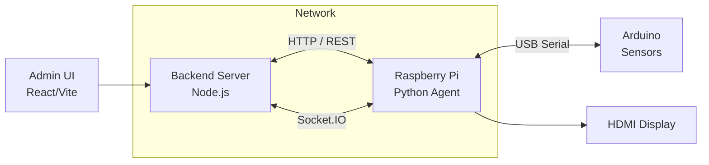
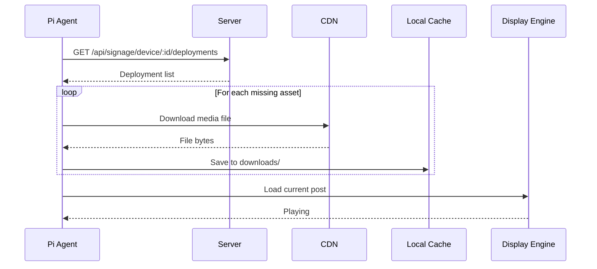

# Raspberry Pi Device Agents

The Pi agents are the **edge display controllers** of the Smart Signage System. Each Raspberry Pi connects to an Arduino sensor board and an HDMI display, forming a self-contained signage node that can operate autonomously even when disconnected from the server.

## What the Pi Does

Every Pi agent performs four continuous jobs:

1. **Identity & Heartbeat** — Registers itself with the central server every 10 seconds, reporting device name, location, IP address, and online status. This makes the device visible in the admin dashboard for approval and content assignment.

2. **Sensor Reading** — Listens to an Arduino Mega over USB serial for environmental and event data: motion detection, ambient brightness (LDR), rain detection, and an emergency button. This data is forwarded to the server and also drives local behavior (e.g., auto-brightness, emergency mode).

3. **Content Synchronization** — Polls the server every 60 seconds for the content playlist assigned to this device. Downloads images and videos to a local cache, and prepares them for display. Supports scheduled posts, live streams, and dynamic updates pushed from the server.

4. **State Management** — Monitors server health and local triggers. Enters **emergency mode** when the Arduino emergency button is pressed or when the server commands it. Falls back to a **disconnection screen** if the server has been unreachable for longer than the configured timeout (default 72 hours).

## Where the Pi Fits



The Pi sits at the edge of the network. It is the only component that talks to both the server (over the network) and the physical sensors/display (locally). This design ensures:

- **Offline resilience** — emergency and disconnection assets play locally without any server contact.
- **Low latency response** — the emergency button triggers immediate local playback; no network round-trip required.
- **Decentralized content** — once content is cached, the device can continue playing its playlist even if the server goes down.

## Two Player Types

| Aspect | Anthias-Based (`anthiasDevice`) | MPV-Based (`mvpDevice`) |
|--------|--------------------------------|-------------------------|
| **Display engine** | Anthias (Dockerized web viewer) | MPV (native media player) |
| **Content handling** | Server pushes assets to Anthias via REST API | Agent downloads files locally and tells MPV what to play |
| **Media types** | Images, videos, live streams (as webpage assets) | Images, videos, live streams (direct playback) |
| **Scheduling** | Anthias built-in playlist | Custom Python scheduler (`scheduler.py`) |
| **Architecture** | Shared `anthiasDevice/` package + thin per-device `config.py` + `run.py` shim | Self-contained per-device folder; everything needed is inside |
| **Best for** | Multiple displays managed centrally, live stream integration, web-based content | Lightweight standalone deployment, full offline control, no Docker |

### Templates

Use these folders to create new devices:

- **`anthiasDevice/`** — Copy and rename to create a new Anthias-based device (e.g., `Device4/`).
- **`mvpDevice/`** — Copy and rename to create a new MPV-based device (e.g., `Device5/`).

Configured instances in this repo:
- `Device1/`, `Device2/` — Anthias devices (copied from `anthiasDevice/`)
- `Device3/` — MPV device (copied from `mvpDevice/`)

See the `README.md` and `setup.md` inside each template folder for deep-dive documentation.

---

## How It Works

### Heartbeat & Registration

When the agent starts, it opens a Socket.IO connection to the server and emits a `heartbeat` event every 10 seconds. The heartbeat carries:

- `device_id` — matches the ID assigned during web UI approval
- `device_name` — human-readable label (e.g., "Lobby-Screen")
- `location` — physical location (e.g., "Main Lobby")
- `ip_address` — local IP, auto-detected
- `status` — `"online"`

If the server has never seen this device before, it replies with a `device_token`. The agent saves this token to a local sidecar file (`.device_token`) and uses it for all subsequent authenticated REST requests.

> **Important:** The device must be approved in the web UI before content can be assigned to it.

### Content Sync Flow



**Anthias devices:** `content_sync.py` fetches the deployment list, downloads missing media, uploads it to the local Anthias instance, and registers webpage assets for live streams. Anthias then handles the display loop.

**MPV devices:** `api.py` fetches deployments and `mvp-player.py` downloads media to `downloads/`. The custom `scheduler.py` decides what MPV should play next, rotating through active posts based on their `duration_seconds` and validity windows.

### Sensor Data Flow

The Arduino emits a line every 2 seconds:

```
SENSOR:motion:1,brightness:742,rain:0,emergency:0
```

The Pi parses this, writes the values to `/tmp/signage_sensors`, and:

- **Forwards to server** — emits `sensor_update` event via Socket.IO
- **Triggers emergency** — if `emergency:1`, immediately plays the local emergency asset
- **Adjusts brightness** — `brightness_control.py` reads `/tmp/signage_sensors` and calls `brightnessctl set {pct}%`

### Emergency & Disconnection States

Priority order (highest to lowest):

1. **Emergency** — triggered by local button, remote command, or server group state. Plays `emergency_fallback.mp4` in a loop. Scheduler is paused. Only clears when **all** assigned groups return to normal.
2. **Disconnection** — triggered when the server has not been successfully contacted for `DISCONNECTION_TIMEOUT_HOURS` (default 72h). Purges all cached content and displays `disconnection.png`.
3. **Normal** — plays the scheduled content playlist.

Both states use local fallback assets so the device remains functional without any network.

---

## Setup

### Automated Setup (Recommended)

Run these scripts directly on the Pi after flashing Raspberry Pi OS Lite:

```bash
# Anthias device
./setup-anthias.sh -d 1 -n "Lobby-Screen" -l "Main Lobby" \
  -s "http://192.168.1.100:5000/api" -p "/dev/ttyUSB0"

# MPV device
./setup-mvp.sh -d 3 -n "Hall-Screen" -l "Conference Hall" \
  -s "http://192.168.1.100:5000/api" -p "/dev/ttyUSB0"
```

Both scripts handle: system update, dependency installation, Anthias/MPV install, Arduino serial permissions, config generation, systemd service creation, and optional brightness control.

See `setup-anthias.sh -h` or `setup-mvp.sh -h` for all options.

### Manual Setup

For detailed manual step-by-step guides, see the `setup.md` files in each template folder:

- `anthiasDevice/setup.md` — Headless Pi setup, Anthias Docker install, Python apt deps, serial config, systemd services
- `mvpDevice/setup.md` — Headless Pi setup, MPV install, Python apt deps, serial config, systemd services, local asset placement

### Quick Dependency Reference

**Anthias devices:**
```bash
sudo apt install -y python3-requests python3-serial python3-python-socketio python3-websocket
```

**MPV devices:**
```bash
sudo apt install -y mpv python3-requests python3-python-socketio python3-serial python3-setuptools
```

**Both:**
```bash
sudo usermod -aG dialout $USER   # Arduino serial access
```

### Post-Setup Checklist

1. Reboot or log out and back in for `dialout` group to take effect.
2. Start the agent manually to verify:
   ```bash
   cd ~/signage/Device1 && python3 run.py          # Anthias
   cd ~/signage/Device3 && python3 mvp-player.py   # MPV
   ```
3. Check logs for `Serial port opened successfully` and heartbeat every 10s.
4. Open the admin dashboard (`http://<server>:5173`) → **Admin → Devices**.
5. Approve the pending device and note the assigned `DEVICE_ID`.
6. Update `config.py` if the assigned ID differs, then restart the agent.
7. Enable the systemd service:
   ```bash
   sudo systemctl start socket-signage.service   # Anthias
   sudo systemctl start mvp-player.service        # MPV
   ```

---

## File Structure Overview

### Anthias Template (`anthiasDevice/`)

| File | Purpose |
|------|---------|
| `socket_client.py` | Main orchestrator: Socket.IO connection, heartbeat, sensor loop, content sync loop, command handlers |
| `content_sync.py` | Anthias API client: downloads media, uploads assets, registers live streams as webpages, cleanup |
| `config_defaults.py` | Shared default constants: server URL, Anthias URL, asset paths, timeouts |
| `config.py` | **Template** — per-device overrides (DEVICE_ID, NAME, LOCATION, SERIAL_PORT, SERVER_URL) |
| `run.py` | Launch shim: adds `anthiasDevice/` to `sys.path`, then starts `socket_client.main()` |
| `brightness_control.py` | Optional: reads sensor brightness value, calls `brightnessctl` to adjust display |
| `Arduino_connection.py` | Standalone serial debug utility |

### MPV Template (`mvpDevice/`)

| File | Purpose |
|------|---------|
| `mvp-player.py` | Main orchestrator: starts MPV, spawns all worker threads, monitors health |
| `socket_client.py` | Socket.IO client: commands, events, heartbeats, sync triggers |
| `api.py` | REST client: fetches deployments, downloads media, syncs emergency asset, token management |
| `scheduler.py` | Post rotation: decides what MPV plays next based on timing, duration, and active windows |
| `player.py` | MPV process control: starts MPV with IPC socket, sends `loadfile`, handles special states |
| `media.py` | Playlist state: caches downloads, persists to disk, tracks emergency/disconnection flags |
| `sensors.py` | Arduino serial reader: parses `SENSOR:` packets, detects emergency, forwards data |
| `config.py` | **Template** — all device settings in one file (no shared defaults needed) |

---

## LIVE_STREAM Support

When a post with `media_type == "LIVE_STREAM"` is published:

- **Anthias:** The agent skips download/upload and registers a **webpage asset** in Anthias pointing to the HLS stream URL. Anthias displays it using its built-in webpage viewer.
- **MPV:** The agent passes the HLS URL directly to MPV via the IPC socket. MPV handles HLS playback natively.

---

## Troubleshooting

| Problem | Solution |
|---------|----------|
| `SerialException: could not open port` | Check `SERIAL_PORT` in `config.py`; verify Arduino is connected (`ls /dev/ttyUSB* /dev/ttyACM*`); ensure user is in `dialout` group |
| Pi not showing in admin device list | Check `SERVER_URL` IP is correct; verify no firewall blocks port 5000 |
| Agent keeps reconnecting | Server may be down, or token is invalid. Stop agent, delete `.device_token`, restart |
| Anthias assets not syncing | Check Anthias is running: `docker ps`; verify `ANTHIAS_URL` in config |
| MPV black screen / no content | Check `journalctl -u mvp-player -f`; verify `downloads/` has cached files; test MPV manually: `mpv --idle --fullscreen` |
| Brightness control not working | Install `brightnessctl` (`sudo apt install brightnessctl`); verify `/tmp/signage_sensors` exists |
| Content sync shows "Server down" | Backend is unreachable. Check network and `SERVER_URL` |
| Emergency mode not clearing | The agent checks **all** assigned groups before clearing. Check logs: `journalctl -u <service> -f \| grep emergency` |

---

_See the root `README.md` for full server and frontend setup instructions._
