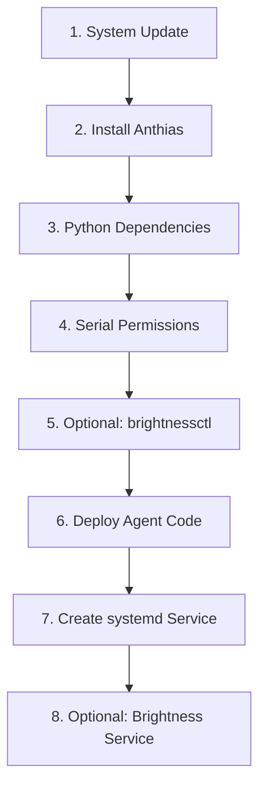
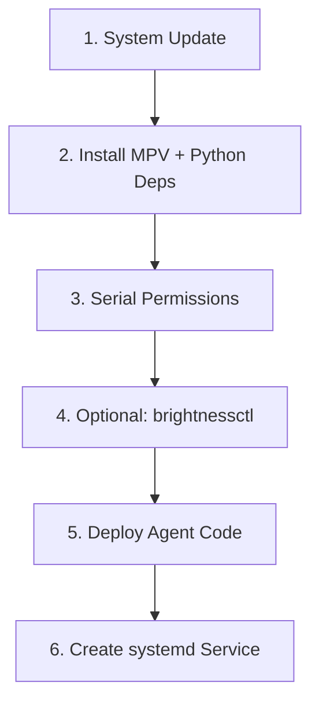

# Automated Raspberry Pi Setup Scripts

This document describes the automated bash setup scripts for configuring Raspberry Pi display agents.

---

## Overview

Four bash scripts handle the Pi lifecycle:

| Script | Purpose | What It Does |
|--------|---------|-------------|
| `setup-anthias.sh` | Install Anthias-based player | System update, Anthias install, Python deps, serial permissions, deploy code, systemd service, optional brightness control |
| `setup-mvp.sh` | Install MPV-based player | System update, MPV + Python deps, serial permissions, optional brightnessctl, deploy code, systemd service |
| `clear-anthias.sh` | Uninstall Anthias device | Stop service, remove service file, delete device folder, optionally remove packages |
| `clear-mvp.sh` | Uninstall MVP device | Stop service, remove service file, delete device folder, optionally remove packages |

Setup scripts are idempotent and can be run on a fresh Raspberry Pi OS installation.

---

## Prerequisites

- Raspberry Pi OS Lite (64-bit) flashed to SD card
- SSH access to the Pi
- Internet connection (for downloading Anthias, packages)
- Arduino Mega with sensor firmware already flashed

---

## Usage

### Anthias Setup

```bash
chmod +x setup-anthias.sh
./setup-anthias.sh -d 1 -n "Lobby-Screen" -l "Main Lobby" -s "http://192.168.1.100:5000/api"
```

### MPV Setup

```bash
chmod +x setup-mvp.sh
./setup-mvp.sh -d 3 -n "Hall-Screen" -l "Conference Hall" -s "http://192.168.1.100:5000/api"
```

---

## Command-Line Options

Both scripts accept the same options:

| Option | Long | Default | Description |
|--------|------|---------|-------------|
| `-d` | `--device-id` | `1` (Anthias) / `3` (MVP) | Pre-registered device ID from admin dashboard |
| `-n` | `--name` | `Pi-Display-1` / `MVP-Player-3` | Human-readable device name |
| `-l` | `--location` | `Floor 1` / `Main Hall` | Physical location |
| `-s` | `--server` | `http://192.168.1.100:5000/api` | Backend API URL |
| `-p` | `--serial-port` | `/dev/ttyUSB0` | Arduino USB serial port |
| `-f` | `--folder` | `Device1` / `Device3` | Per-device folder name under `~/signage/` |
| `-h` | `--help` | — | Show usage help |

### Common Serial Ports

| Port | When to use |
|------|-------------|
| `/dev/ttyUSB0` | Most USB-to-serial adapters (CH340, FT232) |
| `/dev/ttyACM0` | Arduino with native USB (Leonardo, Micro, Due) |
| `/dev/ttyAMA0` | UART on GPIO pins (not USB) |

---

## What Each Script Does

### `setup-anthias.sh` (8 Steps)



| Step | Action | Details |
|------|--------|---------|
| 1 | System update | `apt update && apt full-upgrade`, install git/curl/wget/vim |
| 2 | Install Anthias | Runs Anthias installer if Docker not present; skips if already installed |
| 3 | Python deps | Installs `python3-requests`, `python3-serial`, `python3-socketio`, `python3-websocket` |
| 4 | Serial permissions | Adds `$USER` to `dialout` group for Arduino USB access |
| 5 | Optional brightnessctl | Prompts to install `brightnessctl` for auto-brightness |
| 6 | Deploy code | Copies `anthiasDevice/` template to `~/signage/anthiasDevice`, creates per-device folder with `config.py` and `run.py` |
| 7 | systemd service | Creates `socket-signage-{folder}.service`, enables auto-start |
| 8 | Optional brightness service | Creates `brightness-control-{folder}.service` if brightnessctl was installed |

### `setup-mvp.sh` (6 Steps)



| Step | Action | Details |
|------|--------|---------|
| 1 | System update | `apt update && apt full-upgrade`, install git/curl/wget/vim |
| 2 | Install MPV + Python deps | Installs `mpv`, `python3-requests`, `python3-socketio`, `python3-serial`, `python3-setuptools` |
| 3 | Serial permissions | Adds `$USER` to `dialout` group |
| 4 | Optional brightnessctl | Prompts to install `brightnessctl`. MVP handles brightness **internally** via a daemon thread — no separate service needed. |
| 5 | Deploy code | Copies `mvpDevice/` template to `~/signage/{folder}/`, creates `config.py` with all settings |
| 6 | systemd service | Creates `mvp-player-{folder}.service`, enables auto-start |

---

## Deployed Folder Structure

### Anthias (after setup)

```
~/signage/
├── anthiasDevice/                 # Shared template package
│   ├── socket_client.py
│   ├── content_sync.py
│   ├── brightness_control.py
│   ├── config_defaults.py
│   └── ...
└── Device1/                       # Per-device folder
    ├── config.py                  # Device-specific overrides
    ├── run.py                     # Launch shim (adds anthiasDevice to sys.path)
    ├── emergency_fallback.mp4
    ├── disconnection.png
    └── no_content.jpg
```

### MPV (after setup)

```
~/signage/
└── Device3/                       # Self-contained device folder
    ├── mvp-player.py              # Main orchestrator
    ├── media.py
    ├── player.py
    ├── scheduler.py
    ├── socket_client.py
    ├── api.py
    ├── sensors.py
    ├── brightness_control.py
    ├── config.py                  # All device settings
    ├── downloads/                 # Content cache
    ├── data/                      # Playlist persistence
    ├── emergency_fallback.mp4
    ├── disconnection.png
    └── no_content.jpg
```

---

## Post-Setup Steps

After running either script:

1. **Reboot or re-login** — The `dialout` group change requires a new session.
2. **Test manually** — Start the agent directly to verify:
   - Anthias: `cd ~/signage/Device1 && python3 run.py`
   - MPV: `cd ~/signage/Device3 && python3 mvp-player.py`
3. **Start the service**:
   - Anthias: `sudo systemctl start socket-signage-device1.service`
   - MPV: `sudo systemctl start mvp-player-device3.service`
4. **Approve in web UI** — Open the admin dashboard, find the pending device, note the assigned `DEVICE_ID`.
5. **Update `config.py`** if the assigned `DEVICE_ID` differs from what you passed to the script.
6. **View logs**: `sudo journalctl -u <service-name> -f`

---

## Clear / Uninstall Scripts

To completely remove a deployed device and its service:

### `clear-mvp.sh`

```bash
./clear-mvp.sh -f Device3
```

| Flag | Description |
|------|-------------|
| `-f, --folder NAME` | Target the device folder to remove (default: `Device3`) |
| `-y, --yes` | Skip confirmation prompts (useful in automation) |
| `--remove-packages` | Also run `apt remove` on packages installed by `setup-mvp.sh` |

**What it does:**
1. Stops and disables the `mvp-player-{folder}.service`
2. Deletes the systemd service file
3. Removes the `~/signage/{folder}/` directory (including cached content and config)
4. Optionally removes packages (`mpv`, `python3-requests`, `python3-socketio`, `python3-serial`, `python3-setuptools`, `brightnessctl`)

### `clear-anthias.sh`

```bash
./clear-anthias.sh -f Device1
```

| Flag | Description |
|------|-------------|
| `-f, --folder NAME` | Target the device folder to remove (default: `Device1`) |
| `-y, --yes` | Skip confirmation prompts |
| `--remove-packages` | Also run `apt remove` on packages installed by `setup-anthias.sh` |

**What it does:**
1. Stops and disables `socket-signage-{folder}.service` and `brightness-control-{folder}.service`
2. Deletes both systemd service files
3. Removes the `~/signage/{folder}/` directory
4. Optionally removes packages (`python3-requests`, `python3-socketio`, `python3-serial`, `python3-websocket`, `brightnessctl`)

> **Note:** Neither script removes Anthias itself (Docker containers / images). To fully uninstall Anthias, run its own uninstaller inside `~/screenly/`.

---

## systemd Service Management

| Command | Description |
|---------|-------------|
| `sudo systemctl start <service>` | Start the agent |
| `sudo systemctl stop <service>` | Stop the agent |
| `sudo systemctl restart <service>` | Restart the agent |
| `sudo systemctl status <service>` | Check status |
| `sudo systemctl enable <service>` | Auto-start on boot (already done by script) |
| `sudo systemctl disable <service>` | Disable auto-start |
| `sudo journalctl -u <service> -f` | Follow live logs |
| `sudo journalctl -u <service> --since "1 hour ago"` | View recent logs |

### Service Names

| Script | Default Service Name |
|--------|---------------------|
| `setup-anthias.sh` | `socket-signage-device1.service` |
| `setup-mvp.sh` | `mvp-player-device3.service` |

The service name is derived from the `--folder` argument (lowercased). For example, `-f LobbyScreen` produces `socket-signage-lobbyscreen.service`.

---

## Troubleshooting

| Problem | Cause | Solution |
|---------|-------|----------|
| "Permission denied" on serial port | User not in `dialout` group | Log out and back in, or run `newgrp dialout` |
| Anthias installer fails | No internet or existing Docker conflict | Check network; if Docker exists, skip Anthias install and configure manually |
| MPV not found | Package not installed | `sudo apt install mpv` |
| Service fails to start | Wrong path in config or missing `config.py` | Check `config.py` exists and `SERVER_URL` is reachable |
| Device shows "offline" in dashboard | Agent not running or wrong `DEVICE_ID` | Check service status and verify `DEVICE_ID` matches admin registration |
| No sensor data | Wrong `SERIAL_PORT` in `config.py` | Run `ls /dev/tty*` to find the correct Arduino port |
| Brightness control not working | `brightnessctl` not installed or no backlight device | Check `brightnessctl` is installed; not all displays support DDC/CI |
| MVP: screen never turns off | Motion sensor always reporting `1` | Check ultrasonic sensors are not blocked; verify wiring |
| MVP: screen stays black | `brightnessctl` not installed | `sudo apt install brightnessctl`; MVP handles brightness internally |
| Anthias: brightness not adjusting | Separate `brightness-control` service not running | `sudo systemctl status brightness-control-<folder>.service` |

---

## Comparison: Manual vs. Automated Setup

| Aspect | Manual Setup | Automated (`setup-*.sh`) |
|--------|-------------|--------------------------|
| Time | 30-60 minutes | 5-10 minutes (mostly waiting) |
| Steps | Follow setup.md guides step by step | Single command, all steps automatic |
| systemd services | Create manually by copying .tpl files | Generated automatically with correct paths |
| config.py | Copy and edit template manually | Generated with CLI-provided values |
| Brightness control | Install and configure manually | Anthias: optional systemd service; MVP: **built-in** via `mvp-player.py` daemon thread (motion-aware, turns screen off when idle) |
| Best for | Learning how each piece works | Rapid deployment of multiple devices |

---

_See `pi-scripts/ReadMe.md` for the general Pi agent overview._  
_See `pi-scripts/anthiasDevice/setup.md` and `mvpDevice/setup.md` for manual setup guides._  
_See `frontend/README.md` and `backend/README.md` for the web UI and backend documentation._
